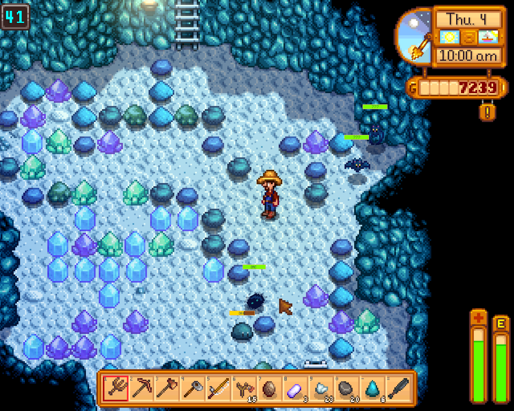

# Speeder's Health Bar Mod
 
This is a fairly simple mod for the game [Stardew Valley](http://stardewvalley.net/), it puts health bars over enemies heads.

Visit the [Forum thread](http://community.playstarbound.com/threads/smapi-enemy-health-bars.110120/)

## Installing

Just unpack the .zip file in the mods folder.

## Uninstalling

Just delete the mod files again.

## Instructions

This mod places health bars over enemies heads, but it takes in account your combat experience, and how well you know that enemy.

You can't see health bars on hidden enemies, and the amount of information available changes based on the combat level and how much of that enemy was killed.

This mod supports configuration files! If you edit the config.json file, you can choose a colour scheme, currently there are only two availble, suggestions are welcome.

Colour scheme 0 (default): Full health enemies show green, low health red.
Colour scheme 1 (Inverted): Full health enemies show red, low health enemies show green.

## Credits

Author: [Maurício Gomes (patreon help welcome!)](https://patreon.com/user?u=3066937)

## License

The license of the project is [GPL3](https://gnu.org/licenses/gpl.html).