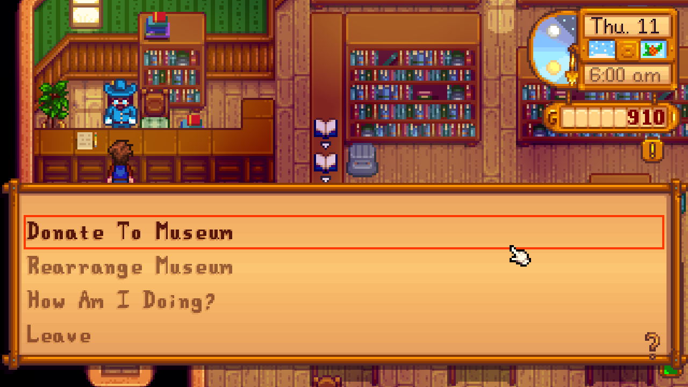

**Archaeology House Content Management Helper** is a [Stardew Valley](http://stardewvalley.net/) mod that is aimed at improving 
the management of the Library/Museum. It provides status information about found books and contributed items and improves 
management of museum pieces. It largely fixes the in-game bug preventing item placement in certain cases and allows 
item rearrangement even if you have nothing to donate. 

Furthermore, to help the user bringing structure into his museum pieces arrangement, each selected item will display a tooltip 
showing detailed item information. To make rearrangement less tedious, items can be directly swapped with each other and 
gamepad cursors can now also be used to select an item (instead of only being usable when an item is selected). 

Lost Books can now be "grabbed & sent" to the library even if the user's inventory is full. No longer will the user have to make space for a book which it doesn't occupy anyway and leaves the user with an empty slot in the inventory.

Also fixes some small bugs in the original game (such as pressing the 'Ok' button next to the inventory will select the item 
beneath it instead of exiting the menu).

## Contents
* [Install](#install)
* [Use](#use)
* [Showcase](#showcase)
* [Compatibility](#compatibility)
* [See also](#see-also)

## Install
1. [Install the latest version of SMAPI](https://smapi.io/).
2. [Install this mod from Nexus mods](http://www.nexusmods.com/stardewvalley/mods/2804/).
3. Run the game using SMAPI.

## Use
Just talk to Gunther and you will be presented with the updated menu. 
To close the museum menu (shown when you donate/replace items), simply press the [Exit] key you use for the game 
(default: key 'E') or press the [Cancel] button on your gamepad.

## Showcase
* Talk to Gunther to see the extended interaction menu.
  

* Select an item to rearrange it or see information about it.
  

* See how you many books and items you have contributed so far.
  

## Compatibility
* Works with Stardew Valley 1.3 on Windows (Linux/Mac not tested).
* Works in single player. Multiplayer works too, excluding lost books which do not seem to synchronize across players.
* No known mod conflicts.

## See also
* [Release notes](release-notes.md)
* [Nexus mod](http://www.nexusmods.com/stardewvalley/mods/2804)
