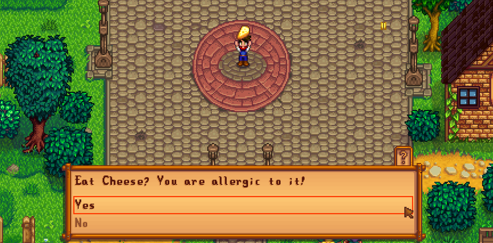

**You're viewing a file in the SMAPI mod dump, which contains a copy of every open-source SMAPI mod
for queries and analysis.**

**This is _not_ the original file, and not necessarily the latest version.**  
**Source repository: https://github.com/lisyce/SDV_Allergies_Mod**

----

# BarleyZP's Allergies

**BarleyZP's Allergy Mod** is a [Stardew Valley](https://www.stardewvalley.net/) mod which allows players to configure food allergies for an extra challenge. It is compatible with version 1.6+.



# Installation

1. Install [SMAPI](https://smapi.io/)
1. Install [this mod](https://www.nexusmods.com/stardewvalley/mods/21238) from Nexus
1. Install [Content Patcher](https://www.nexusmods.com/stardewvalley/mods/1915)
1. Optionally, install [Generic Mod Config Menu](https://www.nexusmods.com/stardewvalley/mods/5098) to easily configure the mod within the game
1. Launch Stardew Valley through SMAPI
1. Configure some allergies and enjoy the challenge!

Ensure that both the "\[CP\] BzpAllergies" and the "BzpAllergies" mods are directly inside your mod folder. This mod contains both a content pack and a C# component, so SMAPI needs to be able to find both of these components.

# For Mod Authors

## Harmony Patches

This mod changes core gameplay logic and thus employs some use of Harmony. Currently, the following methods are patched with prefix or postfix methods (no transpilers are used):

- `GameLocation.createQuestionDialogue`
- `Farmer.doneEating`
- `NPC.checkAction`
- `CraftingRecipe.createItem`
- `CraftingRecipe.consumeIngredients`
- `Object.getDescription`
- `Item.canStackWith`

All of these prefixes allow the original logic to run afterwards, so they should be fairly compatible with other mods that patch these methods.

## Creating Custom Allergens and Integrating Modded Items

See [the content pack docs](docs/content_packs.md).

## Adding NPC Reaction Dialogue

Many of the base game NPCs have special dialogue if you speak to them while having an allergic reaction. If you'd like to have your custom NPCs react, you'll need to add a dialogue option with the key `"BarleyZP.BzpAllergies_farmer_allergic_reaction"`. You may also included dialogue in the `"Characters/Dialogue/MarriageDialogue{Name}"` assets, and the mod will try to use the married dialogue instead if you are married or roommates with that character. Here is an example using Content Patcher (that the base mod uses!) for Alex's non-marriage reaction dialogue.

```json
{
  "Format": "2.0.0",
  "Changes": [
    {
      "LogName": "Alex Dialogue",
      "Action": "EditData",
      "Target": "Characters/Dialogue/Alex",
      "Entries": {
        "BarleyZP.BzpAllergies_farmer_allergic_reaction": "Yikes! You don't look so good...$7"
      }
    }
  ]
}
```

Adding this dialogue is not currently supported through the BarleyZP's Allergies content pack framework. You will need to edit the asset in C# or use another framework like Content Patcher.

# Bug Reports and Feature Requests

You may leave a comment on the linked Nexus mod page or create an issue on this GitHub repository's issues page. There is no guarantee that feature requests will be implemented, but I will take a look at your suggestions!

## Planned Features

- Public API
- Randomized allergens for an extra challenge
- Configurable allergies for NPCs that influence gift tastes, dialogue, etc.
- Compatibility with Stardew Valley Expanded and Ridgeside Village
- Translation support
