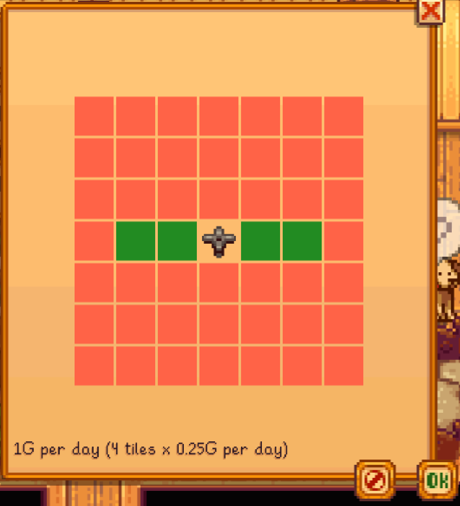
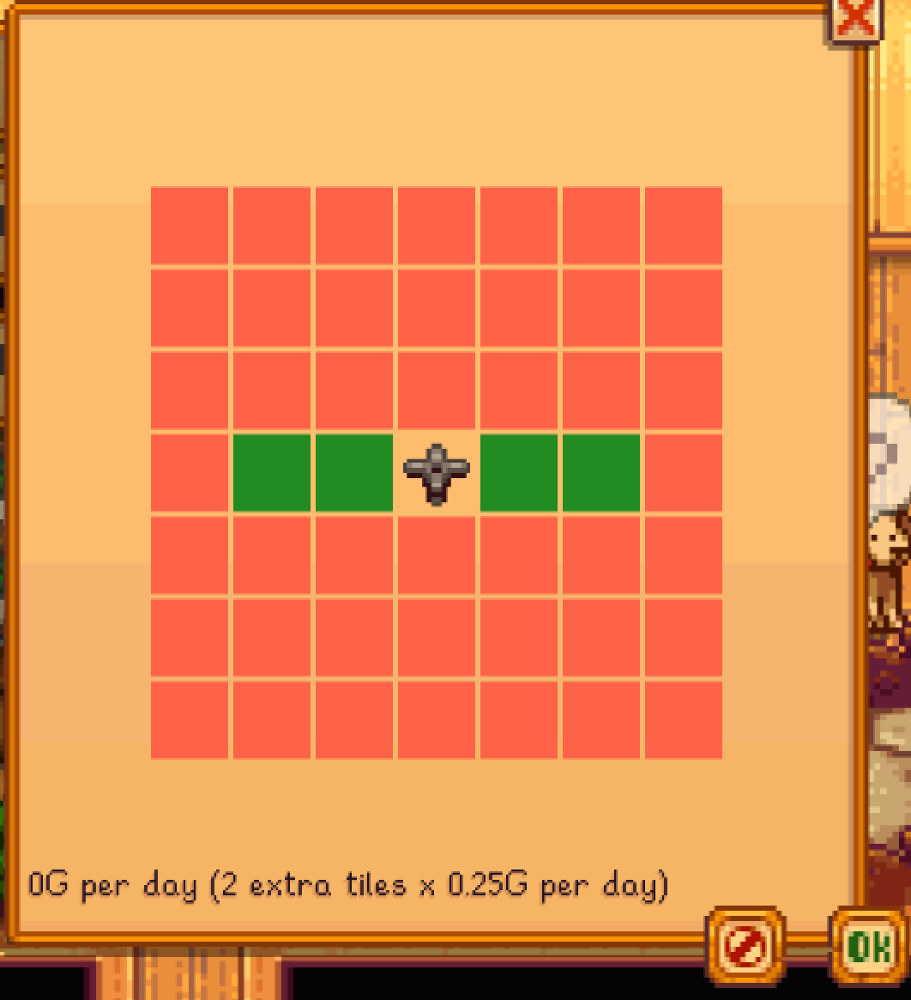
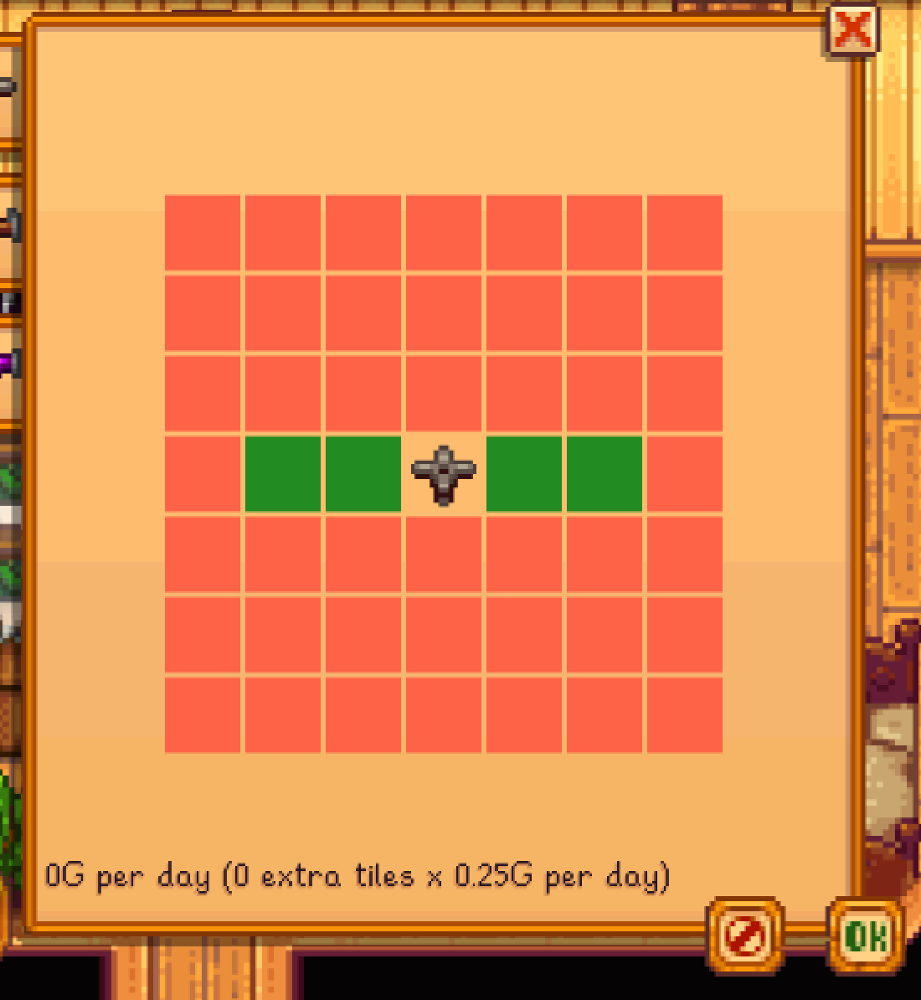

**You're viewing a file in the SMAPI mod dump, which contains a copy of every open-source SMAPI mod
for queries and analysis.**

**This is _not_ the original file, and not necessarily the latest version.**  
**Source repository: https://github.com/gingajamie/smapi-better-sprinklers-plus-encore**

----

# Better Sprinklers Plus
[Nexus](https://www.nexusmods.com/stardewvalley/mods/21624)
 
[Releases](https://github.com/gingajamie/smapi-better-sprinklers-plus-encore/releases/)

A fork of [Better Sprinklers Plus (by JamesCodesThings)](https://www.nexusmods.com/stardewvalley/mods/17767)
which itself is a fork of [Better Sprinklers by Maurício Gomes (Speeder)](http://www.nexusmods.com/stardewvalley/mods/41).

Sprinklers, but better.

Originally by Maurício Gomes (Speeder), subsequently maintained by [JamesCodesThings](https://codesthings.com), updated for SDV 1.6 by gingajamie.


# Contents
- [Features](#features)
- [Install](#install)
- [Configuration](#configuration)
- [Use](#use)
- [Compatibility](#compatibility)
- [Roadmap](#roadmap)
- [Versions](#versions)
- [Motivation](#motivation)
- [Found a bug?](#found-a-bug)

# Features
## Edit Sprinkler Coverage
Pressing `k` (configurable) allows you to change the coverage of each type of sprinkler.

## Activate Sprinklers Manually
Right clicking (configurable) or hitting the "Check" controller button will activate the highlighted sprinkler.

## View Sprinkler/Scarecrow Coverage
Pressing `F3` (configurable) allows you to show the coverage of the highlighted sprinkler.

## Balanced Mode
In balanced mode, the sprinklers you have cost money every day. The amount is configurable, or you can turn it off.

The default, is 0.25G per tile covered per day, rounded to the nearest whole G.

Quality Sprinklers cost half the cost of Normal Sprinklers.

Iridium Sprinklers cost half the cost of Quality Sprinklers.

Pressure Nozzles half the cost of the sprinkler.

> Q: What!? Did you implement bills in my cosy game?
>
> A: Yeah, I did a little. Don't worry though, you can turn them off, change the amount, etc.
> It felt like the most immersive way to balance the mod. The previous balance increased the cost of sprinklers, but that's one-off.
>
> Q: What if I run out of money?
>
> A: Yeah, your sprinklers stop sprinkling.
> Same again, configurable.

# Install
1. [Install the latest version of SMAPI](https://github.com/Pathoschild/SMAPI/releases).
2. Unzip [the mod files](https://www.nexusmods.com/stardewvalley/mods/17767) into your `Mods` folder.
3. Run the game using [SMAPI](https://github.com/Pathoschild/SMAPI/releases).

# Configuration
## Balanced Mode
__Off:__ Sprinklers do not have a daily cost.

__Easy:__ Sprinklers cost 0.1g per tile watered, per day.

__Normal:__ Sprinklers cost 0.25g per tile watered, per day.

__Hard:__ Sprinklers cost 0.5g per tile watered, per day.

__Very Hard:__ Sprinklers cost 1g per tile watered, per day.

## Sprinkler Range
Change this to change the maximum range of a sprinkler type.

## Can't Afford
If you can't afford to run the sprinklers:

__Off:__ the sprinklers run, your wallet is emptied.

__Don't Water:__ the sprinklers don't water your crops.

_note:_ at the moment this does not affect the default spinkler tiles(see the roadmap).

## Default Tiles
The tiles that would be watered by default

__Cost Money:__ The tiles will cost the same as any other tile in balanced mode.



__Are Free:__ The default tiles (in the same position) are free.



__Same Number Are Free:__ The number of tiles that would be watered by default are free.



(x is sprinkler, 1 is tile watered, 0 is tile not watered)
```
00000
11x11
00000
```

## Show Bills Message
__On:__ Every morning you'll see a message for how much your sprinklers cost.

__Off:__ Message is not shown.

## Show Can't Afford Warning
__On:__ If you can't afford to water all your crops one day, you'll get a warning.

__Off:__ Message is not shown.

This one's just for if you want to be warned but don't want the bills message every day.

## Show Placement Coverage
__On:__ The coverage of a sprinkler/scarecrow is shown when placing it.

__Off:__ No coverage is shown.

This is useful if you only want to use Data Layers.

## Sprinkler Cooldown (seconds)

This is used to avoid sprinkler animation overlap when a sprinkler is activated multiple times within quick succesion. Default value of 60 seconds.

## Show Config Key
__Use:__ Changes the hotkey to change sprinkler configuration.

## Show Overlay Key
__Use:__ Changes the hotkey to show coverage overlay.

# Use
## Editing sprinkler coverage
1. Press `K` to show a sprinkler coverage editor
  - This is editable in `config.json`, or using [Generic Mod Config Menu](https://www.nexusmods.com/stardewvalley/mods/5098)
1. Click the squares to change the area a sprinkler waters.
  - The default squares cannot be changed.

## Highlighting coverage
### When placing a sprinkler
- Coverage will be highlighted by default
- This can be switched off in the mod's config.

### Ad-hoc
1. Press F3
2. Point at a sprinkler or scarecrow.

### Alternative
Alternatively, you can use [Data Layers](https://www.nexusmods.com/stardewvalley/mods/1691) to show coverage of sprinklers, scarecrows, and much more.

# Compatibility
Better Sprinklers Plus is compatible with Stardew Valley 1.6+ on Linux/Mac/Windows, both single-player and multiplayer.

If two players have the mod installed in multiplayer, both ranges will apply.

# Versions
## 2.18.0
- Update to `.Net 6`
- Added sprinkler cooldown logic to avoid overlapping of sprinkler animations if a sprinkler is activated in quick succession. Configurable via settings.

# Motivation
A fork of [Better Sprinklers Plus (by JamesCodesThings)](https://www.nexusmods.com/stardewvalley/mods/17767)
which itself is a fork of [Better Sprinklers by Maurício Gomes (Speeder)](http://www.nexusmods.com/stardewvalley/mods/41).

My aim here was to bring the Better Sprinklers Plus fork up-to-date with Stardew Valley 1.6.
This may be a temporary repo whilst awaiting the previous maintainer time to potentially update the existing repo, though they noted they had finished their playthrough which inspired them to work on the Better Sprinklers Plus mod.

Will happily add small features if requested and fix bugs.

# Found a Bug?
Please report it in [Github Issues](https://github.com/gingajamie/smapi-better-sprinklers-plus-encore/issues).
