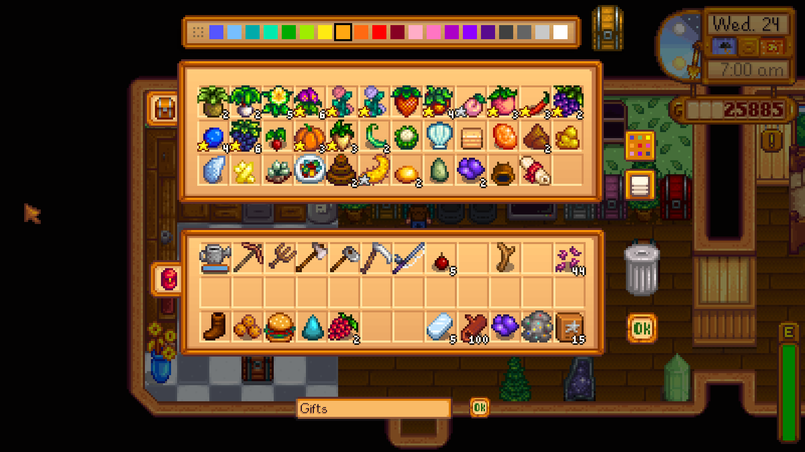

Speeder's Chest Labeling System
===============================
 
This is a fairly simple mod for the game [Stardew Valley](http://stardewvalley.net/), it adds to the game a way to label your chests, and see their names on a hovering tooltip if you pass your mouse pointer over there, the purpose is make organizing things easier.

Visit the [Forum thread](http://community.playstarbound.com/threads/smapi-chest-name-with-mouse-hover-labels.110297/)

Installing
----------

Just unpack the .zip file in the mods folder.

Uninstalling
------------

Just delete the mod files again.
The chests will remain "named" though, but the tooltip won't work, if you want to undo the names, you can remove and put back down the chest, or edit the name back to "Chest" before uninstalling the mod.

Changelog
---------

### 1.6

Moved the label again, so that it fits inside 1366x768 laptop and netbook screens.

### Unnoficial 1.5 update by Mariano Mariscal

Updated to new SMAPI, and to support newer SV version. Moved label from the top of the colour menu.

### 1.5

Fixed (again) the bug of prevent other things from being named, this time it worked...
Updated to SMAPI 0.39.6, now it looks better when zoomed.
Some changes were made to SpeederSDVUIUtils.cs, modders using it should update their mods too.

Credits
-------

Author: Maur&#237;cio Gomes (Speeder) 

Special Thanks: jlee100, for doing a temporary fix to 1.0 until an official 1.1 version could be made. Mariano Mariscal for another non-official update to move the textbox from the top of other UI elements.

License
-------

The license of the project is [GPL3](https://gnu.org/licenses/gpl.html).

Source
------

Mod [source hosted on ](https://gitlab.com/speeder1/ChestNameWithHoverLabel), special thanks to them! (that even provided free support when needed!)

Binary Download Link
--------------------

You can download the compiled mod from [Nexus Mods](http://www.nexusmods.com/stardewvalley/mods/242/?).