**You're viewing a file in the SMAPI mod dump, which contains a copy of every open-source SMAPI mod
for queries and analysis.**

**This is _not_ the original file, and not necessarily the latest version.**  
**Source repository: https://github.com/sergiomadd/StardewValleyMods**

----

Temporary Wiki  

**NEEDS UPDATING!!**

## Contents:
- [Current Features for Beta](#current-features-for-beta)
	- [Pipes](#pipes)
		- [Connectors](#connectors)
		- [Outputs](#outputs)
		- [Inputs](#inputs)
	-  [Supported containers](#supported-containers)
	-  [Supported buildings](#supported-buildings)
	-  [Network Building](#network-building)
	-  [Pipe Signaling](#pipe-signaling)
	-  [Pipe Priorities](#pipe-priorities)
-  [Known Issues](#known-issues)
-  [Planned Features](#planned-features)
-  [See also](#see-also)

---

## Current Features (for Beta):

## Pipes:
- ### Connectors:
	- **Connector Pipe**  
Connector Pipes act as the link between Output and Input pipes.  
They moves items at 2 tiles/1 second  
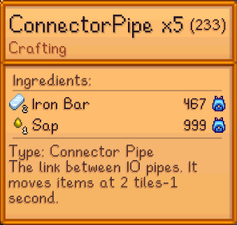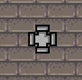  
 

## IOPipes:
- ### Outputs:
	- **Extractor Pipe**  
Extractor Pipes extract items from an adjacent container, at 1 stack/2 seconds.  
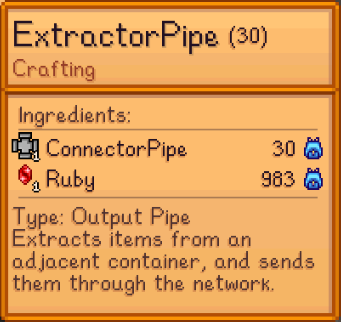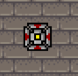   
- ### Inputs:
	- **Inserter Pipe**  
Inserter Pipes insert items into an adjacent container. They do not filter any item.  
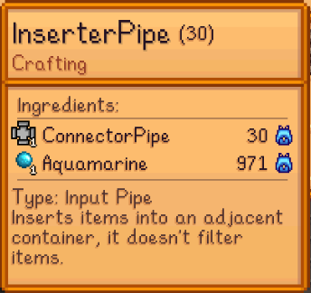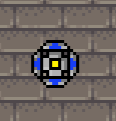  
	- **Polymorphic Pipe**  
Polymorphic Pipes insert items into an adjacent container. They filter items based on the container's current items. If the container is empty, They act like an Inserter Pipe, until 1 item enters the container.  
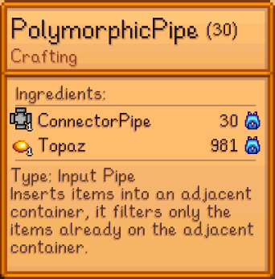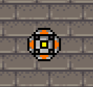  
	- **Filter Pipe**  
Filter Pipes insert items into an adjacent container. They filter items based on the pipe's internal inventory. To open the inventory, simply left click the Filter Pipe like you would with a chest. Then add the items you want filtered. If the internal inventory is empty, they act like an Inserter Pipe, until alteast 1 item is added to the internal inventory.  
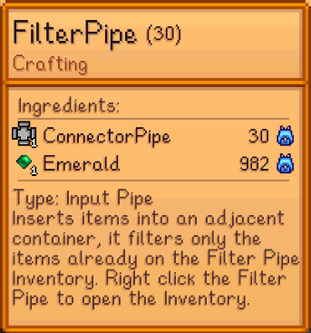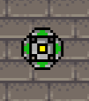  

- ### Supported containers:  
	- **Chest**  
Regular vanilla chests. As you can see below, the items get out of one chest, and enter the other.  
  
  
	- **Junimo Chest**  
Junimo chests work as chests. But as their inventory is linked, you can move items wirelessly.  
  
	- **Mini-Fridge**  
Not yet implmented  
	- **Mini-Shipping Bin**  
Mini-Shipping Bins work the exact same as chests.  

- ### Supported buildings:
	- **Shipping Bin**  
The Shipping Bin doesn't work like a regular chest, but you can insert items into it if an input is adjacent. These items will be shipped at the end of the day. 
Be careful, as you may not be able to get the items back once the get piped in.  Also, as the Shipping Bin has 2 tiles, you can connect 2 inputs to it.  
  

---

## Network Building:
A valid network has to have **at least 1 Output Pipe and 1 Input Pipe**.  
Also for the output to start pumping items, the input has to have a valid adjacent container.  
That said, you can have as many outputs and inputs as you like.  
This is the shortest posibble network, from that, you can extend it as you like.  
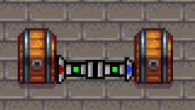  

---

- ### Pipe Signaling: 
- Pipe state is shown through pipe signaling. Each IOPipe can have 3 colors, each corresponding with a state:
	- **Red/Off**:  
	The pipe is locked and wont send/receive items. You can manually turn on or off pipes by clicking on them.  
	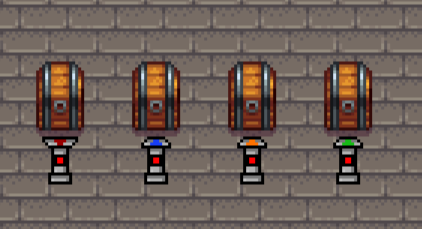 
	- **Green/On**:  
	The pipe is enabled and will send/receive items if possible.  
	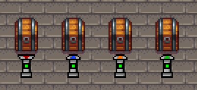
	- **Yellow/Disconnected**:  
	The pipe isn't connected to an adjacent container. Since a container can only have 1 adjacent pipe of each pipe type, you will have to remove all adjacent pipes to the container, and then place the new one. (This will most likely change moving forward).  
	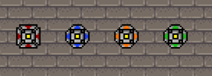  

Connection examples:  
Here, the pipes aren't connected to any container, so they stay yellow.  
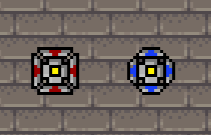  
Then, when a container is added, they turn green.  
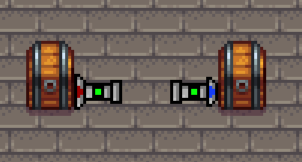  
Finally, there are 2 options. If you place a pipe of the same type, it won't connect to the container. But you can actually place a different pipe type, and it will connect.  
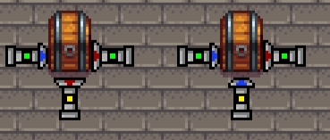  

---

- ### Pipe Priorities:
Items are send to Input pipes based on their priority. The Output pipes will try to send items to the highest priority Inputs first.

| Priority  | Input Type |
| ------------- | ------------- |
| 3  | Filter Pipe  |
| 2  | Polymorphic Pipe  |
| 1  | Inserter Pipe  |

Sorting example video (on YouTube):  
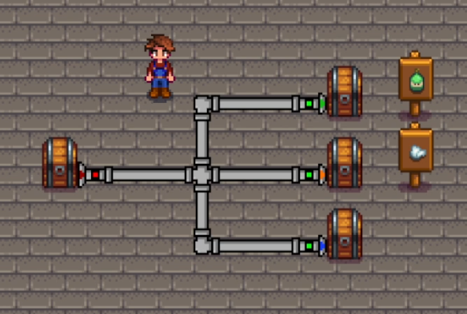  
[Video Link](https://www.youtube.com/watch?v=fsE97re6drE&ab_channel=sergiomadd)  

---

## Planned Features:
**Short term:**
- Extractor Filter Pipe
- More filtering options (category, blacklist, whitelist)
- Pipe connections between locations

**Long Term:**
- Storage Hub: A central storage chest. Like in AE from minecraft.
