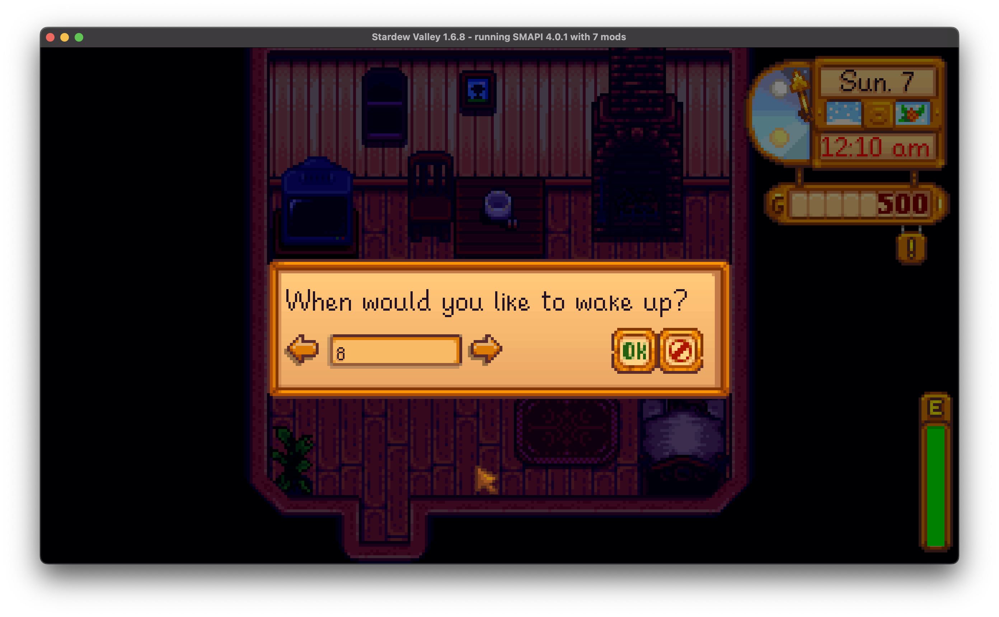

**You're viewing a file in the SMAPI mod dump, which contains a copy of every open-source SMAPI mod
for queries and analysis.**

**This is _not_ the original file, and not necessarily the latest version.**  
**Source repository: https://github.com/calebstein1/CountingSheep**

----

# Counting Sheep

Counting Sheep is a mod for Stardew Valley that adds an alarm clock and a stamina penalty for not getting enough sleep.

In addition to the usual penalty for passing out, this mod causes you start the day with lower stamina if you get fewer than 8 hours of sleep.

When going to bed, you'll be given the opportunity to set your alarm clock, allowing you to balance getting more hours out of the day at the potential expense of a stamina hit from sleep-deprivation.
