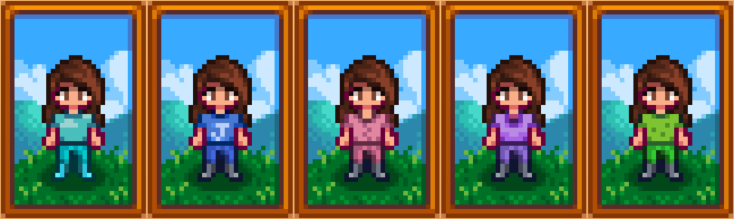

<h1 align="center">
    
</h1>

# Cozy Clothing v1.0.3

> A Stardew Valley mod that adds automatically changes your character's clothing to pajamas when at home.

Releases can be found at the following websites:

- [NexusMods](https://www.nexusmods.com/stardewvalley/mods/5093)
- [Chucklefish](https://community.playstarbound.com/resources/cozy-clothing.5951/)
- [CurseForge](https://www.curseforge.com/stardewvalley/mods/cozy-clothing)
- [ModDrop](https://www.moddrop.com/stardew-valley/mods/755868-cozy-clothing)

## Features

- Character automatically wears pajamas when at home. You can choose which color of pajamas to wear in the Config!

## Installation

1. [Install the latest version of SMAPI](https://smapi.io/).
3. Download this mod and unzip it into Stardew Valley/Mods.
4. Run the game using SMAPI.

## Compatibility

- Works with Stardew Valley 1.4 or later on Linux/Mac/Windows.
- Works in both singleplayer and multiplayer.
- Not compatible with Get Glam mod. Using both mods may lead to unexpected behavior. When this has been fixed, this warning will be removed. Thank you for your patience!

## Config

| Configuration Description                                | Setting Options | Default Setting |
| -------------------------------------------------------- | -------- | -------- |
| PajamaColor | Blue, Water-Blue, Pink, Purple, Green   | Blue |
