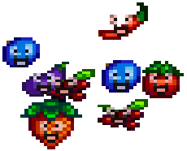
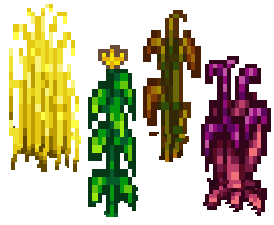
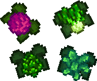
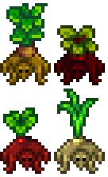
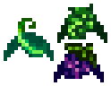
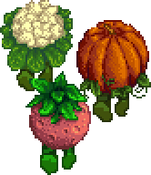
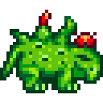
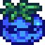

**You're viewing a file in the SMAPI mod dump, which contains a copy of every open-source SMAPI mod
for queries and analysis.**

**This is _not_ the original file, and not necessarily the latest version.**  
**Source repository: https://gitlab.com/kdau/cropbeasts**

----

# Meet the Cropbeasts

[[_TOC_]]

🎶 *Cropbeasts. Meet the Cropbeasts.\
They’re the fruit and veggie family.\
From the town of Pelican,\
They’re a curse upon agronomy.* 🎶

## Common beasts

### Berrybeast

<table>
	<tr>
		<td rowspan="5"></td>
		<th style="text-align: right">Crops:</th><td colspan="3">Blueberry, Cranberries, Eggplant, Hot Pepper, Strawberry, Tomato</td>
	</tr>
	<tr>
		<th style="text-align: right">Hit Points:</th><td>24 – 312</td>
		<th style="text-align: right">Attack:</th><td>5 – 15</td>
	</tr>
	<tr>
		<th style="text-align: right">Speed:</th><td>1 – 4</td>
		<th style="text-align: right">Defense:</th><td>1</td>
	</tr>
	<tr>
		<th style="text-align: right">Special Drops:</th><td colspan="3">—</td>
	</tr>
	<tr>
		<th style="text-align: right">Behaviors:</th><td colspan="3">
			bounces towards the player 
			does cartwheels to speed up or slow down
		</td>
	</tr>
</table>

### Grainbeast

<table>
	<tr>
		<td rowspan="5"></td>
		<th style="text-align: right">Crops:</th><td colspan="3">Amaranth, Corn, Fiber, Unmilled Rice, Wheat</td>
	</tr>
	<tr>
		<th style="text-align: right">Hit Points:</th><td>27 – 351</td>
		<th style="text-align: right">Attack:</th><td>8 – 24</td>
	</tr>
	<tr>
		<th style="text-align: right">Speed:</th><td>2</td>
		<th style="text-align: right">Defense:</th><td>1</td>
	</tr>
	<tr>
		<th style="text-align: right">Special Drops:</th><td colspan="3">seed packet (8% when parrying projectile)</td>
	</tr>
	<tr>
		<th style="text-align: right">Behaviors:</th><td colspan="3">
			keeps its distance and runs away when approached 
			shoots seeds at player in rapid succession 
			in Rice form, waters crops as it passes over them
		</td>
	</tr>
</table>

### Leafbeast

<table>
	<tr>
		<td rowspan="5"></td>
		<th style="text-align: right">Crops:</th><td colspan="3">Artichoke, Bok Choy, Kale, Pineapple, Red Cabbage</td>
	</tr>
	<tr>
		<th style="text-align: right">Hit Points:</th><td>22 – 286</td>
		<th style="text-align: right">Attack:</th><td>6 – 18</td>
	</tr>
	<tr>
		<th style="text-align: right">Speed:</th><td>2</td>
		<th style="text-align: right">Defense:</th><td>1</td>
	</tr>
	<tr>
		<th style="text-align: right">Special Drops:</th><td colspan="3">—</td>
	</tr>
	<tr>
		<th style="text-align: right">Behaviors:</th><td colspan="3">
			flies to player and buzzes around head
		</td>
	</tr>
</table>

### Rootbeast

<table>
	<tr>
		<td rowspan="5"></td>
		<th style="text-align: right">Crops:</th><td colspan="3">Beet, Garlic, Parsnip, Potato, Radish, Rhubarb, Taro Root, Yam</td>
	</tr>
	<tr>
		<th style="text-align: right">Hit Points:</th><td>30 – 390</td>
		<th style="text-align: right">Attack:</th><td>5 – 15</td>
	</tr>
	<tr>
		<th style="text-align: right">Speed:</th><td>2</td>
		<th style="text-align: right">Defense:</th><td>2</td>
	</tr>
	<tr>
		<th style="text-align: right">Special Drops:</th><td colspan="3">—</td>
	</tr>
	<tr>
		<th style="text-align: right">Behaviors:</th><td colspan="3">
			hides in dirt until player approaches 
			scurries away when health is low 
			in Taro Root form, waters crops as it passes over them
		</td>
	</tr>
</table>

### Trellisbeast

<table>
	<tr>
		<td rowspan="5"></td>
		<th style="text-align: right">Crops:</th><td colspan="3">Grape, Green Bean, Hops</td>
	</tr>
	<tr>
		<th style="text-align: right">Hit Points:</th><td>24 – 312</td>
		<th style="text-align: right">Attack:</th><td>6 – 18</td>
	</tr>
	<tr>
		<th style="text-align: right">Speed:</th><td>3</td>
		<th style="text-align: right">Defense:</th><td>1</td>
	</tr>
	<tr>
		<th style="text-align: right">Special Drops:</th><td colspan="3">—</td>
	</tr>
	<tr>
		<th style="text-align: right">Behaviors:</th><td colspan="3">
			swoops at player in repeated volleys
		</td>
	</tr>
</table>

## Rare beasts

### Giant Cropbeast

<table>
	<tr>
		<td rowspan="5"></td>
		<th style="text-align: right">Crops:</th><td colspan="3">Giant Cauliflower, Giant Melon, Giant Pumpkin</td>
	</tr>
	<tr>
		<th style="text-align: right">Hit Points:</th><td>30 – 390</td>
		<th style="text-align: right">Attack:</th><td>15 – 45</td>
	</tr>
	<tr>
		<th style="text-align: right">Speed:</th><td>1</td>
		<th style="text-align: right">Defense:</th><td>4</td>
	</tr>
	<tr>
		<th style="text-align: right">Special Drops:</th><td colspan="3">—</td>
	</tr>
	<tr>
		<th style="text-align: right">Behaviors:</th><td colspan="3">
			walks slowly but can take giant leaps 
			spawns several Berrybeasts when slain
		</td>
	</tr>
</table>

### Ancient Beast

<table>
	<tr>
		<td rowspan="5"></td>
		<th style="text-align: right">Crops:</th><td colspan="3">Ancient Fruit</td>
	</tr>
	<tr>
		<th style="text-align: right">Hit Points:</th><td>35 – 455</td>
		<th style="text-align: right">Attack:</th><td>10 – 30</td>
	</tr>
	<tr>
		<th style="text-align: right">Speed:</th><td>4</td>
		<th style="text-align: right">Defense:</th><td>8</td>
	</tr>
	<tr>
		<th style="text-align: right">Special Drops:</th><td colspan="3">Artifact Trove (5% when slain)</td>
	</tr>
	<tr>
		<th style="text-align: right">Behaviors:</th><td colspan="3">
			floats toward player and stays close 
			can pass through greenhouse walls
		</td>
	</tr>
</table>

### Cactusbeast

<table>
	<tr>
		<td rowspan="5"></td>
		<th style="text-align: right">Crops:</th><td colspan="3">Cactus Fruit</td>
	</tr>
	<tr>
		<th style="text-align: right">Hit Points:</th><td>32 – 416</td>
		<th style="text-align: right">Attack:</th><td>12 – 36</td>
	</tr>
	<tr>
		<th style="text-align: right">Speed:</th><td>2</td>
		<th style="text-align: right">Defense:</th><td>5</td>
	</tr>
	<tr>
		<th style="text-align: right">Special Drops:</th><td colspan="3">Iridium Bar (2% when slain)</td>
	</tr>
	<tr>
		<th style="text-align: right">Behaviors:</th><td colspan="3">
			breathes Sandblast attack that gets in player's eyes 
			hard, prickly exterior deals back the damage it takes
		</td>
	</tr>
</table>

### Coffeebeast

<table>
	<tr>
		<td rowspan="5"></td>
		<th style="text-align: right">Crops:</th><td colspan="3">Coffee Bean</td>
	</tr>
	<tr>
		<th style="text-align: right">Hit Points:</th><td>18 – 234</td>
		<th style="text-align: right">Attack:</th><td>4 – 12</td>
	</tr>
	<tr>
		<th style="text-align: right">Speed:</th><td>3</td>
		<th style="text-align: right">Defense:</th><td>2</td>
	</tr>
	<tr>
		<th style="text-align: right">Special Drops:</th><td colspan="3">Gold Bar (1% when slain)</td>
	</tr>
	<tr>
		<th style="text-align: right">Behaviors:</th><td colspan="3">
			hops around in packs 
			runs away when attacked
		</td>
	</tr>
</table>

### Qi Beast

Spoiler for late-game 1.5 content

<table>
	<tr>
		<td rowspan="5"></td>
		<th style="text-align: right">Crops:</th><td colspan="3">Qi Bean</td>
	</tr>
	<tr>
		<th style="text-align: right">Hit Points:</th><td>24 – 312</td>
		<th style="text-align: right">Attack:</th><td>6 – 18</td>
	</tr>
	<tr>
		<th style="text-align: right">Speed:</th><td>2 – 5</td>
		<th style="text-align: right">Defense:</th><td>3</td>
	</tr>
	<tr>
		<th style="text-align: right">Special Drops:</th><td colspan="3">Qi Gem (20% when slain)</td>
	</tr>
	<tr>
		<th style="text-align: right">Behaviors:</th><td colspan="3">
			bounces towards the player 
			does cartwheels to speed up or slow down
		</td>
	</tr>
</table>

### Starbeast

<table>
	<tr>
		<td rowspan="5"></td>
		<th style="text-align: right">Crops:</th><td colspan="3">Starfruit</td>
	</tr>
	<tr>
		<th style="text-align: right">Hit Points:</th><td>25 – 325</td>
		<th style="text-align: right">Attack:</th><td>10 – 30</td>
	</tr>
	<tr>
		<th style="text-align: right">Speed:</th><td>3</td>
		<th style="text-align: right">Defense:</th><td>3</td>
	</tr>
	<tr>
		<th style="text-align: right">Special Drops:</th><td colspan="3">Solar Essence (20% when parrying projectile) Prismatic Shard (1% when slain)</td>
	</tr>
	<tr>
		<th style="text-align: right">Behaviors:</th><td colspan="3">
			floats at middle distance from player 
			fires energetic Starbursts at player
		</td>
	</tr>
</table>

<!-- markdownlint-disable-file no-inline-html -->
