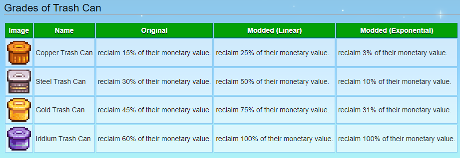

**You're viewing a file in the SMAPI mod dump, which contains a copy of every open-source SMAPI mod
for queries and analysis.**

**This is _not_ the original file, and not necessarily the latest version.**  
**Source repository: https://github.com/ShivaGuy/StardewMods**

----

# Better Trash Can

When trashing an item, you reclaim upto 100% of the value. It changes the default reclamation percentages for Trash Cans progression and allows two configurations for the progression, "Linear" or "Exponential". See the reference table below.

## Reference Table

This mod uses Harmony to patch the reclaimation price calculation in the game and is not compatible with the mods that do the same.
