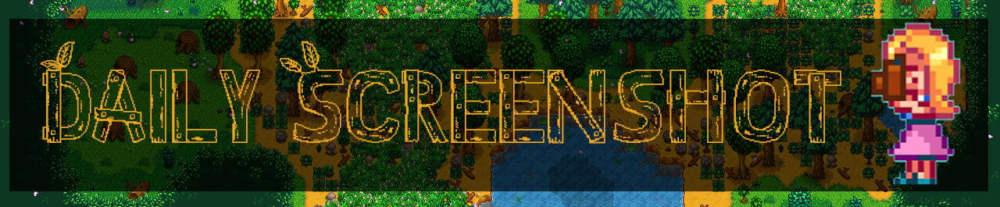

**You're viewing a file in the SMAPI mod dump, which contains a copy of every open-source SMAPI mod
for queries and analysis.**

**This is _not_ the original file, and not necessarily the latest version.**  
**Source repository: https://github.com/CompSciLauren/stardew-valley-daily-screenshot-mod**

----

<!-- markdownlint-disable MD041 -->

<!-- markdownlint-enable MD041 -->
# Daily Screenshot v3.1.0

> A Stardew Valley mod that automatically takes a screenshot of your entire farm at the start of each day.

Releases can be found at the following websites:

- [NexusMods](https://www.nexusmods.com/stardewvalley/mods/4779)
- [Chucklefish](https://community.playstarbound.com/resources/daily-screenshot.5907/)
- [CurseForge](https://www.curseforge.com/stardewvalley/mods/daily-screenshot)
- [ModDrop](https://www.moddrop.com/stardew-valley/mods/677025-daily-screenshot)

For Android users, releases can be found at the following websites:
- [NexusMods](https://www.nexusmods.com/stardewvalley/mods/4779)
- [Chucklefish](https://community.playstarbound.com/resources/daily-screenshot-android.5955/)

## Features

- One screenshot is automatically taken of your entire farm every day as soon as you leave your house.
- Super easy to gather screenshots to create a GIF that shows how your farm changes over time! GIF makers can be found online, such as [ezgif GIF maker](https://ezgif.com/maker).  Here is an [example](./Images/example1.gif).
- Customizable! Change any number of default settings based on your preferences. Examples:
    - What time of day to take screenshot.
    - How often to take screenshot (daily, weekly, monthly, etc).
    - Keyboard shortcut that takes screenshot when pressed (set to "None" by default).
    - What weather conditions are allowed. It is common to allow all except rainy/stormy days, but default option allows all weather.
    - Add multiple sets of rules (example, 1 set for daily automatic screenshots, 1 for manual key-press screenshots).
- Compatible with the ["Generic Mod Config Menu" mod](https://www.nexusmods.com/stardewvalley/mods/5098), which adds an in-game UI for easily updating the config.
- Screenshots are sent to your StardewValley/Screenshots folder, with each save file getting its own "FarmName-Screenshots" folder. Screenshots between multiple save files will not get mixed up.
- Easily access the screenshots in-game by scrolling to the bottom of the "Options" tab in the menu and clicking the "Open Destination Folder" button.
- Keeps the screenshots in the correct order to make creating the GIF easier. This is achieved by naming each screenshot with a "year-season-day.png" numerical format. For example, on Year 1, Winter, Day 3, the screenshot would be named "01-04-03.png".

## Installation

1. [Install the latest version of SMAPI](https://smapi.io/).
2. Download [Generic Mod Config Menu](https://www.nexusmods.com/stardewvalley/mods/5098) and unzip it into Stardew Valley/Mods. (recommended, but optional)
3. Download this mod and unzip it into Stardew Valley/Mods.
4. Run the game using SMAPI.

## Compatibility

- Works with Stardew Valley 1.4 or later on Linux/Mac/Windows.
- Works in both single player and multiplayer.
- No known mod conflicts.
- Works with the [Generic Mod Config Menu](https://www.nexusmods.com/stardewvalley/mods/5098).

## Configuration File

### The file structure

You can add as many rules as you would like. The config file looks like:

``` json
{
  "AuditoryEffects": true,
  "VisualEffects": true,
  "ScreenshotNotifications": true,
  "SnapshotRules": [
    {
      "Name": "Daily Farm Picture",
      "ZoomLevel": 0.25,
      "Directory": "Default",
      "FileName": "Default",
      "Trigger": {
        "Days": "Daily",
        "Weather": "Any",
        "Location": "Farm",
        "Key": "None",
        "StartTime": 600,
        "EndTime": 2600
      }
    },
    {
      "Name": "Keypress Picture",
      "ZoomLevel": 1.0,
      "Directory": "/home/hailey/SDV",
      "FileName": "None",
      "Trigger": {
        "Days": "Daily",
        "Weather": "Any",
        "Location": "Any",
        "Key": "P",
        "StartTime": 600,
        "EndTime": 2600
      }
    }
  ]
}
```

Note: Older configuration files (from prior to v2.0) will automatically be upgraded to the newer format when you upgrade to v2.0 or later.

For more examples of ways to customize the config.json file, see the [Examples](https://github.com/CompSciLauren/stardew-valley-daily-screenshot-mod/wiki/Examples-for-config.json-file) from the GitHub Wiki!

### Triggers

Triggers are things that must happen for a screenshot to take place. All of the conditions must be true. Automatic screenshots (without a key press) happen at most once a day. Manual screenshots (with a key press) can be taken multiple times.

<!-- markdownlint-disable MD033 -->
| Setting | Description | Type | Default Setting |
| --------|------- | -------- | -------- |
| AuditoryEffects | Global setting (applies to all screenshots). Whether a camera sound plays whenever a screenshot is taken. | bool | true |
| VisualEffects |  Global setting (applies to all screenshots). Whether the screen flashes whenever a screenshot is taken. | bool | true |
| ScreenshotNotifications | Global setting (applies to all screenshots). Whether a notification is displayed whenever a screenshot is taken. | bool | true |
| Name | What to show when taking a picture.  Rules without a name will be given a name automatically. | string | Unnamed Rule # |
| ZoomLevel | How should the picture be scaled.  Any number between 0.01 and 1.0.  The smaller the number, the smaller the picture (smaller pictures take less disk space). | float | 0.25 |
| Directory | Where to save the picture.<BR/><BR/>Default or empty means the standard Startdew Valley screenshot directory.<BR/><BR/>**Note: Make sure to use a double backslash on Windows.** | string | Default |
| FileName | A combination of values for the filename, separated by commas.<BR/><BR/>Possible values are: None, Date, FarmName, GameID, Location, Weather, PlayerName, Time, UniqueID.<BR/><BR/>Will follow the pattern: {FarmName}-{GameID}/{Location}/{Weather}/{Player Name}-{Date}-{Time}-{Unique ID} | enum | Date, FarmName, GameID, Location |
| Days | A combination of values for the days and seasons to take a screenshot.<br/><br/>Possible values are: Day_1 .. Day_28, Mondays, Tuesdays, Wednesdays, Thursdays, Fridays, Saturdays, Sundays, FirstDayOfTheMonth, LastDayOfTheMonth, Spring, Summer, Fall, Winter, AnySeason, AnyDay, Daily.<BR/><BR/>**Note: It is important if not using the daily value to specify season(s) and day(s) or a picture will not be taken.**<BR/><BR/>Example: To take a picture on the 15th of fall use Day_15, Fall. | enum | Daily |
| Weather| A combination of values for the weather.<BR/><BR/>Possible values are: Sunny, Rainy, Windy, Stormy, Snowy, Any. | enum | Any |
| Location | A combination of locations to take a picture.  Picture will be taken when going to one of these locations.<BR/><BR/>Possible values are: Farm, Farmhouse, Greenhouse, Beach, FarmCave, Cellar, Desert, Museum, CommunityCenter, Town, Mountain, Mine, MineShaft, IslandWest, IslandFarmhouse, IslandFieldOffice, Unknown, Any. <BR/><BR/>**Note: Unknown includes any locations not listed above.** | enum | Any |
| Key | Key press to look for to take a picture.  If set the picture will be taken on demand and not automatically.<BR/><BR/>Possible values: [List of possible keybindings](https://stardewvalleywiki.com/Modding:Player_Guide/Key_Bindings) | enum | None |
| StartTime | Earliest point at which to take the picture.  The time cannot be more than EndTime and must be less than 600.  Must be an increment of 10. | int | 600 |
| EndTime | Last point at which to take the picture. The time cannot be less than StartTime and cannot be more than 2600. Must be an increment of 10. | int | 2600 |
<!-- markdownlint-enable MD033 -->

## Contributors

Thank you so much to everyone who has contributed to this mod!

<!-- readme: collaborators,contributors -start -->
<table>
<tr>
    <td align="center">
        <a href="https://github.com/CompSciLauren">
            
            <br />
            <sub><b>Lauren Vu</b></sub>
        </a>
    </td>
    <td align="center">
        <a href="https://github.com/kins-dev">
            
            <br />
            <sub><b>Scott Atkins</b></sub>
        </a>
    </td>
    <td align="center">
        <a href="https://github.com/dv297">
            
            <br />
            <sub><b>Daniel Vu</b></sub>
        </a>
    </td>
    <td align="center">
        <a href="https://github.com/atravita-mods">
            
            <br />
            <sub><b>Atravita-Mods</b></sub>
        </a>
    </td>
    <td align="center">
        <a href="https://github.com/f3wer">
            
            <br />
            <sub><b>F3wer</b></sub>
        </a>
    </td>
    <td align="center">
        <a href="https://github.com/vahtos">
            
            <br />
            <sub><b>Glen Adams</b></sub>
        </a>
    </td></tr>
</table>
<!-- readme: collaborators,contributors -end -->

If you're interested in contributing, please see [Contributing.md](./CONTRIBUTING.md). Thanks!
