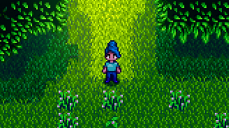

**You're viewing a file in the SMAPI mod dump, which contains a copy of every open-source SMAPI mod
for queries and analysis.**

**This is _not_ the original file, and not necessarily the latest version.**  
**Source repository: https://github.com/maxvollmer/DeepWoodsMod**

----

#  DeepWoods

A mod for Stardew Valley that adds a procedurally generated infinite forest with secrets to discover, difficult challenges to overcome, and vast layers of levels to explore.

---

[Back to Main README](README.md)

---

### Contributing

#### Build the Mod

**You should be familiar with SMAPI modding. If not, please start [here](https://stardewvalleywiki.com/Modding:Modder_Guide/Get_Started) first.**

 - Clone the repo
 - Open the project in Visual Studio 2022 or up
 - Make sure the NuGet packages are installed
 - You should be ready to go

---
#### General

Help with code is always very welcome.

Before you dive into the code to tackle a bug or implement a feature, please join my Discord Server [Max Makes Mods](https://discord.gg/jujwEGf62K) and talk to me, so we won't accidentally work on the same issue in parallel.

---
#### Coding Style

TODO

---
#### Issues & Priorities

TODO

