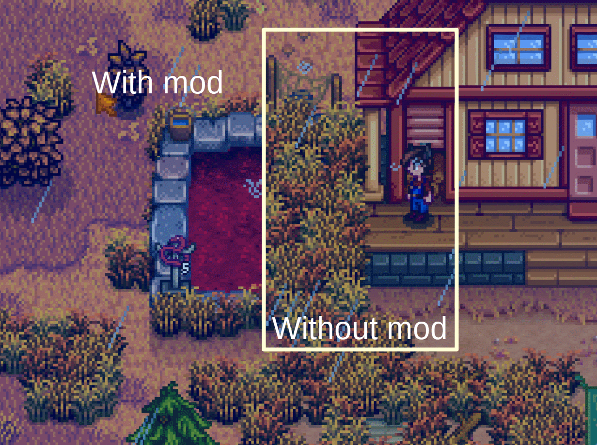

**You're viewing a file in the SMAPI mod dump, which contains a copy of every open-source SMAPI mod
for queries and analysis.**

**This is _not_ the original file, and not necessarily the latest version.**  
**Source repository: https://github.com/atravita-mods/DrawFishPondsOverGrass**

----

Draw Fish Ponds Over Grass
=================================

This mod causes the fish pond to be drawn over any grass placed under it.

## Install

1. Install the latest version of [SMAPI](https://smapi.io).
2. Download this mod and unzip it into `Stardew Valley/Mods`.
3. Run the game using SMAPI.

## Uninstall
Simply delete the mod from your Mods directory.

## Compatibility

* Works with Stardew Valley 1.5.6 on Linux/macOS/Windows.
* Works in single player, multiplayer, and split-screen mode. Should be fine if installed for one player only.
* Should be compatible with most other mods. Does not, however, affect the layer depth fish wells draw at. Those will still probably be under grass.

## See also

[Changelog](DrawFishPondsOverGrass/docs/Changelog.MD)
