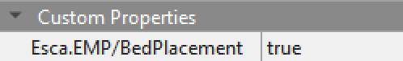
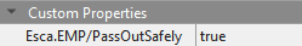
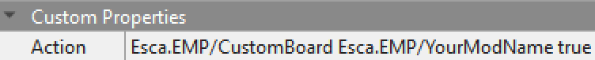
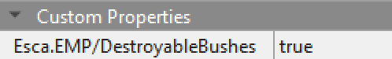
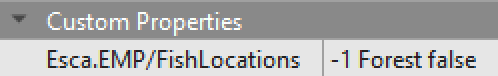
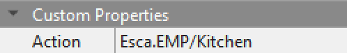
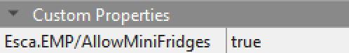
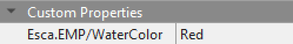

**You're viewing a file in the SMAPI mod dump, which contains a copy of every open-source SMAPI mod
for queries and analysis.**

**This is _not_ the original file, and not necessarily the latest version.**  
**Source repository: https://github.com/Esca-MMC/EscasModdingPlugins**

----

# EMP Modding Guide
This guide explains how to use features from Esca's Modding Plugins (EMP) in other mods for Stardew Valley.

See [the main readme](readme.md) for other information about EMP.

## Contents
* [Bed Placement](#bed-placement)
  * [Pass Out Safely](#pass-out-safely)
* [Content Patcher Tokens](#content-patcher-tokens)
  * [Game State Query](#game-state-query)
  * [Player Stats](#player-stats)
* [Custom Order Boards](#custom-order-boards)
* [Destroyable Bushes](#destroyable-bushes)
* [Fish Locations](#fish-locations)
  * [Using tile properties](#using-tile-properties)
  * [Using the data asset](#using-the-data-asset)
* [Kitchen Features](#kitchen-features)
  * [Allow Mini-Fridges](#allow-mini-fridges)
* [Water Color](#water-color)

## Bed Placement
This feature allows players to place moveable (furniture) beds at additional locations.

To enable bed placement at a location, add the map property `Esca.EMP/BedPlacement` and set its value to `true`:



### Pass Out Safely
This feature prevents certain penalties if players pass out from exhaustion (stamina loss) at specified locations, similar to when players pass out inside the farmhouse.

Note that this specifically prevents money loss and receiving a letter about being rescued by an NPC; it does not prevent reduced stamina the next morning.

To enable this feature at a location, add the map property `Esca.EMP/PassOutSafely` and set its value to `true`:



## Content Patcher Tokens
EMP adds the following custom tokens to Content Patcher. To enable them, do **one** of the following:

A) Add EMP as a dependency in your mod's "manifest.json" file: `"Dependencies": [{"UniqueID": "Esca.EMP"}]`

B) Whenever you use a token from EMP, add this "When" condition: `"HasMod": "Esca.EMP"`

### Game State Query
The `Esca.EMP/GameStateQuery` token can be used to check a [game state query (GSQ)](https://stardewvalleywiki.com/Modding:Game_state_queries) in Content Patcher. It returns either "True" or "False". It's only active while a save is fully loaded.

Note that this token uses the same update rates as other tokens. Its value will only change at the specified update rate for your patch (at the start of each day, by default). GSQs might also be slightly slower than other tokens, so if another token can achieve the same goal, use that instead.

Format example:

```js
{
  "Format": "2.0.0",
  "Changes": [
    {
      "LogName": "Edit object sprites while the Night Market is open",
      "Action": "EditImage",
      "Target": "Maps/springobjects",
      "FromFile": "assets/My_Edited_SpringObjects.png",
      "When": {
        "Esca.EMP/GameStateQuery: IS_PASSIVE_FESTIVAL_OPEN NightMarket": "true"
      },
      "Update": "OnTimeChange"
    }
  ]
}
```

### Player Stats
The `Esca.EMP/PlayerStat` token can be used to check certain statistics about the local player. It returns the current number of whichever stat you input.

Note that this token only checks stats for the current local player. Due to technical limitations, it can't check other players' stats in multiplayer.

For a list of stats tracked by the base game, check the "PLAYER_STAT" description on [this wiki page](https://stardewvalleywiki.com/Modding:Game_state_queries#Player_info_.26_progress). Mods can also add custom stats with C#, [trigger actions](https://stardewvalleywiki.com/Modding:Trigger_actions), etc.

Format example:

```js
{
  "Format": "2.0.0",
  "Changes": [
    {
      "LogName": "Make Parsnip Seeds display the player's total footstep count in their description",
      "Action": "EditData",
      "Target": "Data/Objects",
      "Fields": {
        "472": {
          "Description": "Steps Taken: {{Esca.EMP/PlayerStat: stepsTaken}}"
        }
      },
      "Update": "OnTimeChange"
    }
  ]
}
```

## Custom Order Boards
This feature allows mods to add new Special Orders boards that only display orders from a custom category ("OrderType"). See the wiki's guide to the [Data/SpecialOrders](https://stardewvalleywiki.com/Modding:Special_orders) asset for information about creating special orders.

EMP adds a new value for the `Buildings`-layer `Action` tile property: `Esca.EMP/CustomBoard <OrderType>`

Tiles with this `Action` property value will open the Special Orders board and display random available orders with the specified "OrderType".

The order type must start with "Esca.EMP/". For example, you could add new special orders set to  `"OrderType": "Esca.EMP/YourModName"` or `"OrderType": "Esca.EMP/YourModName/CropOrders"`

Adding `true` at the end of the tile property's value will display a floating "!" icon when new special orders are available. If your board takes up more than one tile, you should generally use "true" only on a single tile (e.g. the middle of the board).

Below is an example of a tile that opens a Special Orders board with type "Esca.EMP/YourModName" and displays a "!" indicator:



See the Stardew Valley Wiki's section on [tile properties](https://stardewvalleywiki.com/Modding:Maps#Tile_properties_2) for more information about `Action` tile properties. Note that this property must be on the `Buildings` layer, and a tile must exist on that layer to give it properties.

* **This feature was commissioned by Lumina/Lumisteria!**

## Destroyable Bushes
This feature allows players to destroy bushes at specific locations or tiles.

Players must use an axe that has been upgraded at least once (Copper Axe or better) to destroy bushes. Destroyed bushes will not regrow; players can use mods such as [Destroyable Bushes](https://www.nexusmods.com/stardewvalley/mods/6304) or [Reset Terrain Features](https://www.nexusmods.com/stardewvalley/mods/4715) for more control over this.

To enable bush destruction at a location or tile, use the map/tile property `Esca.EMP/DestroyableBushes` and set its value to `true`.

Note that if the location and tile both have this property, the tile property will be used. For example, you can set the map property to `true` and a tile property to `false`; this will allow all bushes at the location to be destroyed except on that specific tile.



## Fish Locations
This feature allows players to catch different groups of fish at a single in-game location (a.k.a. map). It gives mods a simple way to control which fish are used from the [Data/Locations](https://stardewvalleywiki.com/Modding:Location_data) asset. It can also control what crab pots will catch from the [Data/Fish](https://stardewvalleywiki.com/Modding:Fish_data) asset (e.g. ocean, freshwater, or custom types).

Mods can use this feature with two different methods: editing a data asset or using tile properties. See each section below for more information.

The asset has higher priority, so if both the asset and tile property are used for the same tile, the asset's settings will be used.

### Using tile properties
Fish locations can be controlled with this `Back`-layer tile property: `Esca.EMP/FishLocations`

The property's value uses this format: `<UseLocation> [UseTile] [UseCrabPotTypes]`

Field | Value | Example | Required? | Description
------|-------|---------|-----------|------------
UseLocation | A location name or "null" | `Mountain` | Required | Fish caught here will come from this location's data. If the word "null" is used, the location won't be changed. Refer to the keys (location names) in Data/Locations, but note that every farm type uses the name "Farm" in-game.
UseTile | X and Y integers | `50 20` | Optional | Fish caught here will come from this tile's data instead. In some cases, this can be used to control which fish area is used in Data/Locations.
UseCrabPotTypes | "freshwater", "ocean", or custom crab types | `ocean` | Optional | **These names are case-sensitive.** Crab pots at this tile will catch any "trap" results with these type names in Data/Fish. Stardew's official types are "freshwater" and "ocean". Multiple types can be used, separated by spaces.

Below is an example tile property where fish will be caught from the Forest's pond, and pots will catch "freshwater" results: `Forest 30 30 freshwater`



### Using the data asset
EMP adds this data asset to Stardew: `"Mods/Esca.EMP/FishLocations"`

The asset can be edited with Content Patcher's "EditData" action like any other data asset. SMAPI (C#) mods can also edit the asset with "IAssetEditor" methods.

Below is an example content.json file for a Content Patcher mod. This example changes some areas of the Farm to catch fish from the Forest's pond, and crab pots there will catch "freshwater" results.
```js
{
  "Format": "2.0.0",
  "Changes": [
    {
      "Action": "EditData",
      "Target": "Mods/Esca.EMP/FishLocations",
      "Entries": {
        "YourName.ExampleMod 1": {  /* give the entry a unique key */
          "Locations": [ "Farm" ],    /* this entry affects the farm */
          "TileAreas": [
            {"X":0, "Y":0, "Width": 50, "Height": 50}, /* this entry affects tiles 0,0 - 49,49 */
            {"X":80, "Y":90, "Width": 2, "Height": 4}  /* this entry affects tiles 80,90 - 81,93 */
          ],
          "UseLocation": "Forest",  /* use fish from the "Forest" data in Data/Locations */
          "UseTile": {"X": 30, "Y": 30}, /* use fish from this tile, which is in the forest's lake */
          "UseCrabPotTypes": ["freshwater"], /* use crabs from the freshwater category in Data/Fish */
        }
      }
    }
  ]
}
```

Each entry in this asset can include the following fields:

Field | Value | Example | Required? | Description
------|-------|---------|-----------|------------
(entry key) | Any unique string | `"YourName.ExampleMod 1"` | Required | A unique key for this entry. Including your mod's [UniqueID](https://www.stardewvalleywiki.com/Modding:Modder_Guide/APIs/Manifest) is recommended.
Locations | A list of location names | `["Farm", "BusStop"]` | Required | A list of locations (maps) this entry will affect. Refer to the keys (location names) in Data/Locations, but note that every farm type uses the name "Farm" in-game.
TileAreas | A list of tile areas | `[ {"X":0, "Y":0, "Width":999, "Height":999} ]` | Required | A list of tile areas this entry will affect. The earlier example will affect the entire map.
UseLocation | A location name | `"Mountain"` | Optional | Fish caught here will come from this location's data. Refer to the keys (location names) in Data/Locations.
UseTile | X and Y integers | `{"X": 50, "Y": 20}` | Optional | Fish caught here will come from this tile's data instead. In some cases, this can be used to control which fish area is used in Data/Locations.
UseCrabPotTypes | A list of crab type names | `ocean` | Optional | **These names are case-sensitive.** Crab pots at this tile will catch any "trap" results with these type names in Data/Fish. Stardew's official types are "freshwater" and "ocean".
Priority | Any integer | `0` | Optional | If a tile is affected by more than one entry, the entry will the highest priority will be used. 0 if not provided.

## Kitchen Features
These features allow mods to add functional kitchens to locations other than the farmhouse.

The main feature is a new value for the `Buildings`-layer `Action` tile property: `Esca.EMP/CustomKitchen`

Tiles with this `Action` property value will open the cooking menu, similar to the stove in an upgraded farmhouse. This works at any location and will use ingredients in the player's inventory, [Mini-Fridges](https://stardewvalleywiki.com/Mini-Fridge) at the same location, and modded chests with `fridge` set to `true`.

Below is an example of how to use this tile property: `Action` `Esca.EMP/Kitchen`



See the Stardew Valley Wiki's section on [tile properties](https://stardewvalleywiki.com/Modding:Maps#Tile_properties_2) for more information about `Action` tile properties. Note that this property must be on the `Buildings` layer, and a tile must exist on that layer to give it properties.

### Allow Mini Fridges
This feature allows players to place [Mini-Fridges](https://stardewvalleywiki.com/Mini-Fridge) in locations other than the farmhouse, which can make it easier to use the cooking menu.

To enable mini-fridge placement at a location, add the map property `Esca.EMP/AllowMiniFridges` and set its value to `true`:



## Water Color
This feature allows mods to change the color of water at a location.

To use this feature at a location, add the map property `Esca.EMP/WaterColor` and give it one of the following values:

* The name of a color from [C#'s KnownColor list](https://docs.microsoft.com/en-us/dotnet/api/system.drawing.knowncolor). Example: `Esca.EMP/WaterColor` `Red`
* RGB values from 0 to 255, separated by spaces. Example: `Esca.EMP/WaterColor` `255 0 0`
* RGBA values from 0 to 255, separated by spaces. Example: `Esca.EMP/WaterColor` `255 0 0 255`

