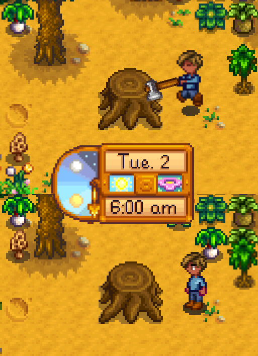
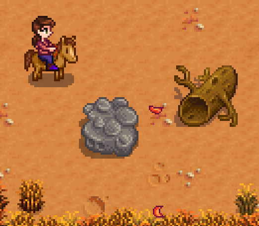
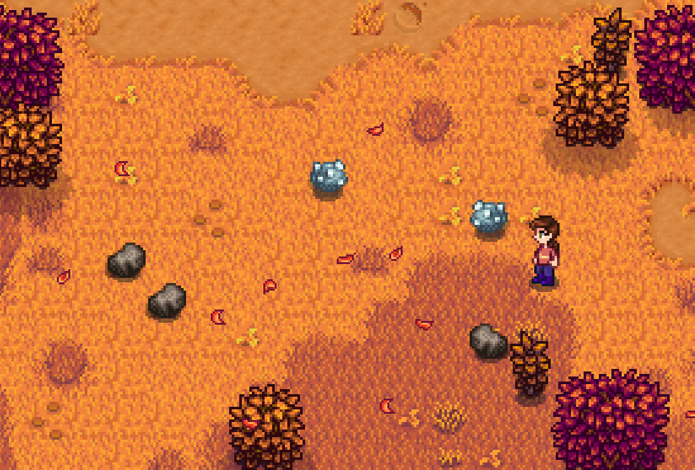
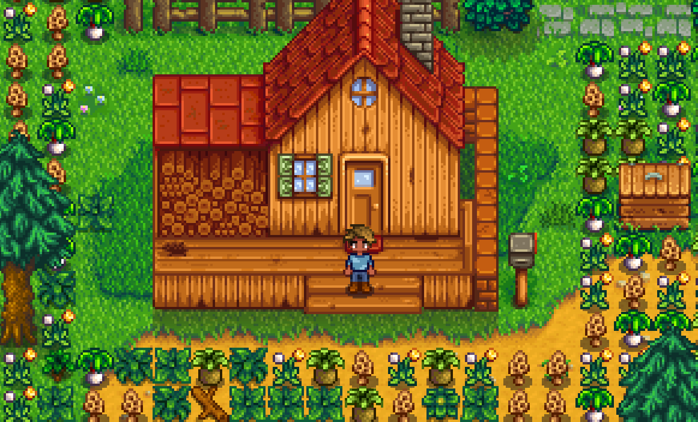

# Farm Type Manager
This mod allows you to customize the features from Stardew Valley's different farm maps. It currently supports spawning ore and forageable plants on any map in the game, and spawning large objects (stumps, boulders, meteorites, etc) on the farm itself. You can configure the number of objects spawned per day, which areas or terrain types they can spawn on, the chances of spawning each object type, and more.

## Contents
* [Installation](#installation)
* [Setup](#setup)
* [Examples](#examples)
* [Commands](#commands)
* [Settings](#settings)
    * [Basic Settings](#basic-settings)
    * [Forage Spawn Settings](#forage-spawn-settings)
    * [Large Object Spawn Settings](#large-object-spawn-settings)
    * [Ore Spawn Settings](#ore-spawn-settings)
    * [Mod Settings](#mod-settings)

## Installation
1. **Install the latest version of [SMAPI](https://smapi.io/).**
2. **Download FarmTypeManager** from [the Releases page on GitHub](https://github.com/Esca-MMC/FarmTypeManager/releases) or from [Nexus Mods](https://www.nexusmods.com/stardewvalley/mods/3231/).
3. **Unzip FarmTypeManager** into your `Stardew Valley/Mods` folder.

## Setup
1. **Run the game** using SMAPI.
2. **Load the farm** you want to customize, or create a new character and progress past the game's intro. This will create a configuration file for your character in the `Stardew Valley/Mods/FarmTypeManager/data` folder.
3. **Open the .json file** with your character's name on it. It's a text file, so any text editor should work.
4. **Customize the file's settings** (see [Examples](#examples) or [Settings](#settings)) and save your changes.
5. **Exit your farm and reload it**, or progress to the next in-game day. The mod's settings should now be active.
 
Note: This mod will be disabled in multiplayer when you play as a farmhand (i.e. join a game hosted by someone else). Its console commands will still function, though.

## Examples
Below are a few examples of changes you can make to your character's configuration file, spawning various things on your farm or the other in-game maps.

### Spawn forage and respawn stumps on the farm
```
"ForageSpawnEnabled": true,
"LargeObjectSpawnEnabled": true,
```


### Randomly spawn new logs and boulders on the farm
```
"LargeObjectSpawnEnabled": true,
```
```
"Large_Object_Spawn_Settings": {
    "Areas": [
      {
        "ObjectTypes": [
          "Log", "Boulder"
        ],
        "FindExistingObjectLocations": false,
        "PercentExtraSpawnsPerSkillLevel": 0,
        "RelatedSkill": "Foraging",
        "MapName": "Farm",
        "MinimumSpawnsPerDay": 0,
        "MaximumSpawnsPerDay": 2,
        "AutoSpawnTerrainTypes": ["Grass", "Dirt", "Diggable"],
        "IncludeAreas": [],
        "ExcludeAreas": []
      }
```


### Spawn ore in a specific area of Cindersap Forest
```
"OreSpawnEnabled": true,
```
```
"Ore_Spawn_Settings": {
   "Ore_Spawn_Settings": {
    "Areas": [
      {
        "MiningLevelRequired": null,
        "StartingSpawnChance": null,
        "LevelTenSpawnChance": null,
        "MapName": "Forest",
        "MinimumSpawnsPerDay": 1,
        "MaximumSpawnsPerDay": 5,
        "AutoSpawnTerrainTypes": [],
        "IncludeAreas": [ "65,22/74,27" ],
        "ExcludeAreas": []
      }
```


### Spawn LOTS of forage on the farm, but not near the house
```
"ForageSpawnEnabled": true,
```
```
"Forage_Spawn_Settings": {
    "Areas": [
      {
        "MapName": "Farm",
        "MinimumSpawnsPerDay": 9999,
        "MaximumSpawnsPerDay": 9999,
        "AutoSpawnTerrainTypes": [ "All" ],
        "IncludeAreas": [],
        "ExcludeAreas": [ "69,17;57,10" ]
      }
```


## Commands
This mod adds the command `whereami` to SMAPI's console. Enter it there to display information about the current map, including: 
* The map's name (e.g. "Farm" or "BusStop")
* Your current tile's X/Y coordinates
* The tile's terrain type (e.g. "Dirt" or "Stone")
* Whether the tile is "Diggable" with tools
* The tile's image index number (used to identify "Quarry" tiles or set up custom tile-matching)

This command can be disabled in the **config.json** file if desired, e.g. if it conflicts with another mod. See [Mod Settings](#mod-settings).

## Settings
The settings below change how the mod affects your farm. By default, the mod will not change your farm at all; you'll have to enable features you want in the Basic Settings section, and then (optionally) configure their behavior with the rest of the settings.

Your config files are stored in the ``Stardew Valley/Mods/FarmTypeManager/data`` folder. When you load a farm in-game and no  file exists yet, a new file will be created for it. The file is named after your save data folder, so it starts with your farmer’s name and then a series of numbers, such as **FarmerName_1234567.json**. Any text editor should be able to open it.

The mod will also generate a **default.json** file in the data folder. It can be edited to change the settings of any newly generated config files. This can be useful if you create new farms frequently or need to customize settings for several farms at once. If the default.json file doesn't exist, it will be created when launching Stardew or loading a farm.

### Basic Settings
This section covers the simple on/off switches you can use to enable default configurations, which work similarly to "vanilla" Stardew farm types.

Name | Valid settings | Description | Notes
-----|----------------|-------------|------
ForageSpawnEnabled | true, **false** | Enables or disables spawning forageable plants. | When set to **true** with other default settings, this will work similarly to the Forest Farm, randomly spawning a few forage items on the farm each day.
LargeObjectSpawnEnabled | true, **false** | Enables or disable spawning large objects (e.g. stumps). | When set to **true** with other default settings, this will find any existing large stumps on your farm and cause those to respawn each day.
OreSpawnEnabled | true, **false** | Enables or disables spawning ore. | When set to **true** with other default settings, this will work similarly to the Hill-top Farm, spawning various kinds of ore on any "Quarry" terrain your farm may have. (If you're not using the Hill-top Farm or a custom farm with similar-looking quarries, nothing will happen. You'll need to change the **AutoSpawnTerrainTypes** or **IncludeAreas** settings in the ore section.)

The sections below cover the more advanced options for each spawn type. When the features in Basic Settings above are enabled, the mod will use the Spawn Settings to determine *which* objects should be spawned, *how many* to spawn each day, and *where* to put them.

### Forage Spawn Settings
Name | Valid settings | Description | Notes
-----|----------------|-------------|------
Areas | *(see Notes)* | A list of forage settings for each in-game area. | The default settings here will provide forage settings for the farm, in a way similar to the game's Forest Farm map. To add forage to multiple maps (or the same map in multiple ways), create copies of the entire bracketed section and separate them with commas, like so: `"Areas": [ {Area 1}, {Area 2}, {Area 3} ]`
SpringItemIndex (Area) | **null**, *(see Notes)* | The index numbers for forage items to spawn in spring *in this area*. | This setting is per-area and will *override* the global SpringItemIndex setting below. Leave this set to *null* unless you want different spring forage items in a specific area. Fill this in by copying the format of the global version below.
SummerItemIndex (Area)| **null**, *(see Notes)* | The index numbers for forage items to spawn in summer *in this area*. | This setting is per-area and will *override* the global SummerItemIndex setting below. Leave this set to *null* unless you want different summer forage items in a specific area. Fill this in by copying the format of the global version below.
FallItemIndex (Area) | **null**, *(see Notes)* | The index numbers for forage items to spawn in fall *in this area*. | This setting is per-area and will *override* the global FallItemIndex setting below. Leave this set to *null* unless you want different fall forage items in a specific area. Fill this in by copying the format of the global version below.
WinterItemIndex (Area) | **null**, *(see Notes)* | The index numbers for forage items to spawn in winter *in this area*. | This setting is per-area and will *override* the global WinterItemIndex setting below. Leave this set to *null* unless you want different winter forage items in a specific area. Fill this in by copying the format of the global version below.
MapName | Any map name: "Farm", "BusStop", etc | The name of the map in which forage will spawn. | Go to a map in-game and use the ``whereami`` console command to find its technical name (see [Commands](#commands)).
MinimumSpawnsPerDay | Any integer (less than or equal to the maximum) | The minimum number of forage to spawn per day. | Numbers less than or equal to zero are valid choices; negative numbers just increase the chance of spawning no forage for the day. If the number is very high (e.g. 9999), forage will spawn until it runs out of valid space.
MaximumSpawnsPerDay | Any integer (greater than or equal to the minimum) | The maximum number of forage to spawn per day. | Note that this is calculated *before* PercentExtraSpawnsPerForagingLevel, so it's possible to spawn more than this number based on players' skill points.
AutoSpawnTerrainTypes | **"Diggable", "Grass"**, "Dirt", "Stone", "Wood", "All", "Quarry", "Custom" | A list of terrains on which forage can spawn. | The "All" setting will let forage spawn anywhere on the map. For other settings, multiple terrain types can be used by separating them with commas, like so: ``"AutoSpawnTerrainTypes": ["Grass", "Diggable"]``
IncludeAreas | `"x,y/x,y"` tile coordinates | A list of coordinates for areas in which forage can spawn. | Use the ``whereami`` command (see [Commands](#commands)) to get a tile's coordinates. Any space between the two coordinates you use will be open for spawning. Separate multiple include areas with commas, like so: `"IncludeAreas": ["0,0/100,100", "125,125/125,125"]`
ExcludeAreas | `"x,y/x,y"` tile coordinates | A list of coordinates for areas in which forage *cannot* spawn. | See the notes for IncludeAreas to find coordinates. Any space covered by ExcludeAreas will not be used to spawn forage, *overriding* AutoSpawnTerrainTypes and IncludeAreas.
StrictTileChecking | **"High"**, "Medium", "Low", "None" | How strictly the mod will validate possible locations for forage. | Depending on the map's internal settings (especially in custom farms), Stardew might consider some tiles "invalid for object placement". If your other settings seem correct but nothing is spawning in this area, try adjusting this setting. Note that "Low" and "None" might result in missing spawns: if a tile really *can't* have objects, the object won't spawn and the mod will no longer notice. May also cause clipping with terrain, buildings, etc.
PercentExtraSpawnsPerForagingLevel | Any integer (default **0**) | The % of extra forage spawned for each level of Foraging skill. | In multiplayer, this is based on the highest skill level among *all* players (even if they're offline). For example, setting this to 10 will spawn +10% forage items per level; if a farmhand has the best Foraging skill of level 8, there will be 80% more forage each day.
SpringItemIndex (Global) | Integer(s) | The index numbers for forage items to spawn in spring. | These are the forage items normally spawned on the Forest Farm during spring. To replace them with something else, see the "Raw data" section of [this wiki page](https://stardewvalleywiki.com/Modding:Object_data).
SummerItemIndex (Global) | Integer(s) | The index numbers for forage items to spawn in summer. | These are the forage items normally spawned on the Forest Farm during summer. To replace them with something else, see the "Raw data" section of [this wiki page](https://stardewvalleywiki.com/Modding:Object_data).
FallItemIndex (Global) | Integer(s) | The index numbers for forage items to spawn in fall. | These are the forage items normally spawned on the Forest Farm during fall. To replace them with something else, see the "Raw data" section of [this wiki page](https://stardewvalleywiki.com/Modding:Object_data).
WinterItemIndex (Global) | Integer(s) | The index numbers for forage items to spawn in winter. | This is empty by default because forage doesn't normally spawn during winter. To add winter forage, use the same format as the other ItemIndex settings above. To add different items, see the "Raw data" section of [this wiki page](https://stardewvalleywiki.com/Modding:Object_data).
CustomTileIndex | Integer(s) | A list of index numbers from the game's tilesheet images, used by the "Custom" setting for AutoSpawnTerrainTypes. | If the AutoSpawnTerrainTypes setting above includes the "Custom" option, any tiles with image index numbers matching this list will be valid places for forage to spawn. You can find a tile's image index number by standing on it and using the `whereami` command, or by using modding tools that edit Stardew maps and/or tilesheet images.

### Large Object Spawn Settings
Name | Valid settings | Description | Notes
-----|----------------|-------------|------
Areas | *(see Notes)* | A list of large object settings for each in-game area. | The default settings here will automatically respawn any existing large stumps on the farm, in a way vaguely similar to the game's Forest Farm map. To add large object spawning to multiple maps (or the same map in multiple ways), create copies of the entire bracketed section and separate them with commas, like so: `"Areas": [ {Area1}, {Area2}, {Area3} ]`
ObjectTypes | **"Stump"**, "Log", "Boulder", "Meteorite", "Mine Rock 1", "Mine Rock 2", "Mine Rock 3", "Mine Rock 4" | A list of object types to spawn. | Objects spawned in this area will be chosen randomly from this list. Adding the same object type multiple times will increase its chances. Separate multiple objects with commas, like so: `"ObjectTypes: [ "Stump", "Log", "Meteorite" ]`
FindExistingObjectLocations | **true**, false | Finds any existing objects listed in ObjectTypes and adds them to the IncludeAreas list. | This can be used to automatically find existing objects' coordinates and respawn them each day. It will set itself to "false" in your settings file after completion.
PercentExtraSpawnsPerSkillLevel | Any integer (default **0**) | The % of extra objects spawned for each level of the RelatedSkill. | In multiplayer, this is based on the highest skill level among *all* players (even if they're offline). For example, setting this to 10 will spawn +10% items per skill level; if a farmhand has the best skill of level 8, there will be 80% more objects each day.
RelatedSkill | "Farming", "Fishing", **"Foraging"**, "Mining", "Combat" | The skill used by PercentExtraSpawnsPerSkillLevel to spawn extra objects.
MapName | Any map name: "Farm", "BusStop", etc | The name of the map in which objects will spawn. | Go to a map in-game and use the ``whereami`` console command to find its technical name (see [Commands](#commands)).
MinimumSpawnsPerDay | Any integer (less than or equal to the maximum) | The minimum number of objects to spawn per day. | Numbers less than or equal to zero are valid choices; negative numbers just increase the chance of spawning no objects for the day. If the number is very high (e.g. 999), objects will spawn until they run out of valid space.
MaximumSpawnsPerDay | Any integer (greater than or equal to the minimum) | The maximum number of objects to spawn per day. | Note that this is calculated *before* PercentExtraSpawnedPerSkillLevel, so it's possible to spawn more than this number based on players' skill points.
AutoSpawnTerrainTypes | "Diggable", "Grass", "Dirt", "Stone", "Wood", "All", "Quarry", "Custom" | A list of terrains on which objects can spawn. | The "All" setting will let objects spawn anywhere on the map. For other settings, multiple terrain types can be used by separating them with commas, like so: ``"AutoSpawnTerrainTypes": ["Grass", "Diggable"]``
IncludeAreas | `"x,y/x,y"` tile coordinates | A list of coordinates for areas in which objects can spawn. | Use the ``whereami`` command (see [Commands](#commands)) to get a tile's coordinates. Any space between the two coordinates you use will be open for spawning. Separate multiple include areas with commas, like so: `"IncludeAreas": ["0,0/100,100", "125,125/125,125"]`
ExcludeAreas | `"x,y/x,y"` tile coordinates | A list of coordinates for areas in which objects *cannot* spawn. | See the notes for IncludeAreas to find coordinates. Any space covered by ExcludeAreas will not be used to spawn forage, *overriding* AutoSpawnTerrainTypes and IncludeAreas.
StrictTileChecking | **"High"**, "Medium", "Low", "None" | How strictly the mod will validate possible locations for large objects. | Depending on the map's internal settings (especially in custom farms), Stardew might consider some tiles "invalid for object placement". If your other settings seem correct but nothing is spawning in this area, try adjusting this setting. Note that "Low" and "None" might result in missing spawns: if a tile really *can't* have objects, the object won't spawn and the mod will no longer notice. May also cause clipping with terrain, buildings, etc.
CustomTileIndex | Integer(s) | A list of index numbers from the game's tilesheet images, used by the "Custom" setting for AutoSpawnTerrainTypes. | If the AutoSpawnTerrainTypes setting above includes the "Custom" option, any tiles with image index numbers matching this list will be valid places for objects to spawn. You can find a tile's image index number by standing on it and using the `whereami` command, or by using modding tools that edit Stardew maps and/or tilesheet images.

### Ore Spawn Settings
Name | Valid settings | Description | Notes
-----|----------------|-------------|------
Areas | *(see Notes)* | A list of ore settings for each in-game area. | The default settings here will automatically spawn ore in any areas of the farm that use "Quarry" tiles resembling those on the Hill-top Farm. To add ore spawning to multiple maps (or the same map in multiple ways), create copies of the entire bracketed section and separate them with commas, like so: `"Areas": [ {Area1}, {Area2}, {Area3} ]`
MiningLevelRequired (Area) | **null**, *(see Notes)* | The minimum Mining skill level needed to spawn each ore type *in this area*. | This setting is per-area and will *override* the global MiningLevelRequired setting below. Leave this set to *null* unless you want different level requirements in a specific area. Fill this in by copying the format of the global version below.
StartingSpawnChance (Area) | **null**, *(see Notes)* | Each ore type’s chance of spawning with the minimum required Mining skill *in this area*. | This setting is per-area and will *override* the global StartingSpawnChance setting below. Leave this set to *null* unless you want different chances in a specific area. Fill this in by copying the format of the global version below.
LevelTenSpawnChance (Area) | **null**, *(see Notes)* | Each ore type’s chance of spawning with level 10 Mining skill *in this area*. | This setting is per-area and will *override* the global LevelTenSpawnChance setting below. Leave this set to *null* unless you want different chances in a specific area. Fill this in by copying the format of the global version below.
MapName | The name of the map in which ore will spawn. | Go to a map in-game and use the ``whereami`` console command to find its technical name (see [Commands](#commands)).
MinimumSpawnsPerDay | Any integer (less than or equal to the maximum) | The minimum amount of ore to spawn per day. | Numbers less than or equal to zero are valid choices; negative numbers just increase the chance of spawning no ore for the day. If the number is very high (e.g. 999), ore will spawn until it runs out of valid space.
MaximumSpawnsPerDay | Any integer (greater than or equal to the minimum) | The maximum amount of ore to spawn per day. | Note that this is calculated *before* PercentExtraSpawnsPerMiningLevel, so it's possible to spawn more than this number based on players' skill points.
AutoSpawnTerrainTypes | "Diggable", "Grass", "Dirt", "Stone", "Wood", "All", **"Quarry"**, "Custom" | A list of terrains on which ore can spawn. | The "All" setting will let ore spawn anywhere on the map. For other settings, multiple terrain types can be used by separating them with commas, like so: ``"AutoSpawnTerrainTypes": ["Grass", "Diggable"]``
IncludeAreas | `"x,y/x,y"` tile coordinates | A list of coordinates for areas in which ore can spawn. | Use the ``whereami`` command (see [Commands](#commands)) to get a tile's coordinates. Any space between the two coordinates you use will be open for spawning. Separate multiple include areas with commas, like so: `"IncludeAreas": ["0,0/100,100", "125,125/,125,125"]`
ExcludeAreas | `"x,y/x,y"` tile coordinates | A list of coordinates for areas in which ore *cannot* spawn. | See the notes for IncludeAreas to find coordinates. Any space covered by ExcludeAreas will not be used to spawn forage, *overriding* AutoSpawnTerrainTypes and IncludeAreas.
StrictTileChecking | **"High"**, "Medium", "Low", "None" | How strictly the mod will validate possible locations for ore. | Depending on the map's internal settings (especially in custom farms), Stardew might consider some tiles "invalid for object placement". If your other settings seem correct but nothing is spawning in this area, try adjusting this setting. Note that "Low" and "None" might result in missing spawns: if a tile really *can't* have objects, the object won't spawn and the mod will no longer notice. May also cause clipping with terrain, buildings, etc.
PercentExtraSpawnsPerMiningLevel | Any integer (default **0**) | The % of extra ore spawned for each level of Mining skill. | In multiplayer, this is based on the highest skill level among *all* players (even if they're offline). For example, setting this to 10 will spawn +10% ore per Mining level; if a farmhand has the best Mining skill of level 8, there will be 80% more ore each day.
MiningLevelRequired (Global) | 0-10 | The minimum Mining skill level needed to spawn each ore type. | An ore type won't start spawning until *any* player (even offline farmhands) has the listed Mining skill. 
StartingSpawnChance (Global) | 0 or more | Each ore type's chance of spawning with the minimum required Mining skill. | These numbers are weighted chances; they don't need to add up to 100. The defaults are roughly based on the native game's spawn chances with slight increases.
LevelTenSpawnChance (Global) | 0 or more | Each ore type's chance of spawning with level 10 Mining skill. | Chances will drift gradually from StartingSpawnChance to LevelTenSpawnChance. For example, in the default settings, frozen geodes' chances of spawning from level 5 to 10 are ``4, 4, 3, 3, 2, 2``.
CustomTileIndex | Integer(s) | A list of index numbers from the game's tilesheet images, used by the "Custom" setting for AutoSpawnTerrainTypes. | If the AutoSpawnTerrainTypes setting above includes the "Custom" option, any tiles with image index numbers matching this list will be valid places for ore to spawn. You can find a tile's image index number by standing on it and using the `whereami` command, or by using modding tools that edit Stardew maps and/or tilesheet images.

### Other Settings
Name | Valid settings | Description | Notes
-----|----------------|-------------|------
QuarryTileIndex | Integer(s) | A list of index numbers for "quarry" tiles in the game's tilesheet images. | These have been manually chosen to match the "quarry" tiles in the game's Hill-top Farm and custom maps that use similar mining areas. They're provided here so that people familiar with editing Stardew maps can customize this mod's "Quarry" terrain setting.

### Mod Settings
These settings are in the **config.json** file, which is in the mod's main folder: ``Stardew Valley/Mods/FarmTypeManager``. They change the behavior of the mod itself, rather than one specific farm.

Name | Valid settings | Description
-----|----------------|------------
EnableWhereAmICommand | **true**, false | Enables or disables the `whereami` console command.
