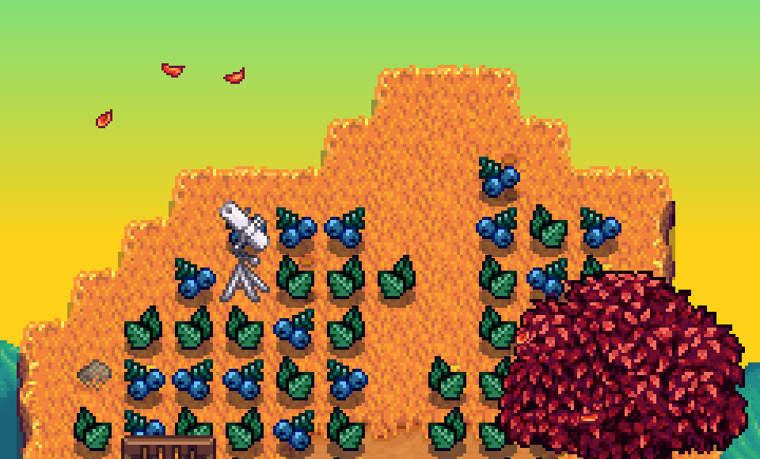

# Farm Type Manager
This mod allows players and modders to customize features from Stardew Valley's different farm maps. It can spawn forageable plants, ore, and monsters on any map in the game, and spawn large objects (stumps, logs, boulders, meteorites) on the farm. Users can configure the number of objects spawned per day, which areas or terrain types they can spawn on, the chances of spawning each object type, and more.

## Contents
* [Installation](#installation)
* [Setup](#setup)
* [Examples](#examples)
* [Commands](#commands)
* [Settings](#settings)
    * [Basic Settings](#basic-settings)
    * [General Spawn Settings](#general-spawn-settings)
		* [Spawn Timing Settings](#spawn-timing-settings)
    * [Forage Spawn Settings](#forage-spawn-settings)
    * [Large Object Spawn Settings](#large-object-spawn-settings)
    * [Ore Spawn Settings](#ore-spawn-settings)
    * [Monster Spawn Settings](#monster-spawn-settings)
		* [Monster Type Settings](#monster-type-settings)
    * [Extra Conditions](#extra-conditions)
    * [Other Settings](#other-settings)
    * [File Conditions](#file-conditions)
    * [Farm Type Manager Settings](#farm-type-manager-settings)
* [Content Packs](#content-packs)

## Installation
1. **Install the latest version of [SMAPI](https://smapi.io/).**
2. **Download FarmTypeManager** from [the Releases page on GitHub](https://github.com/Esca-MMC/FarmTypeManager/releases) or from [Nexus Mods](https://www.nexusmods.com/stardewvalley/mods/3231/).
3. **Unzip FarmTypeManager** into your `Stardew Valley\Mods` folder.

If you use other mods that require Farm Type Manager, then you’re all set here!

If you want to customize Farm Type Manager’s settings yourself, follow these instructions:

## Setup
1. **Run the game** using SMAPI.
2. **Load the farm** you want to customize, or create a new character and progress past the game's intro. This will create a .json configuration file for your character in the `Stardew Valley\Mods\FarmTypeManager\data` folder.
3. **Find the .json file** with your character's name on it. Load it with the **ConfigEditor.html** file in the `FarmTypeManager` folder, or edit manually with any text editor.
4. **Customize the file's settings** (see [Examples](#examples) or [Settings](#settings)) and save your changes.
5. **Exit your farm and reload it**, or progress to the next in-game day. The mod's settings should now be active.
 
Note: This mod will be disabled in multiplayer when you play as a farmhand (i.e. join a game hosted by someone else). Its console commands will still function, though.

## Examples
Below are a few examples of changes you can make to your character's configuration file, spawning various things on your farm or the other in-game maps.

### Spawn forage and respawn stumps on the farm
```
"ForageSpawnEnabled": true,
"LargeObjectSpawnEnabled": true,
```


### Randomly spawn new logs and boulders on the farm
```
"LargeObjectSpawnEnabled": true,
```
```
"Large_Object_Spawn_Settings": {
    "Areas": [
      {
        "ObjectTypes": [
          "Log", "Boulder"
        ],
        "FindExistingObjectLocations": false,
        "MapName": "Farm",
        "MinimumSpawnsPerDay": 0,
        "MaximumSpawnsPerDay": 2,
        "IncludeTerrainTypes": ["Grass", "Dirt", "Diggable"],
```


### Spawn ore in a specific area of Cindersap Forest
```
"OreSpawnEnabled": true,
```
```
"Ore_Spawn_Settings": {
    "Areas": [
      {
        "MapName": "Forest",
        "MinimumSpawnsPerDay": 1,
        "MaximumSpawnsPerDay": 5,
        "IncludeCoordinates": [ "65,22/74,27" ],
```


### Spawn LOTS of forage on the farm, but not near the house
```
"ForageSpawnEnabled": true,
```
```
"Forage_Spawn_Settings": {
    "Areas": [
      {
        "MapName": "Farm",
        "MinimumSpawnsPerDay": 9999,
        "MaximumSpawnsPerDay": 9999,
        "IncludeTerrainTypes": [ "All" ],
        "ExcludeCoordinates": [ "69,17;57,10" ]
```


### Spawn [modded plants](https://www.nexusmods.com/stardewvalley/mods/1598) on the [mod-enabled summit](https://www.nexusmods.com/stardewvalley/mods/2073), but only after rainy days, and only after year 1
```
"ForageSpawnEnabled": true,
```
```
  "Forage_Spawn_Settings": {
    "Areas": [
      {
        "SpringItemIndex": [ 2018, 2021 ],
        "SummerItemIndex": [ 2018, 2021 ],
        "FallItemIndex": [ 2018, 2021 ],
        "WinterItemIndex": null,
        "MapName": "Summit",
        "MinimumSpawnsPerDay": 4,
        "MaximumSpawnsPerDay": 8,
        "IncludeTerrainTypes": [
          "All"
        ],
        "ExtraConditions": {
          "Years": [ "2+" ],
          "WeatherYesterday": [ "Rain", "Storm" ],
```


## Commands
This mod adds the command `whereami` to SMAPI's console. Enter it there to display information about the current map, including: 
* The map's name (e.g. "Farm" or "BusStop")
* Your current tile's X/Y coordinates
* The tile's terrain type (e.g. "Dirt" or "Stone")
* Whether the tile is "Diggable" with tools
* The tile's image index number (used to identify "Quarry" tiles or set up custom tile-matching)

This command can be disabled in the **config.json** file if desired, e.g. if it conflicts with another mod. See [Mod Settings](#mod-settings).

## Settings
The settings below change how the mod affects your farm. By default, the mod will not change your farm at all; you'll have to enable features you want in the Basic Settings section, and then (optionally) configure their behavior with the rest of the settings.

Your config files are stored in the `Stardew Valley\Mods\FarmTypeManager\data` folder. When you load a farm in-game and no  file exists yet, a new file will be created for it. The file is named after your save data folder, so it starts with your farmer’s name and then a series of numbers, such as **FarmerName_1234567.json**. Any text editor should be able to open it.

The mod will also generate a **default.json** file in the data folder. It can be edited to change the settings of any newly generated config files. This can be useful if you create new farms frequently or need to customize settings for several farms at once. If the default.json file doesn't exist, it will be created when launching Stardew or loading a farm.

### Basic Settings
This section covers the simple on/off switches you can use to enable default configurations, which work similarly to "vanilla" Stardew farm types.

Name | Valid settings | Description | Notes
-----|----------------|-------------|------
ForageSpawnEnabled | true, **false** | Enables or disables spawning forageable plants. | When set to **true** with other default settings, this will work similarly to the Forest Farm, randomly spawning forage items on the farm each day.
LargeObjectSpawnEnabled | true, **false** | Enables or disable spawning large objects (e.g. stumps). | When set to **true** with other default settings, this will find any existing large stumps on your farm and cause those to respawn each day.
OreSpawnEnabled | true, **false** | Enables or disables spawning ore. | When set to **true** with other default settings, this will work similarly to the Hill-top Farm, spawning various kinds of ore on any "Quarry" terrain your farm may have. (If you're not using the Hill-top Farm or a custom farm with similar-looking quarries, ore will **not** spawn. You'll need to change the **IncludeTerrainTypes** or **IncludeCoordinates** settings in the ore section.)
MonsterSpawnEnabled | true, **false** | Enables or disables spawning monsters. | When set to **true** with other default settings, this will work similarly to the Wilderness Farm, spawning various monsters on the farm at night when players are present. The monster types change at higher Combat skill levels.

The sections below cover the more advanced options for each spawn type. When the basic features above are enabled, the mod will use the Spawn Settings to determine **which** objects should be spawned, **how many** to spawn each day, and **where** to put them.

### General Spawn Settings
This section covers the general settings that appear in every spawner section.

Name | Valid settings | Description | Notes
-----|----------------|-------------|------
Areas | *(see Notes)* | A list of "spawn areas", which are groups of spawn settings for one "area" of a single map. | Each "area" describes a set of objects/monsters to spawn, exactly where they can spawn on a single map, and various optional spawning rules. To spawn things to multiple maps (or the same map with multiple "areas"), create copies of the entire bracketed section and separate them with commas: `"Areas": [ { Area 1 settings }, { Area 2 settings }, { Area 3 settings } ]`
UniqueAreaID | Any unique name: "Spawn area 1", etc | A unique nickname for this area. | This is used by the save system to record certain info for each area, and it appears in SMAPI's error log. If the same ID is used for multiple areas, the duplicates will be automatically renamed. Changing this later **might** cause minor problems with existing save data, e.g. resetting LimitedNumberOfSpawns.
MapName | Any map name: "Farm", "BusStop", etc | The name of the in-game location where objects will spawn. | Go to an in-game location and use the `whereami` command in SMAPI's console to view its map name (see [Commands](#commands)).
MinimumSpawnsPerDay | An integer (less than or equal to the maximum) | The minimum number of objects to spawn each day. | If the spawn number is very high (e.g. 9999), objects will spawn until they run out of valid space. Numbers <= 0 are valid choices; negative numbers increase the chance of spawning 0 objects for the day.
MaximumSpawnsPerDay | An integer (greater than or equal to the minimum) | The maximum* number of objects to spawn each day. | If the spawn number is very high (e.g. 9999), objects will spawn until they run out of valid space. This maximum **can** be affected by other settings. e.g. "percent extra spawns per skill level" or "maximum simultaneous spawns". 
IncludeTerrainTypes | **"Diggable", "Grass"**, "Dirt", "Stone", "Wood", "All", "Quarry", "Custom" | A list of terrains where objects can spawn. | The "All" setting will let objects spawn on any open, valid tiles. Multiple terrain types can be included by separating them with commas: `"IncludeTerrainTypes": ["Grass", "Diggable"]`
ExcludeTerrainTypes | **"Diggable", "Grass"**, "Dirt", "Stone", "Wood", "All", "Quarry", "Custom" | A list of terrains where objects **cannot** spawn. |  See the notes for IncludeTerrainTypes to choose types. Any types covered by ExcludeTerrainTypes will **not** be used to spawn objects, **overriding** IncludeTerrainTypes and IncludeCoordinates.
IncludeCoordinates | `"x,y/x,y"` tile coordinates | A list of coordinates for areas where objects can spawn. | Use the `whereami` command (see [Commands](#commands)) to get a tile's coordinates. Any space between the two coordinates you use will be open for spawning. Separate multiple include areas with commas: `"IncludeCoordinates": ["0,0/100,100", "125,125/125,125"]`
ExcludeCoordinates | `"x,y/x,y"` tile coordinates | A list of coordinates for areas where objects **cannot** spawn. | See the notes for IncludeCoordinates to find coordinates. Any space covered by ExcludeCoordinates will **not** be used to spawn objects, **overriding** IncludeTerrainTypes and IncludeCoordinates.
StrictTileChecking | **"High"**, "Medium", "Low", "None" | How strictly the mod will validate included tiles. | Depending on the map's internal settings (especially in custom farms), Stardew might consider some tiles "invalid for object placement". If your other settings seem correct but nothing will spawn, try adjusting this setting. Note that "Low" and "None" might result in missing spawns: if a tile really *can't* have objects, the mod might still think it's valid. This might also cause spawning in water, cliffs, buildings, etc.
DaysUntilSpawnsExpire | **null**, Intenger | The number of days spawns will exist before disappearing. | If set to null, spawned objects will behave normally. If set to a positive number, any spawns will only disappear after that number of days (or when removed by a player). If set to 0, spawns will never automatically disappear. Using this setting **will** protect forage from the game's weekly cleanup process.
CustomTileIndex | A list of integers | A list of index numbers from the game's tilesheet images, used by the "Custom" setting for IncludeTerrainTypes. | If the IncludeTerrainTypes setting above includes the "Custom" option, any tiles with these spritesheet index numbers will be valid spawn locations. You can find a tile's index number by standing on it and using the `whereami` command, or by using map/spritesheet modding tools.

#### Spawn Timing Settings
This section is available for each spawn area and affects the time of day when objects will be spawned.

Name | Valid settings | Description | Notes
-----|----------------|-------------|------
StartTime | A Stardew time integer, e.g. **600** for 6:00AM or 2550 for 1:50AM | The earliest time objects can spawn. | Objects spawned by this area will be randomly assigned times between StartTime and EndTime.
EndTime | A Stardew time integer, e.g. **600** for 6:00AM or 2550 for 1:50AM | The latest time objects can spawn. | Objects spawned by this area will be randomly assigned times between StartTime and EndTime.
MinimumTimeBetweenSpawns | An integer (multiple of 10; minimum **10**) | The minimum number of in-game minutes between each spawn. | Randomly chosen spawn times will always be at least this many minutes apart. Example: If this value is `20` and some objects spawn at 6:10AM, nothing will spawn at 6:00 or 6:20.
MaximumSimultaneousSpawns | An integer (minimum 1), or **null** | The maximum number of objects this area will spawn at a specific time. | This **will** override the number of objects spawned per day if every spawn time has already reached this maximum.
OnlySpawnIfAPlayerIsPresent | true, **false** | Whether objects will spawn while no players are present at the in-game map. | If true and no players are present, any spawns assigned to the current time will be skipped; they will **not** be delayed until later.
SpawnSound | The name of a loaded sound, or blank: **""** | A Stardew sound effect that will play when this area spawns objects. | This setting is **case-sensitive** and uses the Sound Bank IDs available in [this modding spreadsheet](https://docs.google.com/spreadsheets/d/1CpDrw23peQiq-C7F2FjYOMePaYe0Rc9BwQsj3h6sjyo).

### Forage Spawn Settings
Name | Valid settings | Description | Notes
-----|----------------|-------------|------
SpringItemIndex (Area) | **null**, *(see Notes)* | The index numbers and/or item names for forage items to spawn in spring *in this area*. | This setting is per-area and will *override* the global SpringItemIndex setting below. Leave this set to *null* unless you want different spring forage items in a specific area. Fill this in by copying the format of the global version below.
SummerItemIndex (Area)| **null**, *(see Notes)* | The index numbers and/or item names for forage items to spawn in summer *in this area*. | This setting is per-area and will *override* the global SummerItemIndex setting below. Leave this set to *null* unless you want different summer forage items in a specific area. Fill this in by copying the format of the global version below.
FallItemIndex (Area) | **null**, *(see Notes)* | The index numbers and/or item names for forage items to spawn in fall *in this area*. | This setting is per-area and will *override* the global FallItemIndex setting below. Leave this set to *null* unless you want different fall forage items in a specific area. Fill this in by copying the format of the global version below.
WinterItemIndex (Area) | **null**, *(see Notes)* | The index numbers and/or item names for forage items to spawn in winter *in this area*. | This setting is per-area and will *override* the global WinterItemIndex setting below. Leave this set to *null* unless you want different winter forage items in a specific area. Fill this in by copying the format of the global version below.
PercentExtraSpawnsPerForagingLevel | Any integer (default **0**) | The % of extra forage spawned for each level of Foraging skill. | In multiplayer, this is based on the highest skill level among *all* players (even if they're offline). For example, setting this to 10 will spawn +10% forage items per level; if a farmhand has the best Foraging skill of level 8, there will be 80% more forage each day.
SpringItemIndex (Global) | A list of integers and/or item names, e.g. `[16, "Red Mushroom"]` | The index numbers and/or item names for forage items to spawn in spring. | By default, these are the forage items normally spawned on the Forest Farm during spring. To find different item IDs or names, see the "Raw data" section of [this wiki page](https://stardewvalleywiki.com/Modding:Object_data), or use this SMAPI console command: `list_items [item name]`
SummerItemIndex (Global) | A list of integers and/or item names, e.g. `[16, "Red Mushroom"]` | The index numbers for forage items to spawn in summer. | By default, these are the forage items normally spawned on the Forest Farm during summer. To find different item IDs or names, see the "Raw data" section of [this wiki page](https://stardewvalleywiki.com/Modding:Object_data), or use this SMAPI console command: `list_items [item name]`
FallItemIndex (Global) | A list of integers and/or item names, e.g. `[16, "Red Mushroom"]` | The index numbers for forage items to spawn in fall. | By default, these are the forage items normally spawned on the Forest Farm during fall. To find different item IDs or names, see the "Raw data" section of [this wiki page](https://stardewvalleywiki.com/Modding:Object_data), or use this SMAPI console command: `list_items [item name]`
WinterItemIndex (Global) | A list of integers and/or item names, e.g. `[16, "Red Mushroom"]` | The index numbers for forage items to spawn in winter. | By default, this is empty because forage doesn't normally spawn during winter. To add winter forage, use the same format as the other ItemIndex settings above. To find different item IDs or names, see the "Raw data" section of [this wiki page](https://stardewvalleywiki.com/Modding:Object_data), or use this SMAPI console command: `list_items [item name]`

### Large Object Spawn Settings
Name | Valid settings | Description | Notes
-----|----------------|-------------|------
ObjectTypes | **"Stump"**, "Log", "Boulder", "Meteorite", "Mine Rock 1", "Mine Rock 2", "Mine Rock 3", "Mine Rock 4" | A list of object types to spawn. | Objects spawned in this area will be chosen randomly from this list. Adding the same object type multiple times will increase its chances. Separate multiple objects with commas: `"ObjectTypes: [ "Stump", "Log", "Meteorite" ]`
FindExistingObjectLocations | **true**, false | Finds any existing objects listed in ObjectTypes and adds them to the IncludeCoordinates list. | This can be used to automatically find existing objects' coordinates and respawn them each day. It will set itself to "false" in your settings file after completion.
PercentExtraSpawnsPerSkillLevel | Any integer (default **0**) | The % of extra objects spawned for each level of the RelatedSkill. | In multiplayer, this is based on the highest skill level among *all* players (even if they're offline). For example, setting this to 10 will spawn +10% items per skill level; if a farmhand has the best skill of level 8, there will be 80% more objects each day.
RelatedSkill | "Farming", "Fishing", **"Foraging"**, "Mining", "Combat" | The skill used by PercentExtraSpawnsPerSkillLevel to spawn extra objects.

### Ore Spawn Settings
Name | Valid settings | Description | Notes
-----|----------------|-------------|------
MiningLevelRequired (Area) | **null**, *(see Notes)* | The minimum Mining skill level needed to spawn each ore type *in this area*. | This setting is per-area and will *override* the global MiningLevelRequired setting below. Leave this set to *null* unless you want different level requirements in a specific area. Fill this in by copying the format of the global version below.
StartingSpawnChance (Area) | **null**, *(see Notes)* | Each ore type’s chance of spawning with the minimum required Mining skill *in this area*. | This setting is per-area and will *override* the global StartingSpawnChance setting below. Leave this set to *null* unless you want different chances in a specific area. Fill this in by copying the format of the global version below.
LevelTenSpawnChance (Area) | **null**, *(see Notes)* | Each ore type’s chance of spawning with level 10 Mining skill *in this area*. | This setting is per-area and will *override* the global LevelTenSpawnChance setting below. Leave this set to *null* unless you want different chances in a specific area. Fill this in by copying the format of the global version below.
PercentExtraSpawnsPerMiningLevel | An integer (default **0**) | The % of extra ore spawned for each level of Mining skill. | In multiplayer, this is based on the highest skill level among *all* players (even if they're offline). For example, setting this to 10 will spawn +10% ore per Mining level; if a farmhand has the best Mining skill of level 8, there will be 80% more ore each day.
MiningLevelRequired (Global) | 0-10 | The minimum Mining skill level needed to spawn each ore type. | An ore type won't start spawning until *any* player (even offline farmhands) has the listed Mining skill. 
StartingSpawnChance (Global) | 0 or more | Each ore type's chance of spawning with the minimum required Mining skill. | These numbers are weighted chances; they don't need to add up to 100. The defaults are roughly based on the native game's spawn chances with slight increases.
LevelTenSpawnChance (Global) | 0 or more | Each ore type's chance of spawning with level 10 Mining skill. | Chances will drift gradually from StartingSpawnChance to LevelTenSpawnChance. For example, in the default settings, frozen geodes' chances of spawning from level 5 to 10 are `4, 4, 3, 3, 2, 2`.

### Monster Spawn Settings
Name | Valid settings | Description | Notes
-----|----------------|-------------|------
MonsterTypes | A list of "monster type" sections *(see Notes)* | A list of monster types to spawn, containing a name and list of optional settings. | Separate each monster type with commas: `"MonsterTypes": [ { "MonsterName": "bat", "Settings": {} }, { "MonsterName": "ghost", "Settings": {"HP": 1, "Damage": 0} } ]`
MonsterName | The name of an in-game monster, e.g. `"green slime"` | The "base" monster used by a Monster Type. | Spawned monsters are based on an in-game monster, and then modified by any optional settings in the "Settings" list. To find a monster name, refer to the list of monsters on the [Stardew wiki Monsters page](https://stardewvalleywiki.com/Monsters). 
Settings | A list of setting names and values, e.g. `"HP": 1` | A list of optional customization settings to apply to a Monster Type. | See the Monster Type Settings section below for more information about each setting.


#### Monster Type Settings
Name | Valid settings | Description | Notes
-----|----------------|-------------|------
HP | An integer (minimum 1) | The monster's maximum health. | 
Damage | An integer (minimum 0) | The amount of damage the monster's attacks deal. | Some monster types/attacks ignore this setting and use hard-coded damage values, e.g. skeleton bone-throwing attacks.
Defense | An integer (minimum 0) | Attacks that hit the monster are reduced by this much damage. | 
DodgeChance | An integer (minimum 0) | The percent chance the monster will completely ignore each attack. | 
Speed | An integer | The monster's movement speed is multiplied by this number. | 
EXP | An integer (minimum 0) | Defeating the monster will give players this amount of Combat skill experience. | Even with this setting, Stardew does **not** give players experience for defeating monsters at the farm.
RelatedSkill | "Farming", "Fishing", "Foraging", "Mining", "Combat" | The player skill that affects the "Skill Level" settings below. | If this setting isn't provided, the "Skill Level" settings below will be ignored.  In multiplayer, these settings check the highest skill level among **all** players.
MinimumSkillLevel | An integer (minimum 0) | The minimum skill level required to spawn this monster type. | This is based on the RelatedSkill setting.
MaximumSkillLevel | An integer (minimum 0) | The maximum skill level allowed to spawn this monster type. | This is based on the RelatedSkill setting.
PercentExtraHPPerSkillLevel | An integer | The monster's HP is increased by this percentage, once for each skill level. | This is based on the RelatedSkill setting. Negative values are valid and will decrease instead.
PercentExtraDamagePerSkillLevel | An integer | The monster's damage is increased by this percentage, once for each skill level. | This is based on the RelatedSkill setting. Negative values are valid and will decrease instead.
PercentExtraDefensePerSkillLevel | An integer | The monster's defense is increased by this percentage, once for each skill level. | This is based on the RelatedSkill setting. Negative values are valid and will decrease instead.
PercentExtraDodgeChancePerSkillLevel | An integer | The monster's dodge chance is increased by this percentage, once for each skill level. | This is based on the RelatedSkill setting. Negative values are valid and will decrease instead.
PercentExtraSpeedPerSkillLevel | An integer | The monster's speed is increased by this percentage, once for each skill level. | This is based on the RelatedSkill setting. Negative values are valid and will decrease instead.
PercentExtraEXPPerSkillLevel | An integer | The monster's EXP is increased by this percentage, once for each skill level. | This is based on the RelatedSkill setting. Negative values are valid and will decrease instead.
Loot | A list of integers and/or item names, e.g. `[16, "Red Mushroom"]` | A list of items the monster will drop when defeated. | Loot is **not** randomized; this monster type will always drop these items. Use multiple monster types to randomize loot. An empty list will cause the monster to drop nothing. See the forage spawner's `ItemIndex` settings for formatting guidelines. 
PersistentHP | true, **false** | Whether the monster will keep any HP damage overnight. | This only applies to monsters with `DaysUntilSpawnsExpire` settings.
CurrentHP | An integer (minimum 1) | The monster's current (not maximum) health at spawn. | This is mainly useful for "themed" monsters to spawn with injuries, or monsters capable of healing themselves.
SeesPlayersAtSpawn | true, **false** | Whether the monster will immediately "spot" players at spawn. | If true, this causes most monster types to immediately approach and attack the nearest player, rather than waiting for players to approach. Slimes will have red eyes and behave aggressively.
SpawnWeight | An integer (minimum/default 1) | The weighted spawn chance of this monster type. | Increasing this will incease the odds of spawning this monster type instead of others, similar to the ``SpawnChance`` settings for the ore spawner. Example: if this monster type's weight is 5 and another type's weight is 1, this type will spawn 5 times as often.
Sprite | The "address" of a loaded asset | A loaded spritesheet to replace this monster's default sprite. | These can be default assests in Stardew or those loaded by a mod like Content Patcher. Examples: `"Characters/Monsters/Skeleton"` or `"Animals/horse"`
Color | A string of RGB or RGBA values, e.g. `"255 0 0"` | The monster's color and transparency level. | This setting overrides MinColor and Maxcolor. It currently only applies to slimes, big slimes, and metal heads. Values can range from 0 to 255 and optionally include alpha transparency, e.g.: `"0 0 0"` or `"0 0 0 127"`
MinColor | A string of RGB or RGBA values, e.g. `"0 0 0"` | The minimum color and transparency randomly applied to this monster. | This setting will be ignored unless MaxColor is also provided. See `Color` above for formatting.
MaxColor |  A string of RGB or RGBA values, e.g. `"255 255 255"` | The maximum color and transparency randomly applied to this monster. | This setting will be ignored unless MinColor is also provided. See `Color` above for formatting.

### Extra Conditions
Name | Valid settings | Description | Notes
-----|----------------|-------------|------
ExtraConditions | *(see Notes)* | A set of optional conditions required to spawn objects in an area. | These can be used to restrict spawning to certain times or weather conditions. Each setting will be ignored if it is set to its default, i.e. `[]` or `null`.
Years | A list of integers, ranges, or "Any"/"All" | A list of years in which things are allowed to spawn. | Years should be inside the brackets with quotation marks, separated by commas if multiple are listed. They can be listed as single years, ranges, or with a **+** to include any following years. See these examples: `["1"]` `["2-4"]` `["1", "3+"]`
Seasons | A list of season names: "Spring", "Summer", "Fall", "Winter", or "Any"/"All" | A list of seasons in which things are allowed to spawn. | Seasons should be inside the brackets with quotation marks, separated by commas if multiple are listed. See these examples: `["Spring"]`, `["Summer", "Winter"]`
Days | A list of integers, ranges, or "Any"/"All" | A list of days on which things are allowed to spawn. | Days should be inside the brackets with quotation marks, separated by commas if multiple are listed. They can be listed as single days, ranges, or with a **+** to include any following days. See these examples: `["1"]` `["2-14"]` `["1", "8+"]`
WeatherYesterday | A list of weather names: "Sun", "Wind", "Rain", "Storm", "Snow", or "Any"/"All" | Things will be allowed to spawn if yesterday's weather matched a name from this list. | Weather names should be inside the brackets with quotation marks, separated by commas if multiple are listed. Note that windy days *do not* count as sunny, and storms *do not* count as rain; remember to include both if needed. See these examples: `["Snow"]`, `["Sun", "Wind"]`, `["Rain", "Storm", "Snow"]`
WeatherToday | A list of weather names: "Sun", "Wind", "Rain", "Storm", "Snow", or "Any"/"All" | Things will be allowed to spawn if today's weather matches a name from this list. | Weather names should be inside the brackets with quotation marks, separated by commas if multiple are listed. Note that windy days *do not* count as sunny, and storms *do not* count as rain; remember to include both if needed. See these examples: `["Snow"]`, `["Sun", "Wind"]`, `["Rain", "Storm", "Snow"]`
WeatherTomorrow | A list of weather names: "Sun", "Wind", "Rain", "Storm", "Snow", or "Any"/"All" | Things will be allowed to spawn if tomorrow's weather forecast matches a name from this list. | Weather names should be inside the brackets with quotation marks, separated by commas if multiple are listed. Note that windy days *do not* count as sunny, and storms *do not* count as rain; remember to include both if needed. See these examples: `["Snow"]`, `["Sun", "Wind"]`, `["Rain", "Storm", "Snow"]`
LimitedNumberOfSpawns | An integer | The number of times this area will spawn things before stopping. | At the end of each day, if things spawned here without being prevented by other "extra conditions", this number will count down by 1 (record in the separate **.save** file). Once it reaches zero, the area will stop spawning things. Note that unlike other ExtraConditions settings, this does not need to be in brackets or quotations. Example: `1`

### Other Settings
Name | Valid settings | Description | Notes
-----|----------------|-------------|------
QuarryTileIndex | Integer(s) | A list of index numbers for "quarry" tiles in the game's tilesheet images. | These have been manually chosen to match the "quarry" tiles in the game's Hill-top Farm and custom maps that use similar mining areas. They're provided here so that people familiar with editing Stardew maps can customize this mod's "Quarry" terrain setting.

### File Conditions
Name | Valid settings | Description | Notes
-----|----------------|-------------|------
File_Conditions | *(see below)* | A list of conditions required to use this config file with a specific farm. | These settings are primarily useful for content packs.
FarmTypes | A list of farm types: "Standard", "Riverland", "Forest", "Hilltop", "Wilderness", or "Any"/"All" | A list of farm types for which this config file will be used. | This should generally be used in content packs that are combined with custom farm maps; for example, if a custom farm replaces your Standard farm type, set this to `["Standard"]`.
FarmerNames | A list of farmer names, e.g. `["Esca"]` | If one of this list's names matches the farmer's name, this config file will be used. | This setting only checks the main farmer's name; it won't be affected by multiplayer farmhands.
SaveFileNames | A list of save file names, e.g. `["Esca_1234567"]` | If one of these names matches the current farm's save file name, this config file will be used. | A niche setting for when other conditions aren't effective at choosing a farm. Note that this technically checks the save *folder* name, not the save file itself.
OtherMods | A list of mods' UniqueIDs and `true` or `false` (see Notes) | If all of the player's loaded mods match this list, this config file will be used. | This can be used to make a content pack or config file only activate with certain mod requirements. `true` means a mod *must* be installed, while `false` means it *can't* be installed. Example: `OtherMods: { "Esca.FarmTypeManager" : true, "FakeModID" : false }`
ResetMainDataFolder | true, **false** | When true, this will move any files in `FarmTypeManager\data` to an archive folder. | This is used by mods migrating from older versions to FTM v1.4's content pack format. It will only happen once, unless the content pack's save data is deleted. The data files are moved to `FarmTypeManager\data\archive\[timestamp]`.

### Farm Type Manager Settings
These settings are in the **config.json** file, which is in the mod's main folder: `Stardew Valley\Mods\FarmTypeManager`. They change the behavior of the mod itself, rather than a specific farm or content pack.

Name | Valid settings | Description
-----|----------------|------------
EnableWhereAmICommand | **true**, false | Enables or disables the `whereami` console command.
EnableContentPacks | **true**, false | Enables or disables any installed content packs for Farm Type Manager.
EnableContentPackFileChanges | **true**, false | Enables or disables special file changes by content packs, such as resetting the `FarmTypeManager\data` folder.
EnableTraceLogMessages | **true**, false | Enables or disables `[TRACE]`-level messages in the SMAPI error log.
MonsterLimitPerLocation | An integer (minimum 0), or **null** | If a single map already contains this number of monsters, the mod will skip spawning any additional monsters there. Use this setting if your content packs are spawning too many monsters, causing Stardew to run slowly.

## Content Packs
In version 1.4 and later, Farm Type Manager can use configuration files from content packs. They will be used *in addition* to the farm-specific files in the `FarmTypeManager\data` folder; they will not replace or override each other.

To create a content pack for Farm Type Manager:

1. Create a new folder in the `Stardew Valley\Mods` folder. Its name should follow this format: `[FTM] Your Pack Name`
2. Create a text file in the new folder called **manifest.json**. (See the [Manifest](https://stardewvalleywiki.com/Modding:Modder_Guide/APIs/Manifest) wiki article for more info.) Copy the format below and fill in the settings appropriately:
```
{
  "Name": "Your Pack Name",
  "Author": "Your Name",
  "Version": "1.0.0",
  "Description": "Your description here. Briefly explain what the content pack does.",
  "UniqueID": "YourName.YourPackName",
  "MinimumApiVersion": "2.10.0",
  "UpdateKeys": [],
  "ContentPackFor": {
    "UniqueID": "Esca.FarmTypeManager",
    "MinimumVersion": "1.7.0"
  }
}
```
3. Create or copy a Farm Type Manager configuration file into the `[FTM] Your Pack Name` folder and name it **content.json**. The format is exactly the same as a farm configuration file from the `FarmTypeManager\data` folder.
4. If you want to combine this content pack with a custom farm map or similar mod, consider editing the **FarmTypes** and/or **OtherMods** settings under **File_Conditions** at the bottom of the configuration file. (See the [File Conditions](#file-conditions) section.)
