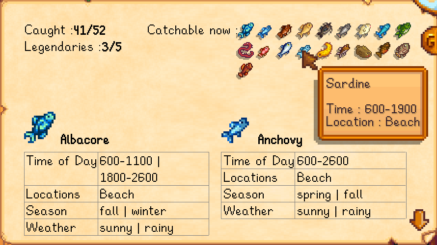
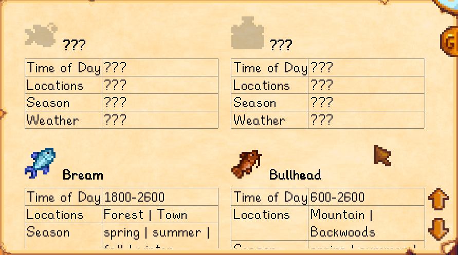

FishDex is a Stardew Valley mod that allows you to lookup fish info in-game. 
The info is available only after you have caught the fish and is hidden otherwise. This
allows you to play without cheating or getting spoiled.

## Install
1. [Install the latest version of SMAPI](https://smapi.io/).
2. [Download](https://github.com/rupak0577/FishDex/releases) and unpack into the `Mods` folder.
3. Run the game using SMAPI.

## Config
The mod creates a `config.json` file in its mod folder the first time you run it. You can open that
file in a text editor to configure the mod.

| setting           | what it affects
| ----------------- | -------------------
| `ScrollAmount`    | The amount to scroll long content on each up/down scroll.
| `ShowAll`         | Shows all the fishes irrespective of whether a fish has been caught before or not.
| `Controls`        | The configured keyboard bindings. Default binding to open the menu = `G`.

## Use
Press `G` to show the fish info menu.