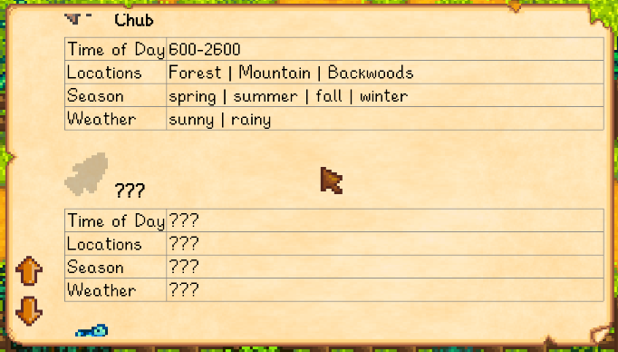

FishDex is a Stardew Valley mod that allows you to lookup fish info in-game. 
The info is available only after you have caught the fish and is hidden otherwise. This
allows you to play without cheating or getting spoiled.

## Install
1. [Install the latest version of SMAPI](https://smapi.io/).
2. [Download](https://github.com/rupak0577/FishDex/releases) and unpack into the `Mods` folder.
3. Run the game using SMAPI.

## Use
Press `G` to show the fish info menu.