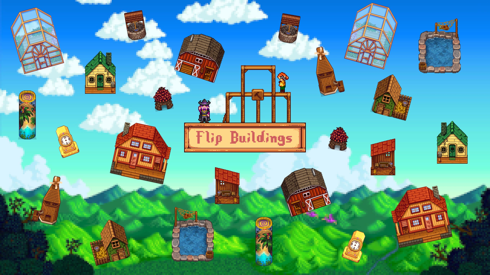

**You're viewing a file in the SMAPI mod dump, which contains a copy of every open-source SMAPI mod
for queries and analysis.**

**This is _not_ the original file, and not necessarily the latest version.**  
**Source repository: https://github.com/mouahrara/FlipBuildings**

----

The Flip Buildings Mod allows you to horizontally flip any building on your farm, including the farmhouse!

## Install
- Install the latest version of [SMAPI](https://smapi.io).
- Download this mod and unzip it into `Stardew Valley/Mods`.
- Run the game using **SMAPI**.

## How to use
Select either Robin's or the Wizard's construction menu, and then click the flip button (↹) to access a view of your farm. From there, you can choose a building to flip.

https://github.com/mouahrara/FlipBuildings/assets/131559634/573ac1fc-1169-40bd-88ea-7caabe1cf72e

## Accessibility
English, French, German (thanks to **CoolRabbit123**) and Russian (thanks to **theRealDuda**) translations are included in the base mod, and contributions are welcome. To contribute, see the dedicated [GitHub issue](https://github.com/StardewModders/mod-translations/issues/61).  
Note that this mod has controller support.

## Multiplayer
The mod is compatible with multiplayer as long as all connected players have the mod installed.  
In multiplayer, the host player can always flip buildings. For guests, the permissions for moving and flipping buildings are the same. Permissions can be modified by the host using the `/movebuildingpermission [off|owned|on]` command in the chat box.
- `off`: Guests cannot move or flip buildings.
- `owned`: Guests can move and flip owned buildings. This includes buildings they've built, their house, and their spouse's house if they're married to another player.
- `on`: Guests can move and flip any building.

## Compatibility
Compatible with [Content Patcher](https://www.nexusmods.com/stardewvalley/mods/1915) retextures, [Alternative Textures](https://www.nexusmods.com/stardewvalley/mods/9246) and [Solid Foundations](https://www.nexusmods.com/stardewvalley/mods/12311), so you can flip buildings with custom textures and buildings from other mods!  
This mod directly modifies parts of **Alternative Textures** and **Solid Foundations**. This means that changes to these mods may break compatibility, in which case let me know so I can fix it. Furthermore, if you notice issues with one of these mods, make sure they occur without the Flip Buildings Mod before reporting them on the creator's page.

## Frequently Asked Questions
- **Can I use this mod on an existing save?**  
Yes, no problem at all.
- **Can I uninstall this mod without any issues?**  
Yes, but uninstalling the mod will reset all flipped buildings. Reinstalling the mod will flip them again.

## See also
- [Release notes](https://github.com/mouahrara/FlipBuildings/releases)
- [Nexus Mods](https://www.nexusmods.com/stardewvalley/mods/18444)
