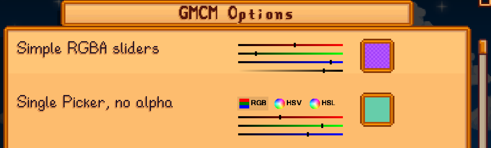
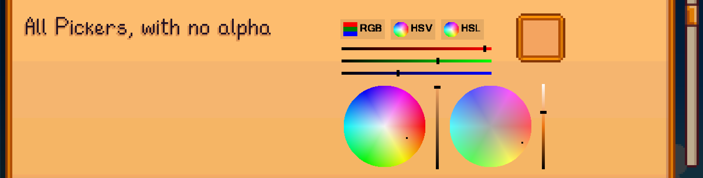

**You're viewing a file in the SMAPI mod dump, which contains a copy of every open-source SMAPI mod
for queries and analysis.**

**This is _not_ the original file, and not necessarily the latest version.**  
**Source repository: https://github.com/jltaylor-us/StardewGMCMOptions**

----

# Stardew Valley GMCM Options

A Stardew Valley SMAP mod that provides additional complex option types for use with Generic Mod Config Menu (GMCM).

You can find this mod on [Nexus Mods](https://www.nexusmods.com/stardewvalley/mods/10505)
if you prefer.

The complex options currently supported are:
* [Color Picker](#color-picker)
* [Image Picker](#image-picker)

## How to Use

**For end users:** Mod authors must code their mods to use GMCM Options (much like they had to code their mods to use GMCM).
There is nothing for you to do except install GMCM Options like every other SMAPI mod.

**For mod authors:**

Copy the [API](StardewGMCMOptions/IGMCMOptionsAPI.cs) into your project.
Use GMCM as normal.  When you want to insert one of the complex options provided by GMCM Options, call the appropriate
method from the GMCM Options API.  That's it!

See [Example.cs](StardewGMCMOptions/Example.cs) for a working example.
(If you want to actually see it work in the game, for real, type `gmcmoptions-example` in the SMAPI console to enable it.)

## Complex Options Provided by GMCM Options

### Color Picker

The color picker option supports choosing colors with or without an Alpha (transparency) channel in any of the following
styles:
* RGB sliders
* HSV color wheel
* HSL color wheel

An option can be a single picker style:

Or display multiple picker styles at once:

When multiple styles are shown for the same option, updates are synchronized between all of the different picker
styles.

### Image Picker

The image picker option is really an "array index picker" where each index is rendered as an image
(or custom draw function) that you supply.  The underlying value of the option is the `uint` of the
selected index.

Label and arrow location are configurable.

The API provides both a full interface where you can supply a custom drawing function, an a simplified
interface where you need only supply an array of tuples describing the images to be drawn and their labels.

----
## See also
* [Release Notes](doc/ReleaseNotes.md)
