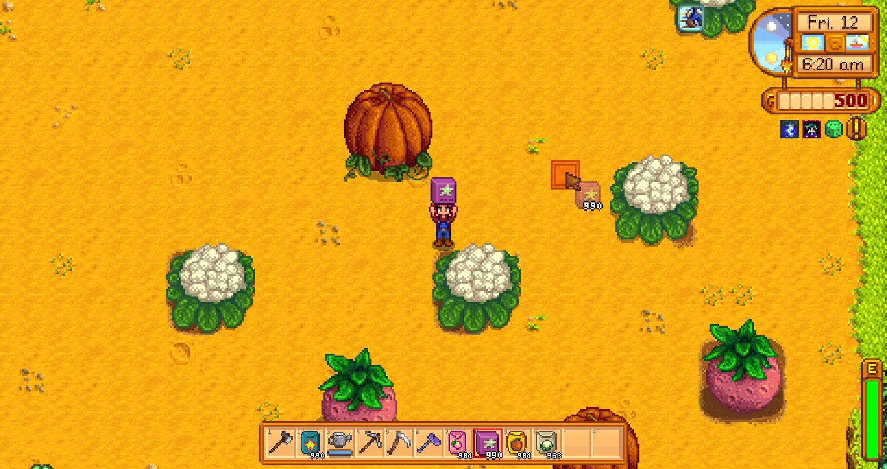

**You're viewing a file in the SMAPI mod dump, which contains a copy of every open-source SMAPI mod
for queries and analysis.**

**This is _not_ the original file, and not necessarily the latest version.**  
**Source repository: https://github.com/atravita-mods/GiantCropFertilizer**

----

Giant Crop Fertilizer
===========================

This mod adds a fertilizer that greatly boosts the chance of getting a giant crop. Simply apply to the middle of a 9x9 square of giant-crop eligible crops, wait for them to become full grown...

(Note: must be applied before the crops grow entirely.)

## Install

1. Install the latest version of [SMAPI](https://smapi.io).
2. Download and unzip [Spacecore](https://www.nexusmods.com/stardewvalley/mods/1348) and [Json Assets](https://www.nexusmods.com/stardewvalley/mods/1720), and unzip both into `Stardew Valley/Mods`.
2. Download this mod and unzip it into `Stardew Valley/Mods`.
3. Run the game using SMAPI.

## Uninstall
Remove every instance of the giant crop fertilizer you have in your inventory and any chest, and then remove this mod from your Mods folder.

## Configuration

`GiantCropChance` sets the chance a crop will grow big. Note: to ensure that the crop will become giant, probably best to set this slightly above `1`, which is why the default is `1.1`.

## Compatibility

* Works with Stardew Valley 1.5.6 on Linux/macOS/Windows.
* Works in single player, multiplayer, and split-screen mode. In multiplayer, all players should install.
* Should be compatible with most other mods. Tested with [MultiFertilizer](https://www.nexusmods.com/stardewvalley/mods/7436), [Json Assets](https://www.nexusmods.com/stardewvalley/mods/1720)'s giant crops and [More Giant Crops](https://www.nexusmods.com/stardewvalley/mods/5263). A small note: when MultiFertilizer is installed, the check that looks for whether or not a tile has already been fertilized doesn't quite work right with this fertilizer. Try to not accidentally apply two to the same square...

(Yes, the picture is from Ginger Island! More Giant Crops allows giant crops on any map, that's where that's from!)

* A note: this fertilizer does NOT work with [CJB Cheats Menu](https://www.nexusmods.com/stardewvalley/mods/4)'s instant crop growth. You can use that to grow the crops, but you'll need to sleep into the next day for this fertilizer to take effect.
* Additionally, this mod currently does not work with DGA giant crops. Will fix that!

## See also

[Changelog](GiantCropFertilizer/docs/Changelog.md)
