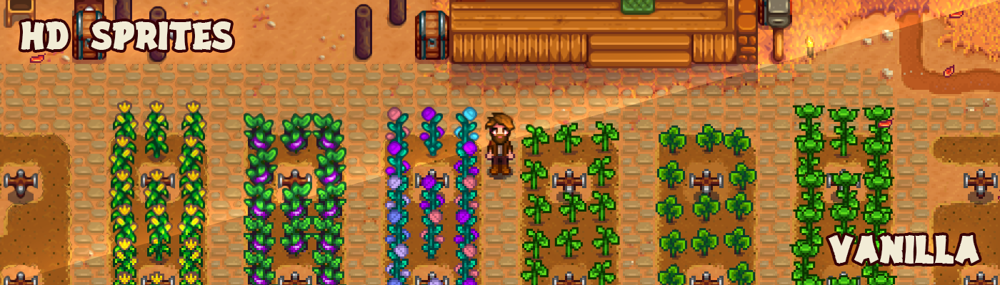

# HDSprites - Stardew Valley Mod (SMAPI / Harmony)

Nexus Mods - [https://www.nexusmods.com/stardewvalley/mods/4024](https://www.nexusmods.com/stardewvalley/mods/4024)

Stardew Valley mod that doubles the resolution of most textures using a 2xBR upscale algorithm.

All files in the mod's assets folder are loaded and will replace their identically named counterpart in the game's base Content folder. The mod assumes that all loaded images are exactly twice the resolution of the original version.

## Requirements
* Visual Studio
* Python
* Windows

## Instructions
0. (Skip if already done) Install the latest SMAPI version [here](https://smapi.io/). 
1. Clone this repository to your computer.
2. Open HDSprites.sln with Visual Studio.
3. Build the solution. If successful, the folder "HDSprites" will be created in your "Stardew Valley/Mods" folder.
4. Copy the "generate_assets.bat" and "tools" folder into "Stardew Valley/Mods/HDSprites".
5. Run the "generate_assets.bat" and wait for it to complete.

## Credit
* Platonymous - ScaledTexture2D and SpriteBatchFix Harmony patch classes - [PyTK mod](https://github.com/Platonymous/Stardew-Valley-Mods/blob/master/PyTK)
* draivin - XNB extractor tool - [XNB Node](https://github.com/draivin/XNBNode)
* Salmakis - Image resizer tool for 2xBR filter - [ImageFilter](https://github.com/Salmakis/ImageFilterCollection)
* Pathoschild - Updating code to work with SMAPI 3.0