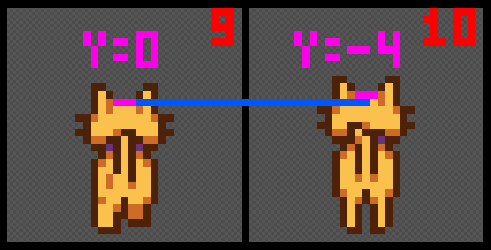

**You're viewing a file in the SMAPI mod dump, which contains a copy of every open-source SMAPI mod
for queries and analysis.**

**This is _not_ the original file, and not necessarily the latest version.**  
**Source repository: https://github.com/SymaLoernn/Stardew_HatsOnPetsPlus**

----

# Stardew_HatsOnPetsPlus
A Stardew Valley framework that aims to let modders place hats on their custom pets and resprites  

## Documentation for modders

In this documentation, I will assume that you are making a Content Patcher mod to either resprite a pet/breed or add a new pet/breed, and that you already were able to do it with Content Patcher.  

If you didn't do this part yet, I suggest that you do so before working on the hat placement, as the knowledge you'll gain by doing this will help you better understand this documentation.  

### 1. How to use Hats On Pets Plus in my mod

To configure your mod to use this framework, you will only need to edit the content.json file of your Content Patcher project, and add an EditData action that will look like this :  
```
{
"Action":"EditData",
"Target":"Syma.HatsOnPetsPlus/CustomPetData",
"Entries":{
    "<YourName.YourModName>": [
        { <First modded Pet/Breed data - See below for more information> },
        { <Second modded Pet/Breed data - See below for more information> },
        ...
    ]
}
```
<YourName.YourModName> should be an unique identifier.  
If for any reason you need to use multiple EditData actions, please use a different identifier for every use (ex : <YourName.YourModName.Option1>)  

The speficic data for each Pet/Breed is covered in the next section.

### 2. How to add custom hat data for a Pet/Breed

The data for drawing hats on your custom Pet and Breed is represented in the following json block : 

```
{
    "Type": <Type>,
    "BreedId": <BreedId>,
    "BreedIdList": [
        <BreedId1>,
        <BreedId2>,
        ...
    ]
    "Sprites": [
        {
            "SpriteId": <SpriteId>,
            "HatOffsetX": <HatOffSetX>,
            "HatOffsetY": <HatOffSetY>,
            "Direction": <Direction>,
            "Scale": <Scale>,
            "Flipped": <Flipped>,
            "Default": <Default>,
            "DoNotDrawHat": <DoNotDrawHat>
        },
        { ... }  // Repeat the previous block for every sprite where you want a custom hat position/direction/scale
    ]
}
```
Signification of each field : 

| Field Name | Field Type | Optional | Default value | Description                                          |
| :------------------ | :------: | :----: | ----: | :---- |
| Type       | String | **No** | - | The pet Type, can be "Cat", "Dog" (case sensitive) or any other vanilla or custom pet type |
|        |  | | | **You must set at least one of the two following fields** (if both are set, they will both be used) |
| BreedId       | String | **Partially** | - | The breed ID of the pet, for vanilla pets it's a number in a string (ex: `"2"`) |
| BreedIdList       | String Array | **Partially** | - | An array of breed IDs, if you want to set hat data for multiple breeds at once (ex: `["0","1", ...]`) |
| **For each sprite :** | | | | |
| SpriteId       | Int | **No** | - | The sprite number on the sprite sheet (it starts from 0 on the upper left corner and goes left to right then top to bottom) |
| HatOffSetX       | Float | Yes | 0 | The X offset of the hat from the center of the sprite, can be negative |
| HatOffSetY       | Float | Yes | 0 | The Y offset of the hat from the center of the sprite, can be negative |
| Direction       | Int | Yes | 2 | Choose which hat sprite is drawn (0 if facing up, 1 is facing right, 2 is down and 3 is left), values stay in the 0 to 3 range to avoid issues |
| Scale       | Float | Yes | 1.333 | The size of the hat sprite, should be positive to avoid weird things |
| Flipped       | Bool | Yes | false | If set to true, the data in this block will only be used for the flipped version of the sprite (seems to only be used for sprites near the end of the sprite sheet) |
| Default       | Bool | Yes | false | If set to true, use the data in this block as default on any sprite with no data on this pet/breed, only one default is allowed per pet and breed (multiple will get overwritten) |
| DoNotDrawHat       | Bool | Yes | false | If set to true, do not attempt to draw the hat for this sprite (and ignore the hatOffsetX, hatOffsetY, Direction and Scale values) |

### 3. How to determine the correct values for my sprites ?

Disclaimer : The images used in this section are edited from a cat sprite sheet included in Stardew Valley.  
Stardew Valley and the sprite sheet I used for this documentation are a property of ConcernedApe and I do not claim ownership of any of these.

#### 3.a How to determine the SpriteId

The spriteId is a value that represents each sprite on a sprite sheet. It starts at 0 for the sprite in the upper left corner, then goes left to right and top to bottom.  

The following image shows the sprite number for every sprite in a vanilla cat sprite sheet :


Keep in mind that different pet sprite sheets might have a different amount of sprites. The sprites ID on the dog sprite sheet for instance goes up to 34.

#### 3.b How to determine HatOffsetX and HatOffsetY values for a sprite

HatOffsetX and HatOffsetY respectively represents where to horizontally and vertically draw the hat on your sprite.  
To make the documentation more readable, HatOffsetX and HatOffsetY will be shortened to X and Y from now on.

The origin (zero value) for both of these fields is roughly at the center of the sprite.  
You can increase the X value to move the hat to the right, and decrease it to move the hat to the left.  
For the Y value, keep in mind that like the spriteId numbering it goes up to bottom. So to move the hat down you have to increase the Y value, and to move the hat up you decrease the Y value.  

Finally, it seems like a change of 1 pixel on the spritesheet is equal to an increment/decrement of 4 in the X/Y values.  
An example of this can be found in the image below, where the vanilla game use an Y value of 0 for the left sprite and a Y value of -4 for the right sprite, despite them showing a 1 px height difference at the top of the head.  



The left sprite on the image, which is specifically the sprite with ID 9 on the cat sprite sheet (3rd row / 2nd column) can also be used as a good reference point as the vanilla game values for X and Y are both 0 on this sprite.

#### 3.c How does the flipped value/flag work and when to use it ?

First, the definition of a flipped sprite/asset in this context is when the game use an horizontally flipped version of a sprite to render it facing the opposite direction than what it looks like on the sprite sheet.  

Stardew Valley is a bit inconsistent on this subject as the walking animations for the pet will have both left-facing and right-facing sprites on the spritesheet, but the sleeping, sitting and playing (running for the dog, pouncing for the cat) animations only have right-facing sprites and use flipped sprites when it wants to render a left-facing animation.  

Specifically, the game makes use of the flipped flag on these specific sprites for the dog and the cat : 

| Animal | Sprite Range | Animation Description |
|:--- |:---: |:---- |
| Cat | 24-27 | Flopping on the floor |
| Cat | 28-29 | Sleeping |
| Cat | 30-31 | Preparing to jump |
| Dog | 20-26 | Sitting |
| Dog | 28-29 | Sleeping |
| Dog | 31 | Sitting again |
| Dog | 32-34 | Running |

**When the flipped flag is set and the game is rendering the pet sprite, HOPP will not use the data for the un-flipped version of the sprite (but it will still use the default one if set) !**  
**You as a mod author must use another json block to defines the necessary values to correctly render the hat for flipped sprites.**

Fortunately, in most cases it is simple to do so and takes only three steps :
1. Copy paste the json block that you used for the non-flipped version of the sprite and add a `"Flipped":true` field in the pasted block.
2. If you set the Direction as 1 or 3 in the data for the non-flipped version of the sprite (when the hat is facing right or left), change it so the hat is facing the opposite direction (1 -> 3 and 3 -> 1).
3. Add or remove a minus sign to the hatOffsetX value (multiply it by -1), then substract 4 from the resulting value if it is different from 0 (For instance, a non-flipped hatOffsetX value of 20 should become a hatOffsetX value of -24).

I recommend you to test and see if the flipped sprites look good, as depending on your sprite it might require some additional adjustment, but it should at least serve as a good starting point.

#### 3.d How does the default flag work ?

The default flag lets you set the data present in the json block as default for the cases where no specific hat data is provided on a sprite.  
Only one data block can be set as default for each pet/breed, and if the default flag is set on multiple sprite data blocks on the same pet and breed, the last one to be read by Hats On Pets Plus will override all of the others.  

This functionnality might get expanded in the future to allow multiple default blocks (essentially letting you do sprite groups to reduce the amount of repeted json blocks), but as of now you can use it as a debug tool (to easily see sprites where you did not add data yet) or a way to reduce the amount of json by setting the most common sprite in your spritesheet as default.  

When choosing which data to use, Hats On Pets Plus will check things in this order :  

1. Is there any data defined for Hats On Pets Plus specifically for this pet and breed ? If yes, go to the next step. If no, defer to vanilla logic (draw hats only on cats and dogs with vanilla values)
2. Is there a data block specified for the current sprite and flipped value for this pet and breed ? If yes, use this block. If no, go to the next step
3. Is there a block specified as default for this pet and breed ? If yes, use this block. If no, default to the vanilla logic for drawing hats (which means trying to draw a hat with vanilla data for cats and dogs, and to draw a hat with some vanilla default value for other pets)

#### 3.e How to reload the data without relaunching the game ?

Version 1.0.3 of Hats On Pets Plus simplified how to reload your custom hat data !  

In order to reload your data once you have modified it in the game mods folder, you only need to run the following command in the SMAPI console :   
`patch reload <yourModId>`

(If you still use version 1.0.2 of Hats On Pets Plus, you also need to run the 'hopp_reload' command that was made obsolete and removed in v1.0.3, but I suggest that you update Hats On Pets Plus to the latest version)

#### 3.f Any additional question or issues ?

If you have more questions on how to use the Hats On Pets Plus framework or encounter any issue, you can contact the author of the mod either on the Nexus Mod Page or on the community Stardew Valley discord server (@Syma).  
I will try to keep this documentation up to date and expand on it (with more tips, examples, etc.) if some things feel confusing to other modders, so don't hesitate to give me feedback as well.

## Credits

Mod author : Syma  
Mod contributor : Elizabethcd  
For their help : Elizabethcd, Shockah and the wonderful people of the Stardew Valley modding channel on the community Discord server

## Current and future TODO list

- Add examples of jsons in the documentation/mod folders
- (Bonus) Contact an artist or make a banner myself for the Nexus page mod
- (Bonus) Provide a full ContentPatcher json example for vanilla cats and/or dogs (could be useful as a template)

Once everything above is done, maybe start a second project to make an online or downloadable tool for modders to make it easy to create custom hat data (by loading a sprite sheet and placing a hat by clicking where to draw it on every sprite). 
