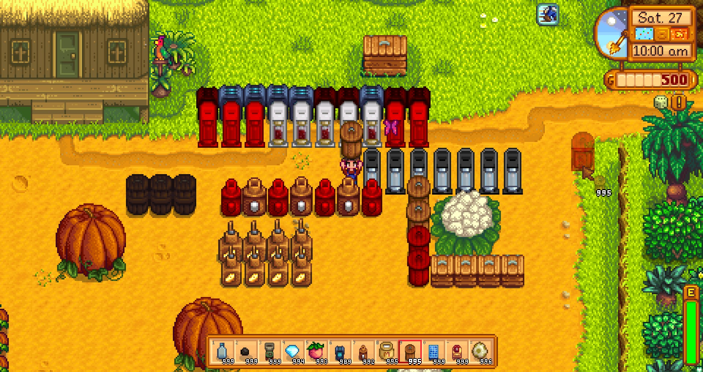

**You're viewing a file in the SMAPI mod dump, which contains a copy of every open-source SMAPI mod
for queries and analysis.**

**This is _not_ the original file, and not necessarily the latest version.**  
**Source repository: https://github.com/atravita-mods/HighlightEmptyMachines**

----

Highlight Empty Machines
===========================

Inspired by [Highlighted Jars](https://www.nexusmods.com/stardewvalley/mods/6833), this mods colors empty machines so they're easier to spot. Works for every vanilla machine and also [Producer Framework Mod](https://www.nexusmods.com/stardewvalley/mods/4970) machines. Additionally, dims "invalid" machines (machines in locations they don't currently work - ie casks in locations that are not valid for them, or PFM machines with location/weather/season restrictions.).

## Install

1. Install the latest version of [SMAPI](https://smapi.io).
2. Download this mod and unzip it into `Stardew Valley/Mods`.
3. Run the game using SMAPI.

## Uninstall
Simply delete from your Mods directory.

## Configuration
Run SMAPI at least once with this mod installed to generate the `config.json`, or use [Generic Mod Config Menu](https://www.nexusmods.com/stardewvalley/mods/5098) to configure.

1. The coloration (both the EmptyColor and InvalidColor) can be set independently. If you have [GMCM Options](https://www.nexusmods.com/stardewvalley/mods/10505) installed, these will be color selectors. Otherwise, it'll be a text field where you can enter any color name from Microsoft's long list [here](https://docs.microsoft.com/en-us/dotnet/api/system.drawing.knowncolor?view=net-6.0), an HTML color code starting with `#` (ie `#FF0000` for red), or list of numbers (ie `255, 0, 0` for red.)
2. Every machine (including PFM machines) can be configured independently. If you have PFM machines, please load into a save before configuring - the PFM machines are not loaded until the save is.

## Mods in screenshot

The mod machines in the screenshot are from the excellent [Artisanal Soda Makers](https://www.nexusmods.com/stardewvalley/mods/5173) by Hadi!

## Compatibility

* Works with Stardew Valley 1.5.6 on Linux/macOS/Windows.
* Works in single player, multiplayer, and split-screen mode. Should be fine if installed for only one player in multiplayer.
* Should be compatible with most other mods. Tested with [Producer Framework Mod](https://www.nexusmods.com/stardewvalley/mods/4970). Currently does not affect DGA machines; I'll add that in later.

## See also

[Changelog](HighlightEmptyMachines/docs/Changelog.md)
