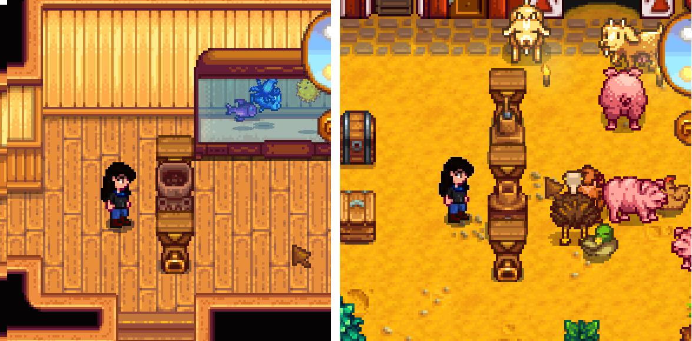

**You're viewing a file in the SMAPI mod dump, which contains a copy of every open-source SMAPI mod
for queries and analysis.**

**This is _not_ the original file, and not necessarily the latest version.**  
**Source repository: https://github.com/BPavol/stardew-valley-mods**

----

# Hopper Extractor mod
Hopper extracts items from machines.

# Install
1. Install the latest version of...
   * [SMAPI](https://smapi.io);
3. Extract mod files to `Mods/` folder.
4. Run the game using SMAPI.

# Use
Hopper placed below machines will extract items and store them in internal storage when machine is ready for harvest.

# Compatibility
Tested on Stardew Valley 1.5.6, Windows, single-player and local multiplayer. Should work for other operating systems too.
Compatibility with other mods is not tested, but should work unless mod patches same method `Object.minutesElapsed` as Hopper Extractor mod.

# Example of usage
