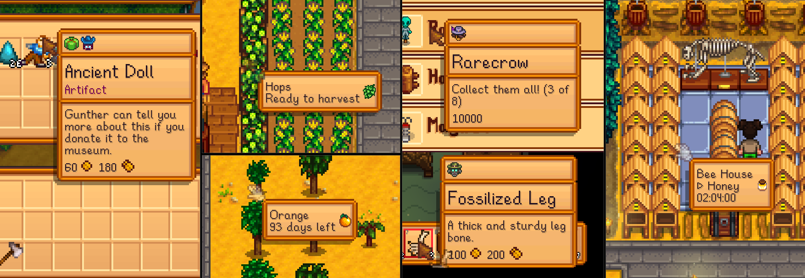
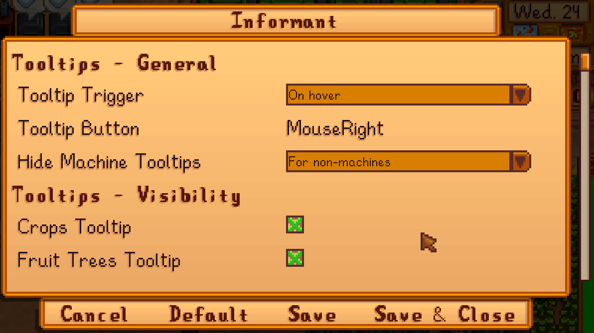
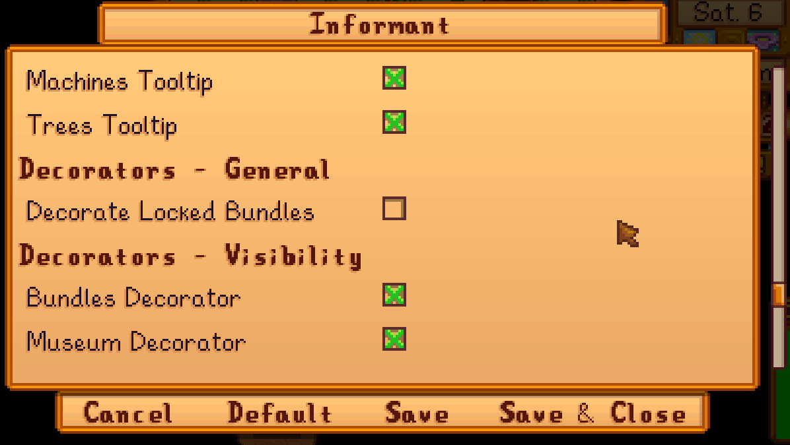
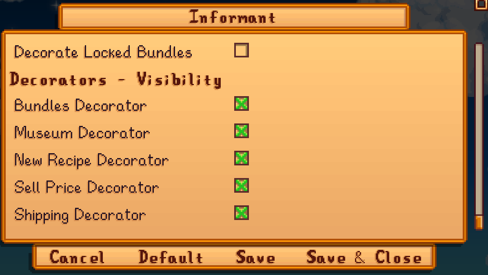

**You're viewing a file in the SMAPI mod dump, which contains a copy of every open-source SMAPI mod
for queries and analysis.**

**This is _not_ the original file, and not necessarily the latest version.**  
**Source repository: https://github.com/slothsoft/stardew-informant**

----

# Informant

_A Mod for Stardew Valley_

[](./LICENSE)

- **Author:** [Stef Schulz](mailto:s.schulz@slothsoft.de)
- **Repository:** <https://github.com/slothsoft/stardew-informant>
- **Open Issues:** <https://github.com/slothsoft/stardew-informant/issues>
- **NexusMods:** <https://www.nexusmods.com/stardewvalley/mods/14293>

A mod that displays additional information on various objects.
It marks inventory items that are still necessary for the bundle, calculates how many days are still left until the
harvest and displays what is in a machine and how much time is left on it.



This mod also provides a handy API to extend its functionality. 


**Content of this ReadMe:**

- **[User Manual](#user-manual)**
  - [Prerequisites](#prerequisites)
  - [Installing](#installing)
  - [Using the Mod](#using-the-mod)
  - [Configuration](#configuration)
  - [Versions](#versions)
- **[Translator Guide](#translator-guide)**
- **[Developer Notes](#developer-notes)**
- **[License](#license)**


## User Manual

### Prerequisites

You need **[SMAPI](https://smapi.io/)** to run any kind of mods. And of course you need 
**[Stardew Valley](https://www.stardewvalley.net/)**.


### Installing

1. Install [SMAPI](https://smapi.io/)
1. Unzip the latest _[Informant.zip](https://github.com/slothsoft/stardew-informant/releases/latest)_ to the _Mods/_ folder
1. If you want to use spacechase0's [Generic Mod Config Menu](https://www.nexusmods.com/stardewvalley/mods/5098), this mod automatically hooks into its menu


### Using the Mod

The mod is automatically present in the game. 
You just need to move the mouse over the object you wish to get the information from.

If you don't like one or more of the displayed information (or worse, if there are conflicts with other mods), you
can disable each type.

#### Decorators

There are some decorators, i.e. images displayed on the regular item tooltip, that have a specific meaning:

-  **Bundles Decorator** - displayed when the item is still needed for the bundles
-  **Museum Decorator** - displayed when the item is still needed for the museum
-  **Shipping Decorator** - displayed when the item was not yet shipped

For the **Bundles Decorator**, there is the option to show it on items needed for still locked bundles. On
default, the decorator is only shown for the bundles you have access to, to keep it fair and balanced.


#### Tooltips

You can also configure the tooltip "trigger", i.e. if you want the tooltip to show when the mouse hovers over an object,
or if you want to press a key. You can also select the key to press.

On default, of all the big craftable objects in the game, only machines that produce something will get a tooltip. You 
can configure that to include all craftable objects, or all except chest (if you have a mod that shows specific 
information for them already).


### Configuration

If you wish to configure this mod, it's advised to install spacechase0's
[Generic Mod Config Menu](https://www.nexusmods.com/stardewvalley/mods/5098). Then there will be a config
page.





But if you wish to change the _config.json_ file manually, you can also do that. The _config.json_ with all
entries is:

```json
{
  "DisplayIds": {
    "bundles": true,
    "challenger-decorator": true,
    "crop": true,
    "fruit-tree": true,
    "machine": true,
    "museum": true,
    "sell-price": true,
    "shipping": true,
    "tree": true
  },
  "DecorateLockedBundles": false,
  "HideMachineTooltips": "ForNonMachines",
  "TooltipTrigger": "Hover",
  "TooltipTriggerButton": "MouseRight"
}
```

| Key in JSON             | Config Name             | Default Value    | Explanation                                                                                                                                              |
|-------------------------|-------------------------|------------------|----------------------------------------------------------------------------------------------------------------------------------------------------------|
| `DisplayIds.bundles`    | Bundles Decorator       | `true`           | True if the bundle decorator should be activated                                                                                                         |
| `DisplayIds.crop`       | Crops Tooltip           | `true`           | True if the crops tooltip should be activated                                                                                                            |
| `DisplayIds.fruit-tree` | Fruit Trees Tooltip     | `true`           | True if the fruit trees tooltip should be activated                                                                                                      |
| `DisplayIds.machine`    | Machines Tooltip        | `true`           | True if the machines tooltip should be activated                                                                                                         |
| `DisplayIds.museum`     | Museum Decorator        | `true`           | True if the museum decorator should be activated                                                                                                         |
| `DisplayIds.sell-price` | Sell Price Decorator    | `true`           | True to show the item's price on the bottom of the tooltip                                                                                               |
| `DisplayIds.shipping`   | Shipping Decorator      | `true`           | True to marks items that were not shipped yet                                                                                                            |
| `DisplayIds.tree`       | Trees Tooltip           | `true`           | True if the trees tooltip should be activated                                                                                                            |
| `DecorateLockedBundles` | Decorate Locked Bundles | `false`          | `ForNonMachines` displays tooltips only on machines that do work<br>`ForChests` hides tooltips only for chests<br>`Never` displays tooltip on every item |
| `HideMachineTooltips`   | Hide Machine Tooltips   | `ForNonMachines` | `ForNonMachines` displays tooltips only on machines that do work<br>`ForChests` hides tooltips only for chests<br>`Never` displays tooltip on every item |
| `TooltipTrigger`        | Tooltip Trigger         | `Hover`          | `Hover` to get tooltips when the mouse hovers over the item<br>`ButtonHeld` to get tooltips only when a button is held                                   |
| `TooltipTriggerButton`  | Tooltip Button          | `MouseRight`     | If the trigger is `ButtonHeld`, this is the button that triggers the tooltip                                                                             |


### Versions

| Version | Issues                                                                         | Changes                                                                                                                                                                                                       |
|---------|--------------------------------------------------------------------------------|---------------------------------------------------------------------------------------------------------------------------------------------------------------------------------------------------------------|
| Future  | [Issues](https://github.com/slothsoft/stardew-informant/milestone/1)           |                                                                                                                                                                                                               |
| 1.3.3   | [Issues](https://github.com/slothsoft/stardew-informant/milestone/13?closed=1) | Portuguese translation and bugfixes                                                                                                                       |
| 1.3.2   | [Issues](https://github.com/slothsoft/stardew-informant/milestone/12?closed=1) | Translations (add French translation; update Korean translation)                                                                                                                                              |
| 1.3.1   | [Issues](https://github.com/slothsoft/stardew-informant/milestone/11?closed=1) | Bugfixes (fix config for "new" recipe; fix fruit tree calculation on Ginger Island; make decorator display shipped item needed for "ship 15 of everything"; fix time remaining for casks; fix ginger tooltip) |
| 1.3.0   | [Issues](https://github.com/slothsoft/stardew-informant/milestone/9?closed=1)  | Additional information (marks uncrafted recipes, shipping decorator, shows icons on tooltips)                                                                                                                 |
| 1.2.2   | [Issues](https://github.com/slothsoft/stardew-informant/milestone/10?closed=1) | Turkish translation                                                                                                                                                                                           |
| 1.2.1   | [Issues](https://github.com/slothsoft/stardew-informant/milestone/8?closed=1)  | Chinese translation                                                                                                                                                                                           |
| 1.2.0   | [Issues](https://github.com/slothsoft/stardew-informant/milestone/7?closed=1)  | Sell price feature                                                                                                                                                                                            |
| 1.1.1   | [Issues](https://github.com/slothsoft/stardew-informant/milestone/6?closed=1)  | Bugfixes from NexusMods feedback                                                                                                                                                                              |
| 1.1.0   | [Issues](https://github.com/slothsoft/stardew-informant/milestone/5?closed=1)  | Split-screen & API fixes                                                                                                                                                                                      |
| 1.0.0   | [Issues](https://github.com/slothsoft/stardew-informant/milestone/4?closed=1)  | Nexus Release                                                                                                                                                                                                 |
| 0.4.0   | [Issues](https://github.com/slothsoft/stardew-informant/milestone/3?closed=1)  | Prepare for Nexus Release                                                                                                                                                                                     |
| 0.3.0   | [Issues](https://github.com/slothsoft/stardew-informant/milestone/2?closed=1)  | Strutured PoC                                                                                                                                                                                                 |
| 0.2.0   | -                                                                              | Crop Informant                                                                                                                                                                                                |
| 0.1.0   | -                                                                              | Bundle Informant                                                                                                                                                                                              |

_(All issues can be found [here](https://github.com/slothsoft/stardew-informant/issues).)_


## Translator Guide

Right now, not all translations are provided. If you want to help, translate either file in the _[i18n/](./Informant/i18n/)_
and test it right in your Stardew Valley (the same folder exists in your _Mods/_ folder). You can than provide it
to me via [pull request](https://github.com/slothsoft/stardew-informant/fork) or [email](mailto:s.schulz@slothsoft.de).

| Key       | Language  | Translated?                                                                        |
|-----------|-----------|------------------------------------------------------------------------------------|
| `default` | English   | ✅                                                                                  |
| `de`      | German    | ✅                                                                                  |
| `es`      | Spanish   | 🔜                                                                                 |
| `fr`      | French    | ✅ (thanks to [ArndGlh](https://github.com/ArndGlh))                                |
| `hu`      | Hungarian | 🔜                                                                                 |
| `it`      | Italian   | 🔜                                                                                 |
| `ja`      | Japanese  | 🔜                                                                                 |
| `ko`      | Korean    | ✅ (thanks to [brighteast99](https://github.com/brighteast99))                      |
| `pt`      | Portugese | ✅ (thanks to [Mikeliro](https://github.com/Mikeliro)                                     |
| `ru`      | Russian   | 🔜                                                                                 |
| `th`      | Thai      | 🔜                                                                                 |
| `tr`      | Turkish   | ✅ (thanks to [ExaBronto](https://www.nexusmods.com/stardewvalley/users/114449313)) |
| `zh`      | Chinese   | ✅ (thanks to [gottyduke](https://github.com/gottyduke))                            |


## Developer Notes

_(This section contains notes to myself.)_

### Starting Development

To start developing this mod, you need to

1. Create [stardewvalley.targets](https://github.com/Pathoschild/SMAPI/blob/develop/docs/technical/mod-package.md#custom-game-path) file with the game folder


### Use the Mod's API

There is a smaller API you can use without a direct dependency to this DLL. Just copy this interface:

```c#
using System;
using Microsoft.Xna.Framework.Graphics;
using StardewValley.TerrainFeatures;

namespace MyMod.ThirdParty; 

/// <summary>
/// Base class for the entire API. Can be used to add custom information providers.<br/>
/// <b>API Version:</b> 1.3.3
/// </summary>
public interface IInformant {

    /// <summary>
    /// Adds a tooltip generator for the <see cref="TerrainFeature"/>(s) under the mouse position.
    /// </summary>
    void AddTerrainFeatureTooltipGenerator(string id, Func<string> displayName, Func<string> description, Func<TerrainFeature, string> generator); 
    
    /// <summary>
    /// Adds a tooltip generator for the <see cref="Object"/>(s) under the mouse position.
    /// </summary>
    void AddObjectTooltipGenerator(string id, Func<string> displayName, Func<string> description, Func<SObject, string?> generator); 
    
    /// <summary>
    /// Adds a decorator for the <see cref="Item"/>(s) under the mouse position.
    /// </summary>
    void AddItemDecorator(string id, Func<string> displayName, Func<string> description, Func<Item, Texture2D?> decorator); 
}
```

And then you can access the mod's API like this:

```c#
public class MyMod : Mod {
    public override void Entry(IModHelper modHelper) {
        Helper.Events.GameLoop.GameLaunched += (sender, args) => {
            var informant = Helper.ModRegistry.GetApi<IInformant>("Slothsoft.Informant");
            if (informant is null)
                return;

            // now call the methods of the informant
            informant.AddItemDecorator(...);
            informant.AddObjectTooltipGenerator(...);
            informant.AddTerrainFeatureTooltipGenerator(...);
        };
    }
}
```

If more control over the API is wanted or needed, a dependency to this mod can be added, and then the 
entire [Api](./Informant/Api) folder can be used.


### Release

1. Run _build.bat_, which only really works on my PC, but so what:
```bat
.\build
```
3. Put the contents of _bin/Informant*.zip_ in a fresh Stardew Valley and test if everything works
4. Create a new tag and release on GitHub, append the ZIPs
5. Increment the version in _manifest.json_ and _build/common.targets_


### Used Tutorials

- **General Information:**
  - SMAPI API: [Modding:Modder Guide/APIs](https://stardewvalleywiki.com/Modding:Modder_Guide/APIs)
  - Stardew Valley API: [StawdewValley on GitHub](https://github.com/veywrn/StardewValley)


## License

This project is licensed under the MIT License - see the [MIT license](./LICENSE) for details.