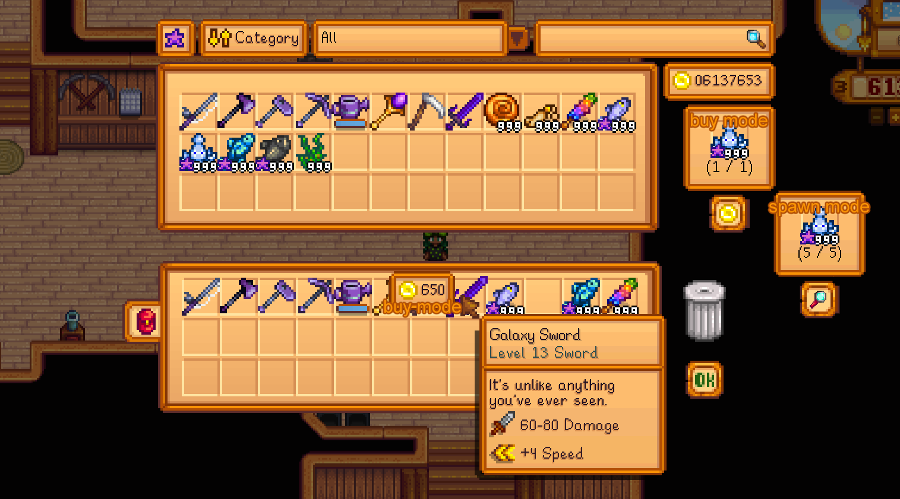

**You're viewing a file in the SMAPI mod dump, which contains a copy of every open-source SMAPI mod
for queries and analysis.**

**This is _not_ the original file, and not necessarily the latest version.**  
**Source repository: https://github.com/TSlex/StardewValley**

----

## Item Research 'n' Spawn

1. [Description](#description)
1. [Modes](#modes)
1. [Usage](#usage)
1. [Keys](#keys)
1. [Commands](#commands)
1. [Compatibility](#compatibility-at-present)
1. [Release notes](release-notes.md)
1. [How to support](supporting.md)

### Description:

**Item Research 'n' Spawn** is a mod for Stardew Valley that lets give any item you want if you've researched it!

Want many of **\<item you want here>**?    
Collect some of them, put in research area, and click the button!    
Now you can have as much of **\<item you want here>** as you want :)



### Modes:

This mod has two modes:

* __"Spawn" mode__ - [Terraria Journey mode](https://terraria.fandom.com/wiki/Journey_Mode#Duplication) like mode.
  Research the items and afterward give as much as you want. Different items have different amount of quantity needed
  for research completion, depends on item category.


* __"Buy" mode__ - [Minecraft ProjectE mod](https://ftb.fandom.com/wiki/ProjectE) like mode. 
  Works almost like "Spawn" mode, but here you need to spend money to get the item. Returning the item (selling)
  will increase your balance. In this mode all researches required only one item.


  
See [commands](#commands) to know how to change mode and prices for "Buy" mode   
In mod config, you can specify default mode!

### Usage:

Press `R` on your keyboard (configurable) to open the menu.

In the menu you can...

+ Change item quality by clicking the quality button.
+ Change category filters by clicking the dropdown.
+ Scroll items with your mouse scroll wheel.
+ Search by pointing at the search box and typing an item name.
+ Research any item by placing it in research area and clicking the research button

Menu saves selected quality, category and search key

### Keys:

Quality button:   
`LMB` - next higher quality   
`RMB` - previous higher quality

Sort option button:   
`LMB` - next option   
`RMB` - previous option

Category selector:   
`LMB` - open dropbox / select category    
`RMB` - close dropbox (without selection) / reset category   
`Scroll` - scroll categories / change category to next/previous   
`<Left/Right arrows>` - change category to next/previous

Searchbar:  
`LMB` - focus / blur    
`Hover` - focus / blur    
`RMB` - clear searchbar   
`ESC` - clear searchbar

Research area:   
`LMB` - standard actions, like in chest / research    
`RMB` - standard actions, like in chest     
`Shift + LMB` - fast move an item to research area and back (if item not researched)

Other:   
`Scroll` - scroll cheat inventory   
`Up/Down arrows` - scroll cheat inventory   
`LMB` - move item to trash (only if researched) / drop items   
`Delete` - delete an item (only if researched and only in "Spawn" mode)   
`Shift + LMB (over trashcan)` - delete all researched items (or sells them in "Buy" mode)
`Shift + LMB` - delete an item or sell it

### Commands:
__In-game only, recommended to open menu at least once!__   
<sub>Add "/" if use from game itself (__if ChatCommands installed__)<sub>
```
rns_get_key //logs active item unique key

rns_unlock_all //unlock all items (in-game only, menu must be opened at least once)   

rns_unlock_active //unlock hotbar active item (in-game only, menu must be opened at least once)  

rns_set_mode [0/1] //change mod mode to Spawn (0) or Buy (1)

rns_set_price [0+] //change price for hotbar active item for "Buy" mode. Price must be non-negative!

rns_reset_price //reset price for hotbar active item for "Buy" mode to initial values

rns_dump_progression //get player(s) progression and saves into file(s)

rns_load_progression //load and apply player(s) progression from file(s)

rns_dump_pricelist //get custom pricelist and saves into file (only for host in multiplayer)

rns_load_pricelist //load and apply custom pricelist from file (only for host in multiplayer)

rns_dump_categories //get custom categories and saves into file (only for host in multiplayer)

rns_load_categories //load and apply custom categories from file (only for host in multiplayer)
```

### Compatibility (at present):

+ **All platforms supported** (MacOS not tested)
+ Singleplayer + multiplayer (not split screen)
+ Only keyboard + mouse (gamepad not tested)
+ **SMAPI 3.9.5** or later

[(Top)](#item-research-n-spawn)
