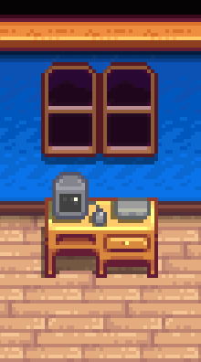
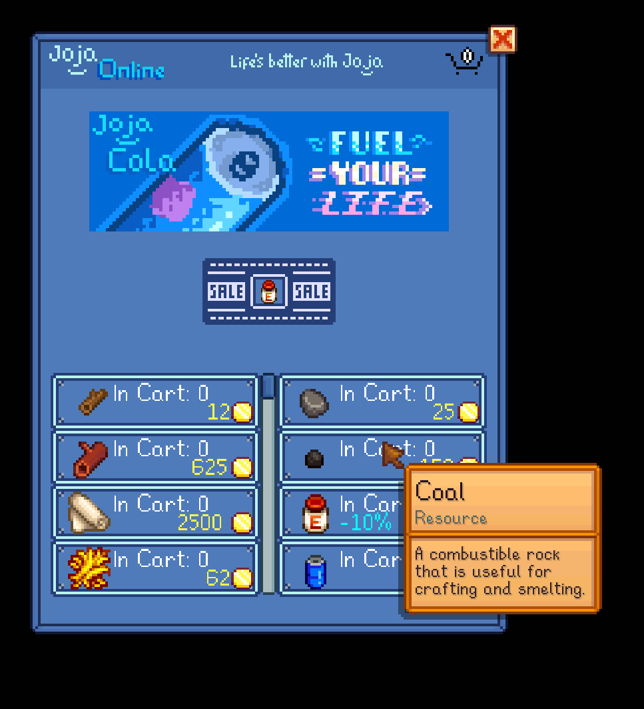
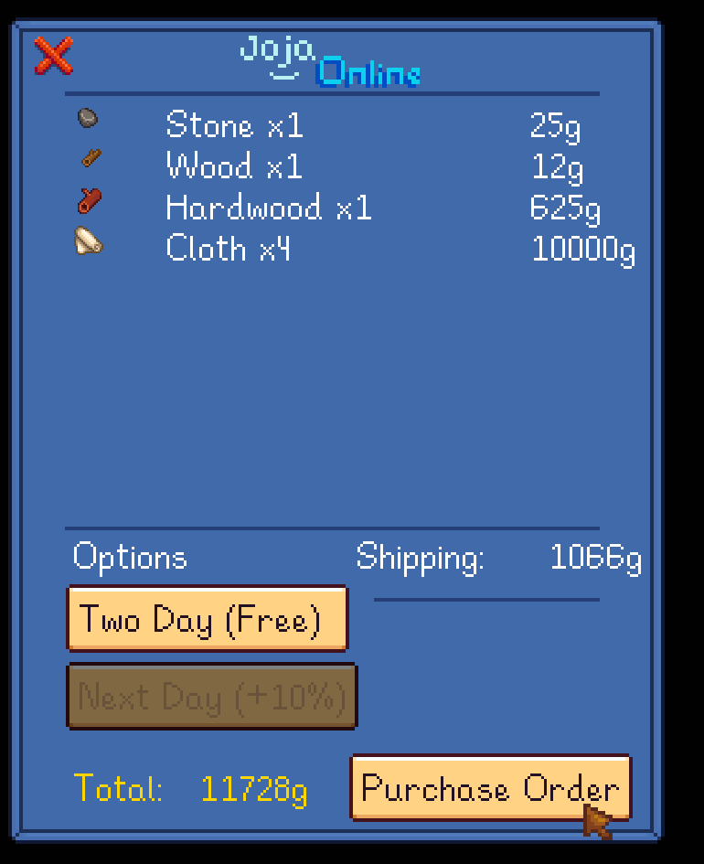

**You're viewing a file in the SMAPI mod dump, which contains a copy of every open-source SMAPI mod
for queries and analysis.**

**This is _not_ the original file, and not necessarily the latest version.**  
**Source repository: https://github.com/Floogen/JojaOnline**

----

# JojaOnline

**JojaOnline** is a mod for [Stardew Valley](http://stardewvalley.net/) that adds a new "online" shop. This mod also adds a computer furniture, which allows access to the new store.

The **JojaOnline** shop has access to all of JojaMart's items (regardless if your local JojaMart has been terminated). The shops share the same prices, including the price change if you purchased a JojaMart membership.

Additionally, **JojaOnline** has some extra items in stock from other local stores (such as wood, stone and fertilizers). The shop has also stocked some items not purchasable elsewhere like hardwood, but don't expect the prices to be cheap!

The idea behind **JojaOnline** was to create a mod that gave players the ability to purchase items without having to spend their time trekking across town from store to store (at the cost of being more expensive). I also wanted it to fit within the world of Stardew Valley and what better way than to have the Joja Corporation providing the service!

## Install
1. [Install the latest version of SMAPI](https://smapi.io/).
2. [Install all the dependencies](#dependencies).
3. Install [this mod from Nexus mods](http://www.nexusmods.com/stardewvalley/mods/7486).
4. Run the game using SMAPI.

## Using JojaOnline
### If using Custom Furniture
Purchase the Computer furniture from your local carpenter store (Robin) and place it anywhere (presumably your home).

Right click the Computer to open up **JojaOnline**.

### If using Mobile Phone
Open your in-game phone from using the Mobile mod and click the **JojaOnline** app icon.

The items available for purchase will be displayed on the lower half of the screen. Left clicking an item will add it to your cart, while right clicking will *remove* items. You can shift click to add or remove multiple items, as well as hold down to add or remove until you let go.

Once you are ready to purchase, click on the cart icon located on the top right and you'll be brought to the checkout screen. There you can see an overview of your selected items and the total cost. You are also able to pick a shipping method.

After you confirm your purchase, your order will arrive by mail!

## Additional Details
### ---Shipping---
**JojaOnline** offers the following shipping options to their customers:
|Shipping Method| Details |
|--|--|
| `Next Day` | Arrives the next morning, but **JojaOnline** will charge an additional 10% |
| `Two Day` | **JojaOnline**'s complimentary free shipping method|

**JojaOnline** also offers Joja Prime membership for a modest fee, which makes Next Day shipping free.

### ---Daily Sale---
The shop will randomly pick a stocked item everyday to put on sale. The sale price is picked at random between `minSalePercentage` and`maxSalePercentage`.

### ---Limitations---
The maximum amount of **unique** items per order is 10. You can, however, have as many orders as you'd like. For example, you could place two separate orders on the same day with next day shipping. Both orders would then arrive on the next morning.

## Configurations
This mod creates a `config.json` under the `...\JojaOnline\JojaOnline` folder. It contains a few options that you can modify to change how **JojaOnline** interacts with the game.

**Settings**
|Name| Description | Default Value |
|--|--|--|
| `areAllSeedsAvailableBeforeYearOne` | If `true`, it adds all of JojaMart's seed stocks to the **JojaOnline** shop, regardless of season. | `false` |
| `giveJojaMemberDiscount` | If `true`, it removes the 25% price increase from the **JojaOnline** shop. | `false` |
| `giveJojaPrimeShipping` | If `true`, it makes next day delivery free. | `false` |
| `minSalePercentage` | The minimum sale percentage the shop will use. | `5` |
| `maxSalePercentage` | The maximum sale percentage the shop will use. | `35` |
| `itemNameToPriceOverrides` | A dictionary of item names to prices, which will override their default prices in **JojaOnline**. Example: `{"Joja Cola": 500}`. | `{}` |

## Dependencies
 - [Mail Framework Mod](https://www.nexusmods.com/stardewvalley/mods/1536)
 - [Json Assets](https://www.nexusmods.com/stardewvalley/mods/1720)
 - [Custom Furniture](https://www.nexusmods.com/stardewvalley/mods/1254) (Optional: Use this or Mobile Phone)
 - [Mobile Phone](https://www.nexusmods.com/stardewvalley/mods/6523) (Optional: Use this or Custom Furniture)

## Compatibility
**JojaOnline** is compatible with Stardew Valley v1.5+ for single-player (multiplayer is not supported).

Please note **JojaOnline** will not work with Custom Furniture when paired with SpaceCore v1.5+ due to an issue with PyTk (required for Custom Furniture). If you must use SpaceCore, please use the Mobile Phone instead of Custom Furniture (or use SpaceCore v1.4.0).
