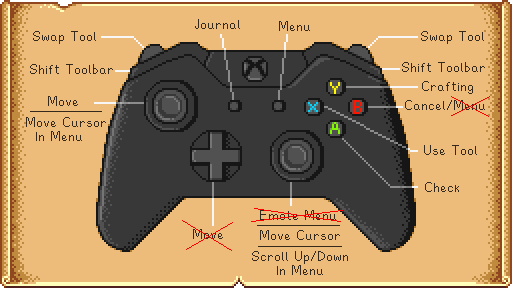

**You're viewing a file in the SMAPI mod dump, which contains a copy of every open-source SMAPI mod
for queries and analysis.**

**This is _not_ the original file, and not necessarily the latest version.**  
**Source repository: https://github.com/Deflaktor/KeySuppressor**

----

# Key Suppressor

Suppresses a configurable list of keys to prevent the base game from handling that key event whilst enabling other mods to still handle that event.

## Motivation

The [Controller mapping](https://stardewcommunitywiki.com/Controls) in Stardew Valley often has multiple keys for the same action defined. For example the XBox Controller has three buttons for opening the menu (Start, Y and B). This mod aims to free up some of the duplicate keys to be used by other mods.

Some example mods which can be used with this mod:
- [Billboard Anywhere](https://www.nexusmods.com/stardewvalley/mods/492)
- [Data Layers](https://www.nexusmods.com/stardewvalley/mods/1691)
- [Horse Flute Anywhere](https://www.nexusmods.com/stardewvalley/mods/7500)
- [Lookup Anything](https://www.nexusmods.com/stardewvalley/mods/541)
- [Drop It - Drop Item Hotkey](https://www.nexusmods.com/stardewvalley/mods/7971)

It does not always work though with mods which require a button to be held. These mods need to adapt their code to ensure compatibility with this mod.

## Configuration

Start the game and let the 'config.json' be generated. By default it creates a list you may want to modify:

| Button               | Suppress Mode              | Note |
| -------------------- | -------------------------- | ---- |
| DPadDown             | Suppress                   |      |
| DPadLeft             | Suppress                   |      |
| DPadRight            | Suppress                   |      |
| DPadUp               | Suppress                   |      |
| LeftShift            | DoNotSuppress              |      |
| RightStick           | Suppress                   | Suppressing this button removes the chat functionality. Useful for splitscreen. |
| ControllerA          | DoNotSuppress              |      |
| ControllerB          | SuppressOnlyWhenPlayerFree | Retains the functionality to cancel within menus, but frees it up for when the player is free to act |
| ControllerX          | DoNotSuppress              |      |
| ControllerY          | DoNotSuppress              |      |
| ControllerBack       | DoNotSuppress              |      |
| ControllerStart      | DoNotSuppress              |      |
| BigButton            | DoNotSuppress              |      |
| LeftShoulder         | DoNotSuppress              |      |
| RightShoulder        | DoNotSuppress              |      |
| LeftTrigger          | DoNotSuppress              |      |
| RightTrigger         | DoNotSuppress              |      |
| LeftThumbstickDown   | DoNotSuppress              |      |
| LeftThumbstickLeft   | DoNotSuppress              |      |
| LeftThumbstickRight  | DoNotSuppress              |      |
| LeftThumbstickUp     | DoNotSuppress              |      |
| RightThumbstickDown  | DoNotSuppress              |      |
| RightThumbstickLeft  | DoNotSuppress              |      |
| RightThumbstickRight | DoNotSuppress              |      |
| RightThumbstickUp    | DoNotSuppress              |      |

You can freely extend this list by other keys. See a list of possible keys in the Stardew Wiki page [Key Bindings](https://stardewcommunitywiki.com/Modding:Player_Guide/Key_Bindings)

The following suppression modes exist:

- `Suppress`: The key is suppressed in all circumstances of the game (even in the main menu, loading screen, etc.)
- `SuppressOnlyWhenPlayerFree`: The key is suppressed only ingame when the player is free to act on the world (no menu is displayed, no cutscene is in progress, etc).
- `SuppressOnlyInMenu`: The key is suppressed only ingame when the player is currently in some menu (inventory, chests, etc.)
- `SuppressOnlyWhenPlayerCanMove`: Same as `SuppressOnlyWhenPlayerFree` but the player is also free to move (e.g. not using a tool)

