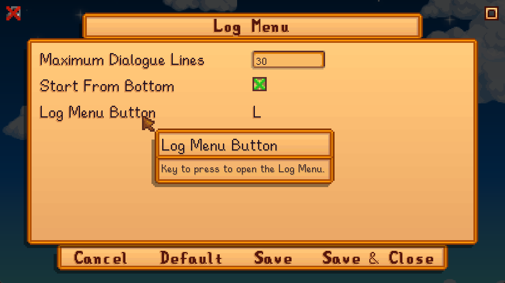

**You're viewing a file in the SMAPI mod dump, which contains a copy of every open-source SMAPI mod
for queries and analysis.**

**This is _not_ the original file, and not necessarily the latest version.**  
**Source repository: https://github.com/jaredtjahjadi/LogMenu**

----

# Log Menu
**Log Menu** is a Stardew Valley mod that adds a Log Menu to display previously seen in-game dialogue. This mod is inspired by the Log/History feature implemented in visual novel games and some RPGs.

## Install
1. [Install the latest version of SMAPI](https://smapi.io/).
2. [Install this mod from Nexus Mods](https://www.nexusmods.com/stardewvalley/mods/19919).
3. Run the game using SMAPI.

## Usage
Press `L` to display the Log Menu. The 30 most recent dialogue lines will be shown.

## Configuration
### In-Game
If you have [Generic Mod Config Menu](https://www.nexusmods.com/stardewvalley/mods/5098) installed, you can click the cog button (⚙) on the title screen or the "Mod Options" button at the bottom of the in-game options menu to configure the mod. Hover the cursor over a field for more details, or see the nex t section.

### `config.json`
A `config.json` file will be created in the mod folder when it is run for the first time. You can open that file in a text editor to configure the mod. If you make a mistake, you can delete the `config.json` file and it will create a default one.

Changable settings:
<table>
  <tr>
    <th>Field</th>
    <th>Description</th>
    <th>Default Value</th>
  </tr>
  <tr>
    <td><code>StartFromBottom</code></td>
    <td>Whether to start from the bottom of the Log Menu.</td>
    <td><code>true</code></td>
  </tr>
  <tr>
    <td><code>OldestToNewest</code></td>
    <td>Whether the messages in the Log Menu should be displayed from oldest (top) to newest (bottom) or vice versa.</td>
    <td><code>true</code></td>
  </tr>
  <tr>
    <td><code>NonNPCDialogue</code></td>
    <td>Whether to include dialogue from interacting with objects, furniture, etc.</td>
    <td><code>true</code></td>
  </tr>
  <tr>
    <td><code>ToggleHUDMessages</code></td>
    <td>Option to log HUD messages.</td>
    <td><code>false</code></td>
  </tr>
  <tr>
    <td><code>LogLimit</code></td>
    <td>The maximum number of lines to display in the Log Menu.</td>
    <td>30</td>
  </tr>
  <tr>
    <td><code>LogButton</code></td>
    <td>The button to press in order to open the Log Menu.</td>
    <td><code>L</code></td>
  </tr>
</table>

## Compatibility
Log Menu is compatible with Stardew Valley 1.5.6 on Linux, MacOS, and Windows.

## To-Do
- ~~Remove empty strings from dialogue list (i.e., when a dialogue box with a question has responses but no text)~~
- Implement config option to log HUD messages
- Implement config option to log dialogue from skipped cutscenes
- Allow player to open Log Menu while a dialogue box is open and return to the dialogue box when the log menu is closed (???)
- When player selects response to question, update Log Menu to make the selected response bold (???)