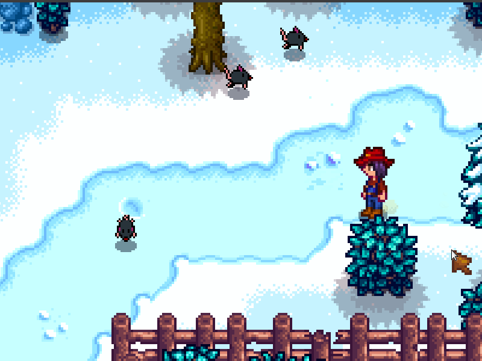

**You're viewing a file in the SMAPI mod dump, which contains a copy of every open-source SMAPI mod
for queries and analysis.**

**This is _not_ the original file, and not necessarily the latest version.**  
**Source repository: https://github.com/mus-candidus/MiceInTheValley**

----

**MiceInTheValley** is a [Stardew Valley](http://stardewvalley.net/) mod which adds mice.
The small rodents appear in random locations near bushes.

