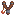

**You're viewing a file in the SMAPI mod dump, which contains a copy of every open-source SMAPI mod
for queries and analysis.**

**This is _not_ the original file, and not necessarily the latest version.**  
**Source repository: https://github.com/daleao/modular-overhaul**

----

<div align="center">

# MARGO :: Professions (PRFS)


</div>

<!-- TABLE OF CONTENTS -->
<details  open="open"  align="left">
<summary>Table of Contents</summary>
<ol>
	<li><a href="#overview">Overview</a></li>
	<li>
		<a href="#professions">Professions</a>
		<ol>
			<li><a href="#-farming">Farming</a></li>
			<li><a href="#-foraging">Foraging</a></li>
			<li><a href="#-mining">Mining</a></li>
			<li><a href="#-fishing">Fishing</a></li>
			<li><a href="#-combat">Combat</a></li>
		</ol>
	</li>
	<li><a href="#prestige">Prestige</a></li>
	<li><a href="#limit-breaks">Limit Breaks</a></li>
	<li><a href="#compatibility">Compatibility</a></li>
	<li><a href="#recommended-mods">Recommended Mods</a></li>
	<li><a href="#for-mod-authors">For Mod Authors</a></li>
	<li><a href="#faq">F.A.Q.</a></li>
</ol>
</details>

## Overview

This module is an extensive overhaul of vanilla professions and skills, and makes up the core of the overhaul. Almost every profession has been reworked to be an equally unique and attractive choice targetting a specific style of gameplay, many of which were simply not viable in vanilla (i.e., ranching). And while it is not guaranteed that an "optimal" path does not exist, the main goal is to create opportunities for diversified or themed strategies as well as engaging new gameplay mechanics. Gone are the ~~boring~~ uninspiring +X% sell price bonuses, and in their stead we introduce bomberman mining, thief/assassin combat, truly epic sharpshooting and even Slime taming. The new professions are meant to scale with player, provide new end-game objectives and steer the player towards new playstyles.

By popular demand this module also introduces an immersive (and completely optional) **Prestige** system, which will eventually allow the player to obtain *all* professions and open up skill progression to level 20. Also added are unique Limit Breaks for each combat profession, with accompanying new visual and sound effects.

This module was inspired by [Enai Siaion][user:enai]'s excellent [Ordinator][mod:ordinator] mod for Skyrim, and borrows many ideas (and a few assets) from the likes of [League Of Legends][url:league], [Diablo][url:diablo] and the classic [Ragnarok Online][url:ragnarok]. It also includes new improved profession icons by [IllogicalMoodSwing][user:illogicalmoodswing] (**please visit and endorse [Profession Icons Redone][mod:icons-redone]!**).

Integrations are provided out-of-the-box for several popular mods. See the [compatibility](#compatibility) section for details.

This module is safe to enable or disable mid-save. All profession perks will be applied retroactively. However, please note that disabling this mod will have no effect on skill levels or acquired professions, so make sure to manually reset your skills and professions back to vanilla standards **before** disabling, using provided console commands.

<sup><sup>[🔼 Back to top](#margo--professions-prfs)</sup></sup>

## Professions

Click on any profession below to display more details. When a perk is preceded by a <font color="gold">⭐ gold star</font>, it refers to a [prestige](#prestige) variant.

###  Farming

<ul>

<details>
<summary><b>Harvester (Lv5)</b> - 10% chance for extra yield from harvested crops.
</summary>

<ul>
<font size="2">

- Yields an equivalent 10% monetary bonus to vanilla on average, but also provides value if you choose not to sell raw crops.

<font color="gold">
<b>⭐  Expert Harvester (Lv15)</b> - <s>10%</s> → 20% chance for extra yield from harvested crops.
</font>

</font>
</ul>
</details>

<details>
<summary><b>Agriculturist (Lv10)</b> - Crops grow 10% faster. Can harvest best-quality crops organically without fertilizer.
</summary>

<ul>
<font size="2">

- Allows harvesting iridium-quality crops, normally only possible with Deluxe Fertilizer. The chance is equivalent to half of that with Deluxe Fertilizer, which means that fertilizers are **by no means** obsolete. Note that quality is determined only on the moment of harvest; planted crops have no quality.

<font color="gold">
<b>⭐  Cropwhisperer (Lv20)</b> - Crops grow <s>10%</s> → 20% faster.
</font>

</font>
</ul>
</details>

<details>
<summary><b>Artisan (Lv10)</b> - Artisan machines work 10% faster. Machine output quality can be as good as input ingredient quality.
</summary>

<ul>
<font size="2">

- The quality of the output is based on your Farming level, with the lowest quality being 2 stages below the input quality, and the highest being 1 stage higher. For reference, the chance for output quality to *equal* input quality at Farming level 10 is 30%.
- Note that the quality preservation part of the perk is tied to the Artisan player, while the production time and quality promotion perks are tied to the machine itself; in other words, only Artisans themselves can process goods which preserve the ingredient quality, and they can do so on any machine, whereas non-Artisan players can still benefit from faster production and small chance for quality upgrade (in that case, capped at silver), so long as they use a machine that was crafted by an Artisan player (ownership requirements can be turned off in the configs).

<font color="gold">
<b>⭐  Mastercraftsman (Lv20)</b> - Artisan machines work <s>10%</s> → 25% faster.
</font>

</font>
</ul>
</details>

<details>
<summary> <b>Rancher (Lv5)</b> - Befriend animals 2× more quickly.
</summary>

<ul>
<font size="2">

- Gain double mood *and* friendship points from petting. Newborn animals are also born with a non-zero, random initial friendship.

<font color="gold">
<b>⭐  Expert Rancher (Lv15)</b> - Befriend animals <s>2×</s> → 3× more quickly.
</font>

</font>
</ul>
</details>

<details>
<summary> <b>Breeder (Lv10)</b> - Incubation 2× faster and natural pregnancy 3× more likely. Increase value of animals at high friendship.
</summary>

<ul>
<font size="2">

- At max friendship animals are worth 2.5x their base price, instead of vanilla 1.3×. If Animal Husbandry is installed, gestation following insemination is also 2× faster.

<font color="gold">
<b>⭐  Progenitor (Lv20)</b> - Incubation <s>2×</s> → 3× faster and natural pregnancy <s>3×</s> → 5× more likely.
</font>

</font>
</ul>
</details>

<details>
<summary> <b>Producer (Lv10)</b> - Happy animals produce 2× as frequently. Produce is worth 5% more for every full barn or coop.
</summary>

<ul>
<font size="2">

- Note that happiness, or [mood](https://stardewvalleywiki.com/Animals#Mood), is **not** the same as friendship.
- This will **not** allow certain animals that already produce every day (i.e., cows and chickens) to produce more that once per day.
- The bonus produce value also applies to artisan goods derived from animal products (such as cheeses, mayos and cloth), honey (bees are animals too), and meat from Animal Husbandry or PPJA Fresh Meat.
- Only deluxe buildings can be considered full, and only barns and coops owned by the Producer will be considered (ownership requirements can be turned off in the configs).
- There is no limit to the bonus value.

<font color="gold">
<b>⭐  Yieldmeister (Lv20)</b> - Happy animals produce <s>2×</s> → 3× as frequently.
</font>

</font>
</ul>
</details>

</ul>

###  Foraging

<ul>

<details>
<summary> <b>Forager (Lv5)</b>- 20% chance for double yield of foraged items.
</summary>

<ul>
<font size="2">

- Other than the name, this profession is unchanged from vanilla.

<font color="gold">
<b>⭐  Expert Forager (Lv15)</b> - <s>20%</s> → 40% chance for double yield of foraged items.
</font>

</font>
</ul>
</details>

<details>
<summary> <b>Ecologist (Lv10)</b> - Wild berries restore 50% more health and energy. Progressively identify forage of higher quality.
</summary>

<ul>
<font size="2">

- All foraged items will have the same deterministic quality, providing immediate inventory convenience. However, that quality will initially start out at silver, and gradually progress to iridium as you forage more items.
- Unlike vanilla, this perk will also apply to hoed forage (such as Winter Root, Snow Yams and Ginger), Coconuts shaken off palm trees, and mushrooms produced by Mushroom Boxes, but only if the cave owner (i.e., the host player) has the profession. It will likewise apply to crafted Mushroom Boxes and Mushroom Propagators, if either of those mods is installed.

<font color="gold">
<b>⭐  Bioharmonist (Lv20)</b> - Wild berries restore <s>50%</s> → 100% more health and energy.
</font>

</font>
</ul>
</details>

<details>
<summary> <b>Scavenger (Lv10)</b> - Location of forageable items revealed. Occasionally detect buried treasure.
</summary>

<ul>
<font size="2">

- Whenever you are outside there is a chance to trigger a short Scavenger Hunt for hidden buried treasure. Follow the purple HUD arrow to find the treasure and dig it up (with a hoe) within the time limit to obtain a reward. Rewards may start out underwheming, but can be improved dramatically by building up a streak.
- Your Scavenger Hunt streak will also increase the chance for additional forage to spawn when entering a new map.
- You may also hold a key (LeftShift by default) to highlight all forageable items currently on-screen, for your convenience.
- You can optionally configure the tracking HUD arrows to only appear when holding that same key (LeftShift by default).

<font color="gold">
<b>⭐  Relicseeker (Lv20)</b> - Time freezes during Scavenger Hunts.
</font>

</font>
</ul>
</details>

<details>
<summary> <b>Lumberjack (Lv5)</b> - Felled trees yield 25% more wood.
</summary>

<ul>
<font size="2">

- Other than the name, this profession is unchanged from vanilla.

<font color="gold">
<b>⭐  Expert Lumberjack (Lv15)</b> - Felled trees yield <s>25%</s> → 40% more wood.
</font>

</font>
</ul>
</details>

<details>
<summary> <b>Arborist (Lv10)</b> - Trees grow faster when planted by hand. All trees have a chance to drop hardwood.
</summary>

<ul>
<font size="2">

- Bonus to growth speed is 50% for regular Trees, and 25% for Fruit Trees. Only applies to trees manually planted by a player with this profession, unless ownership requirements are disabled. Does not apply to Trees planted naturally by other Trees.
- The hardwood bonus is inherited and uchanged from vanilla.

<font color="gold">
<b>⭐  Silviculturist (Lv20)</b> - All trees can drop twice as much hardwood.
</font>

</font>
</ul>
</details>

<details>
<summary> <b>Tapper (Lv10)</b> - Tappers are cheaper to craft. Tapped trees produce syrup 25% faster.
</summary>

<ul>
<font size="2">

- New regular recipe: x25 wood, x1 copper bar.
- New Heavy recipe: x18 hardwood, x1 radioactive bar.

<font color="gold">
<b>⭐  Syrupwright (Lv20)</b> - Tapped trees produce syrup <s>25%</s> → 50% faster.
</font>

</font>
</ul>
</details>

</ul>

###  Mining

<ul>

<details>
<summary> <b>Miner (Lv5)</b> - +1 ore per ore vein.
</summary>

<ul>
<font size="2">

- Completely unchanged from vanilla.

<font color="gold">
<b>⭐  Expert Miner (Lv15)</b> - <s>+1</s> → +2 ore per ore vein.
</font>

</font>
</ul>
</details>

<details>
<summary> <b>Spelunker (Lv10)</b> - Chance to find ladders and shafts increases after each mine level. +1 speed every 10 levels.
</summary>

<ul>
<font size="2">

- Plus 0.5% ladder chance per level. Bonus ladder chance resets each time you leave the mines. **This includes taking the stairs back to the mine entrance.**

<font color="gold">
<b>⭐  Cavewarden (Lv20)</b> - Recover some health and stamina at each mine level.
</font>

</font>
</ul>
</details>

<details>
<summary>
 <b>Prospector (Lv10)</b> - Location of ladders and mining nodes revealed. Occasionally detect rocks with valuable minerals.
</summary>

<ul>
<font size="2">

- Analogous to Scavenger.
- Tracks all mining nodes and mineral forages off-screen with a yellow pointer, and ladders, shafts and panning spots with a green pointer.
- Whenever you are in the mines there is a chance to trigger a short Propsector Hunt for hidden stone treasure. Break stones until you hear a sound cue, then keep breaking more stones, following the pitch of the sound cue until you find the treasure stone. The higher pitch of the sound, the closer you are to the treasure stone. Find it within the time limit to obtain a reward. Rewards may start out underwheming, but can be improved dramatically by building up a streak. (For accessibility purposes, you may enable `UseLegacyProspectorHunt` in the config settings to replace the sound minigame with a visual minigame of "follow-the-purple-arrow", exactly like the Scavenger Hunt.)
- Your Prospector Hunt streak will also increase the chance for additional ores nodes to spawn when entering a new mine level, and for panning points to spawn when entering a new applicable map.
- You may also hold a key (LeftShift by default) to highlight all resource nodes and ladders currently on-screen, for your convenience.
- You can optionally configure the tracking HUD arrows to only appear when holding that same key (LeftShift by default).

<font color="gold">
<b>⭐  Archaeologist (Lv20)</b> - Time freezes during Prospector Hunts.
</font>

</font>
</ul>
</details>

<details>
<summary> <b>Blaster (Lv5)</b> - Craft twice as many explosives. Exploded rocks yield 2× as much coal.
</summary>

<ul>
<font size="2">

- Provides a new style of mining while attempting to compensate for the lack of coal without the vanilla Prospector profession.

<font color="gold">
<b>⭐  Expert Blaster (Lv15)</b> - Exploded rocks yield <s>2×</s> → 3× as much coal.
</font>

</font>
</ul>
</details>

<details>
<summary> <b>Demolitionist (Lv10)</b> - Bomb radius +1. Exploded rocks yield 20% more resources.
</summary>

<ul>
<font size="2">

- Improves the bomberman mining style while attempting to compensate for the lack of Geologist and Gemologist professions from vanilla. As a configurable bonus, the pyromaniac inside of you [gets excited](https://www.youtube.com/watch?v=0nlJuwO0GDs) when you are hit by an explosion.
- You can also manually detonate bombs; any bombs placed while holding down the Mod Key (default LeftShift) will not detonate until you release that same key.

<font color="gold">
<b>⭐  Pyrotechnician (Lv20)</b> - Bomb radius <s>+1</s> → +2. Exploded rocks yield <s>20%</s> → 40% more resources.
</font>

</font>
</ul>
</details>

<details>
<summary> <b>Gemologist (Lv10)</b> - Progressively identify gems and minerals of higher quality. Crystalariums work 25% faster.
</summary>

<ul>
<font size="2">

- Analogous to Ecologist.
- All gems and minerals mined from nodes will have the same deterministic quality, starting at silver and gradually increasing to iridium as you mine more gems.
- Note that this bonus applies only to gems and minerals that have been either physically mined, or produced by Geode Crushers owned by the Gemologist. Crystalariums and geodes opened by Clint will **not** receive quality upgrades.
- When the Gemologist gains a quality upgrade, all gems currently being processed in a Crystalarium owned by that Gemologist will also receive a one stage boost. This is only for convenience, to avoid having to manually swap every Crystalarium, and can be toggled off in the settings.
- The production time bonus for Crystalariums is likewise tied to the owner, and therefore only Crystalariums crafted by the Gemologist will receive that perk (ownership requirements can be turned off in the configs).

<font color="gold">
<b>⭐  Crystallographer (Lv20)</b> - Crystalariums work <s>25%</s> → 50% faster.
</font>

</font>
</ul>
</details>

</ul>

###  Fishing

<ul>

<details>
<summary> <b>Fisher (Lv5)</b> - Baits are 2× more effective when fishing.
</summary>

<ul>
<font size="2">

- Doubles the chance to attract fish normally associated with every bait.
- Also doubles the double catch chance of Wild Bait and the bonus treasure chance of Magnet.

<font color="gold">
<b>⭐  Expert Fisher (Lv15)</b> - Baits are <s>2×</s> → 3× more effective when fishing.
</font>

</font>
</ul>
</details>

<details>
<summary> <b>Angler (Lv10)</b> - Fish are 0.5% more valuable for every unique species caught. Fully-expending a tackle causes it's effects to linger on the fishing rod.
</summary>

<ul>
<font size="2">

- Unless disabled in the settings, a "MAX" icon will be shown in the Collections menu under each fish which has been caught at max size. A blue icon indicates a regular fish, while a red icon indicates a crab pot fish. Only blue-iconed fish are counted for the perk.
- Legendary fish are worth 5 regular fish; i.e., 2.5% bonus to fish sell price. This includes Extended Family, and the legendary fish from Sardew Aquarium and Ridgeside Village, if those mods are installed.
- Lingering tackle effects last for 40 uses (same as regular tackle). This effectively doubles tackle duration, but more importantly, it allows two tackles to be in effect at the same time. **Note that the same tackle effect cannot stack with itself**, so this encourages swapping out different tackles, mixing and matching.

<font color="gold">
<b>⭐  Rodmancer (Lv20)</b> - Fish are again 0.5% more valuable for every unique max-sized species caught.
</font>

</font>
</ul>
</details>

<details>
<summary> <b>Aquarist (Lv10)</b> - Fish pond max capacity +2. Catching bar decreases slower for every unique fish species raised in a fish pond.
</summary>

<ul>
<font size="2">

- The catching bar decreases 5.5% slower per unique Fish Pond. In multiplayer, **only counts Fish Ponds owned by the player with this profession**. Does stack with Trap Bobber.
- Also allows raising legendary fish. Extended family can be raised in the same pond as the parent if [PNDS](../Ponds) module is enabled.

<font color="gold">
<b>⭐  Ichthyologist (Lv20)</b> - Fish pond max capacity <s>+2</s> → +4.
</font>

</font>
</ul>
</details>

<details>
<summary> <b>Trapper (Lv5)</b> - Crab pots are cheaper to craft. Can trap higher-quality haul.
</summary>

<ul>
<font size="2">

- All trapped fish can have quality up to gold. After prestige, can have quality up to iridium, with silver at the lowest.
- Chance depends on fishing level (same formula as forage).
- The crab pot recipe part of the perk is unchanged from vanilla.

<font color="gold">
<b>⭐  Expert Trapper (Lv15)</b> - Can trap best-quality haul.
</font>

</font>
</ul>
</details>

<details>
<summary> <b>Luremaster (Lv10)</b> - Baited Crab pots can produce 2× per day. Unlock new bait effects.
</summary>

<ul>
<font size="2">

- Each type bait will also apply it's regular fishing effects:
	- **Regular bait:** 25% chance to catch fish, subject to the same location and season limitations as regular fishing.
	- **Wild bait:** 50% chance to also double the haul.
	- **Magnet:** Repels all fish (as per its description), but attracts metal items such as resources, artifacts, treasure chests, rings and even some weapons (treasure table is similar to fishing treasure chests).
	- **Magic bait:** Chance to catch high-level fish of any location or season. Also upgrades all catch to iridium-quality.
- All baits, with the exception of Magnet, also prevent collecting junk.

<font color="gold">
<b>⭐  Baitweaver (Lv20)</b> - Baited Crab pots can produce <s>2×</s> → 3× per day.
</font>

</font>
</ul>
</details>

<details>
<summary> <b>Conservationist (Lv10)</b> - Crab pots without bait can trap junk. Clean the Valley's waters to merit tax deductions and villager favor.
</summary>

<ul>
<font size="2">

- Every 100 (configurable) junk items collected will earn you a 1% tax deduction the following season (max 25%, also configurable).
- What a "tax deduction" means depends on whether the [TXS](../Taxes/README.md) module is enabled; if it is enabled, a tax deduction works as you would expect, reducing your overall amount due. If this module is not enabled, then a tax deduction works as a % value increasing to all items shipped in the bin.
- If you quality for a deduction you will receive a formal mail from the Ferngill Revenue Service on the first of the season, informing you of your currrent deduction rights.

<font color="gold">
<details>
<summary><b>⭐  Oceanographer (Lv20)</b> - Crab pots without bait have a chance to trap fish. Special conditions apply during rainy or full-moon days.
</summary>

- Limited to fish ordinarily caught with a crab pot.
- Your deep knowledge of current and tidal patterns allow your crab pots to catch entire schools of fish during days when the weather is rainy or stormy, or during the day of the full-moon (15th). All fish caught during these days receive a dramatic boost to quantity and a +1 boost to quality.
- On regular days, the chance to catch fish this way is only 10%, and regular quantity and quality rules apply.

</details>
</font>

</font>
</ul>
</details>

</ul>

###  Combat

<ul>

<details>
<summary> <b>Fighter (Lv5)</b> - Damage +10%. +15 HP.
</summary>

<ul>
<font size="2">

- Completely unchanged from vanilla.

<font color="gold">
<b>⭐  Expert Fighter (Lv15)</b> - Damage <s>+10%</s> → +20%.
</font>

</font>
</ul>
</details>

<details>
<summary> <b>Brute | Amazon (Lv10)</b> - Become enraged as you suffer damage, gradually increasing your own damage and attack speed. +25 HP.
</summary>

<ul>
<font size="2">

- **Rage:** Damage +1% and Attack Speed +0.5% per stack*. Max 100 stacks. Rage slowly decays after not dealing or taking damage for 20 seconds (40 when prestiged).

<font color="gold">
<b>⭐  Wildheart (Lv20)</b> - Stay enraged for twice as long.
</font>

</font>
</ul>
</details>

<details>
<summary> <b>Bushwhacker (Lv10)</b> - Crit. chance +50%. Chance to poach an item from enemies on each attack.
</summary>

<ul>
<font size="2">

- **Poaching:** Each monster can only be poached once. Poach chance is increased by your critical strike chance and luck (**not** Daily Luck!), and decreased by the enemy's resistance and jitteriness (yes, that's a real stat which monsters have). Any item from the monster's available loot table can be obtained by this method.

<font color="gold">
<b>⭐  Saboteur (Lv20)</b> - Enemies can be poached twice, and become afflicted with deadly poison on a successful poach.
</font>

</font>
</ul>
</details>

<details>
<summary> <b>Rascal (Lv5)</b> - Gain one additional ammo slot. 35% chance to recover spent ammo.
</summary>

<ul>
<font size="2">

- Press the Mod Key (default LeftShift) to cycle between equipped ammos. The extra slot can be used not only to easily switch between combat and mining (with explosive ammo), but also, if CMBT module is enabled, allows slotting gemstones which function as weapon forges. In this way, a slingshot is limited to only 1 forge, but this is available *much* earlier, doesn't require cinder shards, and can be freely swapped at will.
- Can also equip Slime as ammo, which causes a slow debuff to enemies.
- Squishy ammo (i.e., fish, fruits, veggies, and slime) and explosive ammo cannot be recovered.

<font color="gold">
<details>
<summary><b>⭐  Expert Rascal (Lv15)</b> - <s>35%</s> → 50% chance to recover spent ammo. Can equip Monster Musk to shoot alluring ammo.
</summary>

- **Alluring Ammo:** Equip Monster Musk like any other ammo. It will always slot to the bottom ammo slot. Only 1 will be slotted at a time, and it cannot be removed once slotted. As long as a Monster Musk is equipped, projectiles will gain the **musked** effect. When a musked projectile collides with anything, it transfers the musk to that wall or monster, causing other enemies to flock to that spot for 15s. This allows players to completely evade combat. Each slotted Monster Musk will last for 10 shots. This effect does not work with Explosive Ammo, but the Monster Musk will still be consumed.

</details>
</font>

</font>
</ul>
</details>

<details>
<summary> <b>Desperado (Lv10)</b> - Consecutive shots within 1 second deal 50% more damage if they hit different enemies. Gain the ability to overcharge.
</summary>

<ul>
<font size="2">

- After successfully hitting an enemy, you have 1 second to hit a different enemy in order to qualify for the bonus damage. This emphasizes quick-shooting and switching targets, as expected of a Desperado. 
- **Overcharge:** Continue holding the fire button past to reveal the overcharge meter. A fully overcharged shot gains up to two times the original damage, knockback, velocity and cross-section (i.e., hitbox).

<font color="gold">
<details>
<summary><b>⭐  Deadeye (Lv20)</b> - Overcharged shots have a chance to pierce through enemies.
</summary>

- **Pierce:** Piercing chance depends on overcharge percentage and enemy resistance. A piercing shot then ignores enemy resistance and can damage armored enemies. A shot can pierce any number of times, but the shot's subsequent power and piercing chance are reduced based on each pierced enemy's resistance. Squishy projectiles (i.e., fish, fruits, veggies, and slime) cannot pierce regardless of overcharge.

</details>
</font>

</font>
</ul>
</details>

<details>
<summary> <b>Slimed Piper | Siren (Lv10)</b> - Attract Slimes. Chance to recover some health or energy, or gain a buff when you defeat a Slime.
</summary>

<ul>
<font size="2">

- Each Slime raised in a hutch adds a chance to spawn an extra Slime in dungeons and dangeorus areas, up to the number of enemies on that map.
- Initial obtainable buffs are limited to +Attack and +Defense. Buffs can stack up to 5 times and last for 3 real-life minutes, refreshing the duration each time a new stack is gained. If at least one buff stack is active, also gain immunity to the Slimed debuff, even without a Slime Charmer ring (but **not** to Slime damage).
- Slime ammo deals twice as much damage, and can be used to heal ally Slimes.

<font color="gold">
<details>
<summary><b>⭐  Slime Conductor | Enchantress (Lv20)</b> - Increased effectiveness and variety of defeated Slime effects.
</summary>

- Healing and energy recovery are increased, and the the buff stack limit for Attack and Defense is doubled to 10.
- Enables new buffs, including Luck, Speed, Magnetism and buffs to any of the other 4 skills.

</details>
</font>

</font>
</ul>
</details>

</ul>

<sup><sup>[🔼 Back to top](#margo--professions-prfs)</sup></sup>

## Prestige

The Prestige mechanic is comprised of two main features: **Skill Reset** and **Prestige Levels**. Your choice of **Prestige Mode** may exclude one or both of these features. Available modes:

- **Standard**
- **Challenge**
- **Streamlined**
- **Capped**
- **None**

### Skill Reset

If enabled, the [Statue of Uncertainty](https://stardewvalleywiki.com/The_Sewers#Statue%20Of%20Uncertainty) is replaced by the **Statue of [Prestige](https://tvtropes.org/pmwiki/pmwiki.php/Main/PrestigeClass)**.

<div align="center">


</div>

<br>

Instead of changing your profession choices, the Statue of Prestige will reset your level 10 skills back to level 0, for a price. Why would you want to do that? Because you get to keep every profession you already have (yes, including level 5), and you can then level up again to acquire a different profession. By doing this enough times, you will eventually have acquired all professions in that skill.

Note that you will inevitably need to choose each 5th-level profession twice on your way to getting both corresponding 10th-level professions. When this happens, **you do NOT gain the level 5 perks twice**. These perks are acquired only once, on the first time you choose that profession.

You will also find that leveling becomes progressively easier after each skill reset (or harder, if you configure it that way). By default, reseting a skill will also cause you to forget all associated recipes, but that can be turned off.

For this incredible service, the Statue of Prestige will charge you 10,000g the first time, 50,000g the second, and 100,000g the third and last time, although the cost can also be configured. After performing three skill resets, you should have acquired all four level 10 professions simultaneously. As you reset and acquire new professions your progress will be reflected on the skills page menu, either by a new colorful star, or by a growing ribbon, depending on your settings.

This feature is included in the **Standard**, **Challenge** and **Capped** modes. Note that changing the mode to **None** or **Streamlined** will **not** remove any professions from your farmer.

All custom mod skills based on SpaceCore are compatible with Skill Reset by default.

### Prestige Levels

Once conditions have been met, the level cap for your skills will be raised to 20, allowing you to continue to develop your tool proficiency, max health and other stats via **Prestige Levels**. Other perks of these levels include better odds of higher-quality crops, fishes and forage, a larger fishing bar, more berries foraged per bush, and longer-lasting [Limit Breaks](#limit-breaks). On top of that, at levels 15 and 20 you will be asked to choose a **Prestige Profession**. A prestiged profession grants improved perks or, in some cases, entirely new ones (see above).

<div align="center">


</div>

<br>

You may choose only **one** Prestige Profession per skill. You will be able to change your prestige choices back at the Statue of Prestige, provided that you have unlocked prestige for all skills, for a modest fee of 20,000g (also configurable).

Prestige Levels are included in the **Standard**, **Challenge** and **Streamlined** modes:

- In **Standard** mode, Prestige Levels are unlocked individually for each skill after the corresponding skill has been reset 3 times and all 10th-level professions within that skill have been acquired.
- In **Challenge** mode, Prestige Levels are unlocked simultaneously for all skills after all skills have been reset 3 times and all 10th-level professions have been acquired across all skills (***only Vanilla skills are considered***).
- In **Streamlined** mode, Prestige Levels are available immediately at level 10 with no additional requirements.

Note that changing the mode to **None** or **Capped** will **not** reduce your skill levels if they are already above 10.

Custom mods skills based on SpaceCore can be made compatible with Prestige Levels by registering via the provided [API](../../API/IModularOverhaulApi.cs).

<sup><sup>[🔼 Back to top](#margo--professions-prfs)</sup></sup>

## Limit Breaks

In addition to their regular perks listed above, every level 10 profession in the Combat skill tree also grants a unique [Limit Break](https://tvtropes.org/pmwiki/pmwiki.php/Main/LimitBreak). This special ability must be charged by performing certain actions during combat. You can track the current charge by the HUD bar labeled "L".

Note that, though all combat professions can be acquired via skill reset, only one Limit Break can be registered at any time; if the Combat skill is reset, you will be asked the moment you choose your next profession whether you wish to keep or replace your current Limit Break. The four Limit Breaks are:

<ul>

<details>
<summary> <b>Undying Frenzy (Brute / Amazon)</b> - Unleash your fury for 15s. During this time, you gain double rage accumulation and your health cannot drop below 1. When the effect ends, recover 5% of your max health for every enemy slain during the frenzy.
</summary>

<ul>
<font size="2">

Charged by taking damage or defeating enemies. Charges more quickly if enemies are defeated using a blunt weapon.
</ul>
</font>
</details>

<details>
<summary> <b>Ambuscade (Bushwhacker)</b> - Become invisible and untargetable for 30s. This effect ends prematurely if you attack an enemy. When the effect ends, gain a 2× crit. power buff that lasts for twice the leftover invisibility duration. If an enemy is slain within 0.5s out of Ambush, immediately regain 25% Limit charge.
</summary>

<ul>
<font size="2">

Charged by scoring critical hits, and the charge amount is proportional to crit. power.
</ul>
</font>
</details>

<details>
<summary> <b>Death Blossom (Desperado)</b> - For 15s, enable auto-fire and all shots fire in eight cardinal directions at once at no additional ammo cost.
</summary>

<ul>
<font size="2">

- Journey of the Prairie King, "IRL".
- Charged by hitting monsters with projectiles. Charges more quickly when low on health.
</ul>
</font>
</details>

<details>
<summary> <b>Hamelin Concerto (Slimed Piper / Enchantress)</b> - Empower all nearby Slimes and place them under your control for 30s. Your allied Slimes will seek out and attack other enemies, diverting their attention.
</summary>

<ul>
<font size="2">

- Empowered Slimes grow in size by a random factor, up to twice the original size. This growth accompanies a proportional increase in damage and health.
- If an enlarged Slime is defeated, it will break up into tiny baby Slimes. You may quickly dispose of them to abuse your base Piper perks.
- There is a low chance to that a charmed Slime will be converted to a special variant. If "Prismatic Jelly" special order is active, there is also a low chance for a charmed Slime to be converted to the prismatic variant.
- Nearby Big Slimes will explode immediately.
- Charged by being touched by Slimes, defeating Slimes and Big Slimes, or shooting Slime ammo.
</ul>
</font>
</details>

</ul>

After all possible skills have had their level cap raised, the Statue of Prestige will let you switch between the four Limit Breaks for free (though a cost can be configured). Switching Limit Breaks is not possible if the Prestige system is disabled. As with the Prestige system, Limit Breaks can be turned off in the mod settings.

<sup><sup>[🔼 Back to top](#margo--professions-prfs)</sup></sup>

## Compatibility

<details>
<summary> 🟩 <b><font color="green">Click here to expand the list of mods which are compatible and have added integration:</font></b> 🟩 </summary>

- All [SpaceCore][mod:spacecore] custom skills are fully supported by the skill reset systems, including but not limited to: [Luck Skill][mod:luck], [Cooking Skill][mod:cooking], [Magic][mod:magic], [Love Of Cooking][mod:loc], [Binning Skill][mod:binning] and [Socializing Skill][mod:socializing]. However, **only skills which explicitly provide prestiged professions will be supported by the Prestige system**. An [API](../../ModApi.cs) is provided for mod authors to register their custom skills for prestige. Authors are responsible for providing the prestige perks and functionality of their own professions, as well as corresponding prestige icons and descriptions.
- [Automate][mod:automate] machines will apply Artisan, Ecologist and Gemologist perks to all appropriate machines which meet the ownership requirements (if that setting is enabled). In the case of machines that are not crafted, such as the Farm Cave Mushroom Boxes and terrain features like Berry Bushes and Fruit Trees, only the session host's professions will apply. In cases which consider the professions of the user, and not of the owner, then the owner of the closest chest in the automation group is used.
- [Producer Framework Mod][mod:pfm] and [PFMAutomate][mod:pfm-automate] respect the same rules as above, but not all machines are compatible by default. Machines from the following PPJA packs and addons are compatible out-of-the-box:
	- [Artisan Valley][mod:artisan-valley]
	- [Artisanal Soda Makers][mod:soda-makers]
	- [Fizzy Drinks][mod:fizzy-drinks]
	- [Shaved Ice & Frozen Treats][mod:frozen-treats]
	If any other mods are used which add artisan machines, you can manually add them to the 	CustomArtisanMachines list in the config. Note that this list cannot be configured in-game via GMCM; it must be configured manually in the config.json file.
- [Animal Husbandry Mod][mod:husbandry] will be affected by Breeder and Producer professions; Breeder will reduce pregnancy time, and Producer's price bonus will be applied to meats.
- [Fresh Meat][mod:fresh-meat] crops are considered animals products and not actually crops, and therefore will also benefit from Producer profession.
- [Better Junimos][mod:better-junimos] will carry over profession perks, provided the corresponding config setting is enabled.
- [Mushroom Propagator][mod:mushroom-propagator] will be affected by the Ecologist quality perk.
- [Custom Ore Nodes][mod:con] will also be tracked by Prospector.
- [Teh's Fishing Overhaul][mod:tfo] will respect fishing profession bonuses; the optional Recatchable Legendaries file is also compatible.
- [Vintage Interface][mod:vintage-ui] will be automatically detected and the Limit gauge will be changed accordingly to match the installed version (v1 and v2 are both supported).
- [Stardew Valley Expanded][mod:sve] will also change the look of the Limit gauge in Galdora maps to match the Galdoran UI theme.
- [CJB Cheats Menu][mod:cjb-cheats], if you download the optional translation files, will display this mod's profession names under Skill Cheats menu.
- [Archery][mod:archery] bows and crossbows will also apply Rascal and Desperado perks.
- Legendary fish from [Stardew Aquarium][mod:aquarium], [More New Fish][mod:more-new-fish] and [Ridgeside Village][mod:ridgeside] can be raised in ponds with the Aquarist profession.

**⚠ Note about SVE:**

If using SVE, certain NPC heart events will not trigger if your skill levels is greater than 10. To fix this, open up the following files, search for `SkillLevel`, and edit the field value to include the extended levels:

 * In `Stardew Valley Expanded\[CP] Stardew Valley Expanded\code\NPCs\Morgan.json`, there is 1 instance of `SkillLevel:Mining`. Edit so it looks like this:
        
```json
"Action": "EditData",
"Target": "data/events/wizardhouse",
"When": {
    "SkillLevel:Mining": "7, 8, 9, 10, 11, 12, 13, 14, 15, 16, 17, 18, 19, 20"
},
```

* In `Stardew Valley Expanded\[CP] Stardew Valley Expanded\code\NPCs\Willy.json`, there are 2 instances of `SkillLevel:Fishing`. Edit so they look like this:

```json
"Action": "EditData",
"Target": "data/events/farm",
"When": {
    "SkillLevel:Fishing": "5, 6, 7, 8, 9, 10, 11, 12, 13, 14, 15, 16, 17, 18, 19, 20"
},
```

```json
"Action": "EditData",
"Target": "data/events/forest",
"When": {
    "SkillLevel:Fishing": "8, 9, 10, 11, 12, 13, 14, 15, 16, 17, 18, 19, 20"
},
```

</details>

<details>
<summary> 🟨 <b><font color="yellow">Click here to expand the list of mods which are compatible without integration:</font></b> 🟨 </summary>

- [Multi Yield Crops][mod:myc]
- [Craftable Mushroom Boxes][mod:mushroom-boxes]
- [Better Beehouses][mod:better-beehouses]
- [Forage Fantasy][mod:forage-fantasy]
- [Capstone Professions][mod:capstone]
</details>

<details>
<summary> 🟥 <b><font color="red">Click here to expand the list of mods which are NOT compatible:</font></b> 🟥 </summary>

- Any mods that change vanilla skills.
- [Better Crab Pots][mod:better-crab-pots], [Crab Pot Loot Has Quality And Bait Effects][mod:crab-pot-loot] or any mod that affects crab pot behavior.
- [Better Slingshots][mod:better-slingshots], [Ring Overhaul][mod:ring-overhaul], or any mod that affects Slingshot behavior.
- [Quality Artisan Products][mod:qap] and [Quality Artisan Products for Artisan Valley][mod:qap-av], as they will be overriden by this mod's changes to the Artisan profession (use [Flower Meads][mod:flower-meads] instead for the namesake feature).
- [All Professions][mod:all-professions] and [Skill Prestige][mod:prestige], as they conflict with this mod's Prestige system. You could potentially use them if you disable this mod's Prestige system, but I will not provide support in case of bugs.
- [Yet Another Harvest With Scythe Mod][mod:yahwsm] will not apply modded profession perks. This feature is included in the [TOLS](../Tools) module; use that or the embedded feature in CJB Cheats Menu.
</details>

<sup><sup>[🔼 Back to top](#margo--professions-prfs)</sup></sup>

## Recommended Mods

- [Artisan Valley][mod:artisan-valley] to add more variety to Artisan and Producer products.
- [Slime Produce][mod:slime-produce] for even more interesting and profitable Slime Hutches.
- [Ostrich Mayo and Golden Mayo][mod:new-mayo] for better consistency of Ostrich and Golden egg processing with the Artisan profession.
- [Skill Training][mod:skill-training] to immersively speed-up your skill resets.
- [Tap Giant Crops][mod:tap-giant-crops] to get way more out of the Tapper profession.

<sup><sup>[🔼 Back to top](#margo--professions-prfs)</sup></sup>

## For Mod Authors

### Contentsmiths

The following mod textures can be targeted by CP mods:

- `DaLion.ModularOverhaul/HudPointer`: changes the texture of the arrow which tracks Scavenger and Prospector objectives. You can use this to provide larger or different-shaped arrows. The provided texture should be grey, as it will be colored in dynamically.
- `DaLion.ModularOverhaul/MaxIcon`: changes the texture of the "MAX" icon used in the fishing collection tab.
- `DaLion.ModularOverhaul/MaxIcon`: changes the texture of the "MAX" icon used in the fishing collection tab.
- `DaLion.ModularOverhaul/PrestigeRibbons`: changes the ribbon or star texture shown to the right of each skill in the skills page menu. Pay attention to the fact that ribbon and star versions each use different dimensions. I don't recommend changing these.
- `DaLion.ModularOverhaul/ProfessionIcons`: changes the profession icons for regular and Prestige professions.
- `DaLion.ModularOverhaul/SkillBars`: changes the texture of Prestige-level skill bars (blue / green rectangles) in the skill page menu.
- `DaLion.ModularOverhaul/LimitGauge`: changes the texture of the Limit Charge gauge.

### Blacksmiths

The module exposes an API to facilitate integration with other mods. Currently exposed endpoints include:

- Checking the current quality of Ecologist forage or Gemologist minerals.
- Checking the current tax deduction bracket for Conservationist.
- Forcing new Treasure Hunt events, or interrupting active Treasure Hunts.
- Triggering events when a Treasure Hunt starts or ends.
- Checking a player's registered Ultimate ability.
- Triggering events when a player's [Limit Break](#limit-breaks) gains charge, becomes active or inactive.
- Checking whether the Limit Charge gauge is currently being displayed. This is useful for UI mods to decide whether to reposition their own HUD elements.
- Checking the player's config settings for this mod.
- Registering custom skills for Prestige.

To consume the API, copy both interfaces from the [API folder](../../API/) namespace to your project and [ask SMAPI for a proxy][wiki:integrations-api].

<sup><sup>[🔼 Back to top](#margo--professions-prfs)</sup></sup>

## F.A.Q.

<details>
<summary><b>Do Ecologist and Gemologist professions count forages/gems acquired before the profession?</b></summary>

No.
</details>

<details>
<summary><b>Do Artisan/Producer/Aquarist and similar professions based on ownership of a machine or building, apply retroactively to machines/buildings that have already been crafted/built?</b></summary>

Yes.
</details>

<details>
<summary><b>Can Luremaster and Conservationist work together?</b></summary>

Yes. Otherwise the whole Prestige thing wouldn't make any sense.
Luremaster applies only to crab pots with bait, whereas Conservationist applies only to crab pots without.
</details>

<details>
<summary><b>Can I obtain all prestige professions simultaneously?</b></summary>

No, sorry. Making tough choices is part of this mod's design.
You can cheat them in with console commands if you really want (`profs add -p all`).  
</details>

<details>
<summary><b>Can I obtain all Limit Breaks simultaneously?</b></summary>

Obviously not.
</details>

<details>
<summary><b>What do Legendary Fish produce in Fish Ponds? How long do they take to multiply?</b></summary>

They will produce ores, gems and other valuables fitting to the fish's theme, as well as, obviously, roe.
With the exception of Angler when placed together with Ms. Angler (requires [PNDS](../Ponds)), they do not reproduce.
</details>

<!-- MARKDOWN LINKS & IMAGES -->
[shield:prestige]: https://img.shields.io/badge/Prestige-yellow?style=flat

<!-- MOD LINKS -->
[mod:ordinator]: <https://www.nexusmods.com/skyrimspecialedition/mods/1137> "Ordinator"
[mod:w3ee]: <https://www.nexusmods.com/witcher3/mods/3522> "W3EE"
[mod:sve]: <https://www.nexusmods.com/stardewvalley/mods/3753> "Stardew Valley Expanded"
[mod:spacecore]: <https://www.nexusmods.com/stardewvalley/mods/1348> "SpaceCore"
[mod:luck]: <https://www.nexusmods.com/stardewvalley/mods/521> "Luck Skill"
[mod:cooking]: <https://www.nexusmods.com/stardewvalley/mods/522> "Cooking Skill"
[mod:magic]: <https://www.nexusmods.com/stardewvalley/mods/2007> "Magic"
[mod:loc]: <https://www.nexusmods.com/stardewvalley/mods/6830> "Love Of Cooking"
[mod:binning]: <https://www.nexusmods.com/stardewvalley/mods/14073> "Binning Skill"
[mod:socializing]: <https://www.nexusmods.com/stardewvalley/mods/14142> "Socializing Skill"
[mod:automate]: <https://www.nexusmods.com/stardewvalley/mods/1063> "Automate"
[mod:pfm]: <https://www.nexusmods.com/stardewvalley/mods/4970> "Producer Framework Mod"
[mod:pfm-automate]: <https://www.nexusmods.com/stardewvalley/mods/5038> "PFM Automate"
[mod:artisan-valley]: <https://www.nexusmods.com/stardewvalley/mods/1926> "Artisan Valley"
[mod:fresh-meat]: <https://www.nexusmods.com/stardewvalley/mods/1721> "Fresh Meat"
[mod:soda-makers]: <https://www.nexusmods.com/stardewvalley/mods/5173> "Artisanal Soda Makers"
[mod:fizzy-drinks]: <https://www.nexusmods.com/stardewvalley/mods/5342> "Fizzy Drinks"
[mod:frozen-treats]: <https://www.nexusmods.com/stardewvalley/mods/5388> "Shaved Ice & Frozen Treats"
[mod:new-mayo]: <https://www.nexusmods.com/stardewvalley/mods/7660> "Ostrich Mayo & Golden Mayo"
[mod:qap]: <https://www.moddrop.com/stardew-valley/mods/707502-quality-artisan-products> "Quality Artisan Products"
[mod:qap-va]: <https://www.moddrop.com/stardew-valley/mods/726947-quality-artisan-products-for-artisan-valley> "Quality Artisan Products for Artisan Valley"
[mod:flower-meads]: <https://www.nexusmods.com/stardewvalley/mods/5767> "Flower Meads"
[mod:husbandry]: <https://www.nexusmods.com/stardewvalley/mods/1538> "Animal Husbandry Mod"
[mod:better-junimos]: <https://www.nexusmods.com/stardewvalley/mods/2221> "Better Junimos"
[mod:mushroom-propagator]: <https://www.nexusmods.com/stardewvalley/mods/4637> "Mushroom Propagator"
[mod:con]: <https://www.nexusmods.com/stardewvalley/mods/5966> "Custom Ore Nodes"
[mod:tfo]: <https://www.nexusmods.com/stardewvalley/mods/866/> "Teh's Fishing Overhaul"
[mod:forage-pointers]: <https://www.nexusmods.com/stardewvalley/mods/7781> "Forage Pointers"
[mod:myc]: <https://www.nexusmods.com/stardewvalley/mods/6069> "Multi Yield Crops"
[mod:mushroom-boxes]: <https://www.nexusmods.com/stardewvalley/mods/10296> "Craftable Mushroom Boxes"
[mod:better-beehouses]: <https://www.nexusmods.com/stardewvalley/mods/10996> "Better Beehouses"
[mod:better-crab-pots]: <https://www.nexusmods.com/stardewvalley/mods/3159> "Better Crab Pots"
[mod:crab-pot-loot]: <https://www.nexusmods.com/stardewvalley/mods/7767> "Crab Pot Loot Has Quality And Bait Effects"
[mod:forage-fantasy]: <https://www.nexusmods.com/stardewvalley/mods/7554> "Forage Fantasy"
[mod:better-slingshots]: <https://www.nexusmods.com/stardewvalley/mods/2067> "Better Slingshots"
[mod:ring-overhaul]: <https://www.nexusmods.com/stardewvalley/mods/10669> "Ring Overhaul"
[mod:slime-produce]: <https://www.nexusmods.com/stardewvalley/mods/7634> "Slime Produce"
[mod:capstone]: <https://www.nexusmods.com/stardewvalley/mods/7636> "Capstone Professions"
[mod:all-professions]: <https://www.nexusmods.com/stardewvalley/mods/174> "All Professions"
[mod:prestige]: <https://www.nexusmods.com/stardewvalley/mods/569> "Skill Prestige"
[mod:icons-redone]: <https://www.nexusmods.com/stardewvalley/mods/4163> "Profession Icons Redone"
[mod:vintage-ui]: <https://www.nexusmods.com/stardewvalley/mods/4697> "Vintage Interface"
[mod:cjb-cheats]: <https://www.nexusmods.com/stardewvalley/mods/4> "CJB Cheats Menu"
[mod:tap-giant-crops]: <https://www.nexusmods.com/stardewvalley/mods/13052> "Tap Giant Crops"
[mod:skill-training]: <https://www.nexusmods.com/stardewvalley/mods/14452> "Skill Training"
[mod:yahwsm]: <https://www.nexusmods.com/stardewvalley/mods/2731> "Yet Another Harvest With Scythe Mod"
[mod:archery]: <https://www.nexusmods.com/stardewvalley/mods/16767> "Archery"
[mod:aquarium]: <https://www.nexusmods.com/stardewvalley/mods/6372> "Stardew Aquarium"
[mod:more-new-fish]: <https://www.nexusmods.com/stardewvalley/mods/3578> "More New Fish"
[mod:ridgeside]: <https://www.nexusmods.com/stardewvalley/mods/7286> "Ridgeside Village"

<!-- USER LINKS -->
[user:enai]: <https://www.nexusmods.com/skyrimspecialedition/users/3959191> "Enai Siaion"
[user:reaperanon]: <https://www.nexusmods.com/witcher3/users/54536917> "ReaperAnon"
[user:illogicalmoodswing]: <https://www.nexusmods.com/stardewvalley/users/38784845> "IllogicalMoodSwing"

<!-- OTHER LINKS -->
[url:league]: <https://www.leagueoflegends.com/> "League Of Legends"
[url:diablo]: <https://diablo2.blizzard.com/> "Diablo II"
[url:ragnarok]: <https://ro.gnjoy.com/index.asp> "Ragnarok Online"
[wiki:fishponddata]: <https://stardewvalleywiki.com/Modding:Fish_Pond_data> "Fish Pond Data"
[wiki:integrations-api]: <https://stardewvalleywiki.com/Modding:Modder_Guide/APIs/Integrations> "APIs - Integrations"

[🔼 Back to top](#margo--professions-prfs)