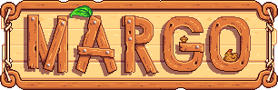

**You're viewing a file in the SMAPI mod dump, which contains a copy of every open-source SMAPI mod
for queries and analysis.**

**This is _not_ the original file, and not necessarily the latest version.**  
**Source repository: https://github.com/daleao/modular-overhaul**

----

<div align="center">




A complete and comprehensive rework of Stardew Valley gameplay mechanics, offering a much more engaging and immersive "Vanilla+" experience.

[![License][shield:license]](LICENSE)

</div>

## Table of Contents

- [Introduction](#introduction)
- [Modules](#modules)
- [Installation & Update](#installation--update)
- [Reporting Bugs or Issues](#reporting-bugs-or-issues)
- [API for C# Developers](#api-for-c-developers)
- [Building the Source Code](#building-the-source-code)
- [Dependencies](#dependencies)
- [Mod Recommendations](#mod-recommendations)
- [Credits & Special Thanks](#contributors--special-thanks)

## Introduction

This mod is a compilation of overhaul modules, each targeting a specific gameplay component or mechanic. Together, the modules complement each other to create a "Vanilla+" experience.

The modular nature of this mod allows users to cherry-pick features to their liking, while also preserving the deep native integration required between individual modules. This reduces the amount of redundant code which helps the mod run better and be more easily maintained.

**Note about existing saves:** This mod is meant to provide an entirely new experience of *progression*. While it can be added to existing save files, doing so would be largely pointless due to missing out on that experience. Therefore, I strongly recommend reserving this mod for your next playthrough.

<sub><sup>[🔼 Back to top](#table-of-contents)</sup></sub>

## Modules

The available modules are listed below. **Please read this page carefuly in its entirety.** Modules can be toggled on or off **in the title screen** via GMCM. Each module is itself highly configurable, and will be added to the GMCM menu if enabled. Some modules require specific enabling/disabling instructions you should pay attention to. These requirements will be mentioned below.

- **[PRFS](Modules/Professions#margo--professions-prfs)** is the original module, formely known as Walk Of Life. It overhauls all the game's professions with the goal of supporting more diverse and interesting playstyles. It also introduces optional Prestige mechanics for very-late game save files and Limit Breaks for Combat professions.

- **[CMBT](Modules/Combat#margo--combat-cmbt)** is a huge overhaul of nearly all aspects of combat; from rebalanced stats, melee and ranged weapons, rings and enchantments, to entirely new mechanics like status effects, weapon combos, a new weapon type, Gemstone Music Theory, and much more. **This module adds new items via Json Assets, and thus may cause Json Shuffle on existing saves.** 

- **[PNDS](Modules/Ponds#margo--ponds-pnds)** is a complement to the new Aquarist profession. It allows Fish Ponds to produce Roe with scaling quantities and qualities, spontaneously grow algae, and even enrich metallic nuclei...

- **[TXS](Modules/Taxes#margo--taxes-txs)** is a complement to the new Conservationist profession. It introduces a realistic taxation system as an added challenge and end-game gold sink. Because surely a nation at war would be capitalizing on that juicy farm income.

- **[TOLS](Modules/Tools#margo--tools-tols)** is a one-stop-shop for tool customization and quality-of-life. It enables resource-tool charging, farming-tool customization, intelligent tool auto-selection, and even adds Radioactive tool upgrades, among other things.

- **[TWX](Modules/Tweex#margo--tweex-twx)** is the final module, and serves as a repository for smaller tweaks and fixes to inconsistencies not large enough to merit a separate module.

Please note that only the Professions and Tweex modules are enabled by default.

99% of your questions about this mod are answered in the pages above. It took me several years of work to produce this mod and document it neatly, so I expect you can spend at least 15 minutes to read the documentation before asking questions.

All modules should be fully multiplayer and split-screen compatible **if and only if all players have it installed**.

<div align="center">

**⚠ This mod is not Android-compatible. ⚠**
</div>

An Android version of Chargeable Tools is available in a dedicated branch.

<sub><sup>[🔼 Back to top](#table-of-contents)</sup></sub>

## Installation & Update

1. Make sure the dependencies are installed:
    - [SpaceCore](https://www.nexusmods.com/stardewvalley/mods/1348) is always required.
    - [Json Assets](https://www.nexusmods.com/stardewvalley/mods/1720) is required for the new items in CMBT module.
    - [Custom Ore Nodes](https://www.nexusmods.com/stardewvalley/mods/5966) (version 2.3.4 or higher) is required for the Garnet Node.
    - [Generic Mod Config Menu](https://www.nexusmods.com/stardewvalley/mods/5098) is highly recommended.
2. Go to the [Releases page](https://github.com/daleao/modular-overhaul/releases) (link also to the right) and download the latest `ModularOverhaul.zip` file.

<div align="center">


</div>

3. Extract the downloaded archive file into your local mods folder.
4. Explore the `compat` folder to find compatibility files that must be manually installed.
5. Start the game once with SMAPI to generate a config file.
6. Enable the desired modules in GMCM by pressing Shift+F12 in the title screen, or by manually editing the `config.json` file.

<div align="center">

**⚠ Please review the compatibility sections of each specific module in the links above. ⚠**
</div>

As with any mod, always **delete any previous installation completely** before updating. If you'd like to preserve your config settings you can delete everything except the `config.json` file.

**The use of Vortex or other mod managers is not recommended for Stardew Valley.**

<sub><sup>[🔼 Back to top](#table-of-contents)</sup></sub>

## Reporting Bugs and Issues

1. Make sure the mod is updated to the latest version. I will not support older versions.
2. Make sure you can reliably reproduce the issue. **Write out the steps to reproduce the issue.**
3. Check whether the issue is caused by a mod conflict:
    - You can do this easily by renaming your mod folder to something else (for example, just add an dot, or an underscore), creating a new one, and then copying over SpaceCore, MARGO and, optionally, CJB Cheats Menu + Item Spawner (to help with quick testing). If the issue can no longer be reproduced in this condition, then gradually copy over your remaining mods in small groups, until you identify the conflicting mod. *You can safely ignore any Content Patcher or other framework mods while doing this, as those will never cause conflicts.*
4. Check whether the issue can be reproduced on a brand new save file. If it cannot, then I will probably ask you to upload your save folder to any file-sharing service of your choice, and share the url.
5. Upload your entire log to [smapi.io](https://smapi.io/log). There you will also find instructions in case you don't know where to find your log.
    <div align="center">
    
    **⚠ Do NOT copy-paste errors directly from the console window. ⚠**
    </div>

6. Go to the [Issues page](https://github.com/daleao/modular-overhaul/issues) and check whether a similar issue thread already exists. If it does not, then create a new thread. Please include:
    - A descriptive title.
    - As much detail as you can muster. Consider describing not only what happened, but also when and how it happened, and what you expected should happen instead.
    - Your results from steps 2-4 above.
    - The link to your uploaded log and, if applicable, your uploaded save folder.

You can also ping me on the [Stardew Valley Discord server](https://discord.com/channels/137344473976799233/678284714829807636), `@DaLion (MARGO)`.

<sub><sup>[🔼 Back to top](#table-of-contents)</sup></sub>

## API for C# Developers

This mod offers an API for C# developers wishing to add third-party compatibility.
To use it, copy both files in the [API folder](./API) over to your project, and change the namespace to something appropriate.
Then [request SMAPI for a proxy](https://stardewvalleywiki.com/Modding:Modder_Guide/APIs/Integrations#using-an-api).

Below are some usecases for the API:

- **[PRFS]**: Checking the current value of dynamic perks associated with certain professions.
- **[PRFS]**: Hooking custom logic into Scavenger and Prospector Treasure Hunts.
- **[PRFS]**: Hooking custom logic to several stages of the [Limit Break](./Modules/Professions/README.md#limit-breaks).
- **[PRFS]**: Allowing SpaceCore skills to surpass level 10, and be [Prestiged](./Modules/Professions/README.md#prestige) at levels 15 and 20.
- **[CMBT]**: Checking the [Resonances](./Modules/Combat/README.md#chords) currently active on any given player.
- **[CMBT]**: Inflicting and curing [Status Effects](./Modules/Combat/README.md#status-effects).
- Checking the config settings of any given player (note that you must create your own interface for this).

<sub><sup>[🔼 Back to top](#table-of-contents)</sup></sub>

## Building the Source Code

In order to build this mod you will also need to clone my [Stardew Valley Shared Lib](https://gitlab.com/daleao/sdv-shared) and adjust the following lines in `ModularOverhaul.csproj`:

1. Your **game path**, as well as (optionally) build paths:
  ```xml
  <!-- paths -->
  <PropertyGroup>
    <GamePath>G:\Steam\steamapps\common\Stardew Valley 1.5.6</GamePath>
    <GameModsPath>$(GamePath)/Mods - Build/$(Configuration)</GameModsPath>
    <ModZipPath>$(GamePath)/Mods - Build/Archive</ModZipPath>
  </PropertyGroup>
  ```

2. The relative or full path to Stardew Valley Shared Lib's `Shared.projitems` file:
  ```xml
  <!-- shared projects -->
  <Import Project="..\Shared\Shared.projitems" Label="Shared" Condition="Exists('..\Shared\Shared.projitems')" />
  ```

3. The relative or full path to a copy of [SpaceCore](https://www.nexusmods.com/stardewvalley/mods/1348)'s .dll.
  ```xml
  <!-- mod dependencies -->
  <ItemGroup>
    <Reference Include="SpaceCore">
      <HintPath>depend\SpaceCore.dll</HintPath>
      <Private>false</Private>
    </Reference>
  ```

<sub><sup>[🔼 Back to top](#table-of-contents)</sup></sub>

## Dependencies

This project uses the following NuGet packages:

| Package Name | Author | Version |
| ------------ | ------ | ------- |
| [Pathoschild.Stardew.ModBuildConfig](https://smapi.io/package/readme) | [Jesse Plamondon-Willard](https://github.com/Pathoschild) | 4.1.1 |
| [Pathoschild.Stardew.ModTranslationClassBuilder](https://github.com/Pathoschild/SMAPI-ModTranslationClassBuilder) | [Jesse Plamondon-Willard](https://github.com/Pathoschild) | 2.0.1 |
| [Leclair.Stardew.ModManifestBuilder](https://github.com/KhloeLeclair/Stardew-ModManifestBuilder) | [Khloe Leclair](https://github.com/KhloeLeclair) | 2.1.0 |
| [Ardalis.SmartEnum](https://github.com/ardalis/SmartEnum) | [Steve Smith](https://github.com/ardalis) | 2.1.0 |
| [NetEscapades.EnumGenerators](https://github.com/andrewlock/NetEscapades.EnumGenerators) | [Andrew Lock](https://github.com/andrewlock) | 1.0.0-beta04 |
| [FastExpressionCompiler.LightExpression](https://github.com/dadhi/FastExpressionCompiler) | [Maksim Volkau](https://github.com/dadhi) | 3.3.3 |
| [CommunityToolkit.Diagnostics](https://github.com/CommunityToolkit/dotnet) | Microsoft | 8.0.0 |
| [JetBrains.Annotations](https://www.jetbrains.com/help/resharper/Code_Analysis__Code_Annotations.html) | JetBrains | 2023.2.0 |

It also requires a copy of [SpaceCore](https://www.nexusmods.com/stardewvalley/mods/1348)'s .dll.

<sub><sup>[🔼 Back to top](#table-of-contents)</sup></sub>

## Mod Recommendations

For those interested, [this is my curated modlist](https://smapi.io/log/f8a5b79ca5e649a59bc0a5661ed2d6f3). This mod list is built on the following principles:

- **Immersion** and **Consistency** above anything. That excludes anything that screams "Hi, I am a mod".
- **High-quality sprites only**. That means vanilla or better.
- **Medieval Aesthetic.** Nothing beats [Gwen's Medieval Valley](https://www.nexusmods.com/stardewvalley/users/51171631?tab=user+files). It combines perfectly with my favorite recolor: the criminally underated [Wittily](https://www.nexusmods.com/stardewvalley/mods/2995). The brown [Vintage UI](https://www.nexusmods.com/stardewvalley/mods/4697) tops off the combination.
- **[Stardew Valley Expanded](https://www.nexusmods.com/stardewvalley/mods/3753)** as the main and only expansion, as it's the only one with art that matches the vanilla style and buildings supported by Gweniaczek. [Aquarium](https://www.nexusmods.com/stardewvalley/mods/6372) is also used for a bit more longevity.
    - [Ridgeside Village](https://www.nexusmods.com/stardewvalley/mods/7286) is an excellent mod with a great artstyle. I recommend anyone try it out, *as long as you don't touch their broken weapons*. Unfortunately the plot and writing are not to my taste.
    - [East Scarp](https://www.nexusmods.com/stardewvalley/mods/5787) opens up the game for some of the best-written NPC mods out there. I would absolutely recommend [Always Raining in the Valley](https://www.nexusmods.com/stardewvalley/mods/9999) and the Sword & Sorcery series by [DestyN0VA](https://www.nexusmods.com/stardewvalley/users/95913693?tab=user+files), if it weren't for the extremely inconsistent art quality of East Scarp itself.
- **Vanilla-style portraits**. Poltergeister's [Seasonal Cute Characters](https://www.nexusmods.com/stardewvalley/mods/5450) is the only feature-complete portrait mod that is both seasonal *and* covers **all** characters, including SVE. I manually combine it with [stanloona420's revised character series](https://www.nexusmods.com/stardewvalley/users/71935143?tab=user+files) and the outstanding [Slightly Cuter-er Penny Portraits](https://www.nexusmods.com/stardewvalley/mods/11576) by Juan Miguelito.
- My heavily edited version of [Monster Girls](https://www.nexusmods.com/stardewvalley/mods/14692) is the least immersive and borderline NSFW mod in this list. For anyone who's not a pervert I'd probably recommend [Slime Rancher](https://www.nexusmods.com/stardewvalley/mods/12654).
- I try to be minimalist on new items, mostly sticking to [PPJA](https://www.nexusmods.com/stardewvalley/users/26612284?tab=user+files) with a few interesting additions when the art or gameplay particularly stands out to me (e.g., [Magical Crops](https://www.nexusmods.com/stardewvalley/mods/8762)).

Please note that a lot of the mods in the list have been very heavily customized to fit these criteria, including but not limited to, typo fixes, harmonized textures and even entire map edits. The most heavily edited mods are versioned with the suffix `-DaLion`. I am not at liberty to share my personal edits, but all of them are framework mods, mostly CP, JA and PFM, which means it should be relatively easy for anyone to edit themselves. If you are not willing to make that effort then my recommendation would be to avoid them entirely due to a general lack of polish.

Make sure to test every mod before committing it to your mod list, and do not make changes to that list once you begin playing.

<sub><sup>[🔼 Back to top](#table-of-contents)</sup></sub>

## Credits & Special Thanks

We hail the Lord and Savior [Pathoschild][user:pathoschild], creator of [SMAPI][url:smapi], Content Patcher and the mod-verse, as well as the Father, **ConcernedApe**, creator of Stardew Valley, a benevolent God, who continues to freely expand the game for both players and modders.

This mod borrows ideas and assets from [Ragnarok Online][url:ragnarok], [League of Legends][url:league] and early Pokemon games. Credit to those, respectively, goes to [Gravity][url:gravity], [Riot Games][url:riot] and [Game Freak][url:gamefreak]. This mod is completely free, provided under [a non-commercial license](LICENSE).

Special thanks to [atravita][user:atravita] and [Shockah](user:shockah) who have helped me extensively with the mod's programming. And to the various translators who have contributed to this project:

* ![][flag:german][FoxDie1986][user:foxdie1986]
* ![][flag:chinese][xuzhi1977][user:xuzhi1977] and [Jumping-notes][user:jumping-notes]
* ![][flag:korean][BrightEast99][user:brighteast99] and [Jun9273][user:jun9273]
* ![][flag:japanese][sakusakusakuya][user:sakusakusakuya]
* ![][flag:russian][romario314][user:romario314]

You have the right to upload your own translation of this project, but I reserve the right to copy your translation directly into the project.

Thanks to [JetBrains][url:jetbrains] for providing a free open-source license to ReSharper and other tools.

<div align="center">
<a href="https://smapi.io" target="_blank"></a>
<a href="https://www.jetbrains.com" target="_blank"></a>
<a href="https://discord.com/invite/stardewvalley" target="_blank"></a>
</div>

<!-- MARKDOWN LINKS & IMAGES -->
[shield:license]: https://img.shields.io/badge/Custom%20License-Non%20Commercial%20Mod-brightgreen?style=for-the-badge
[shield:nexus]: https://img.shields.io/badge/Download-Nexus-yellow?style=for-the-badge
[url:nexus]: https://www.nexusmods.com/stardewvalley/mods/14470
[shield:moddrop]: https://img.shields.io/badge/Download-Mod%20Drop-blue?style=for-the-badge
[url:moddrop]: https://www.moddrop.com/stardew-valley/

[url:stardewvalley]: <https://www.stardewvalley.net/> "Stardew Valley"
[url:jetbrains]: <https://jb.gg/OpenSource> "JetBrains"
[url:smapi]: <https://smapi.io/> "SMAPI"
[url:gamefreak]: <https://www.gamefreak.co.jp/> "Game Freak"
[url:gravity]: <https://www.gravity.co.kr/> "Gravity"
[url:ragnarok]: <https://ro.gnjoy.com/index.asp> "Ragnarok Online"
[url:riot]: <https://www.riotgames.com/> "Riot Games"
[url:league]: <https://www.leagueoflegends.com/> "League of Legends"

[user:pathoschild]: <https://www.nexusmods.com/stardewvalley/users/1552317> "Pathoschild"
[user:atravita]: <https://www.nexusmods.com/stardewvalley/users/116553368> "atravita"
[user:shockah]: <https://www.nexusmods.com/stardewvalley/users/11089> "Shockah"
[user:foxdie1986]: <https://www.nexusmods.com/stardewvalley/users/1369870> "FoxDie1986"
[user:xuzhi1977]: <https://www.nexusmods.com/stardewvalley/users/136644498> "xuzhi1977"
[user:jumping-notes]: <https://github.com/Jumping-notes> "Jumping-notes"
[user:brighteast99]: <https://www.nexusmods.com/stardewvalley/users/158443518> "BrightEast99"
[user:Jun9273]: <https://github.com/Jun9273> "jun9273"
[user:sakusakusakuya]: <https://www.nexusmods.com/stardewvalley/users/155983153> "sakusakusakuya"
[user:romario314]: <https://www.nexusmods.com/stardewvalley/users/68548986> "romario314"

[flag:german]: <https://i.imgur.com/Rx3ITqh.png>
[flag:chinese]: <https://i.imgur.com/zuQC9Di.png>
[flag:korean]: <https://i.imgur.com/Jvsm5YJ.png>
[flag:japanese]: <https://i.imgur.com/BMA0w39.png>
[flag:russian]: <https://i.imgur.com/cXhDLc5.png>

[🔼 Back to top](#margo-modular-gameplay-overhaul)