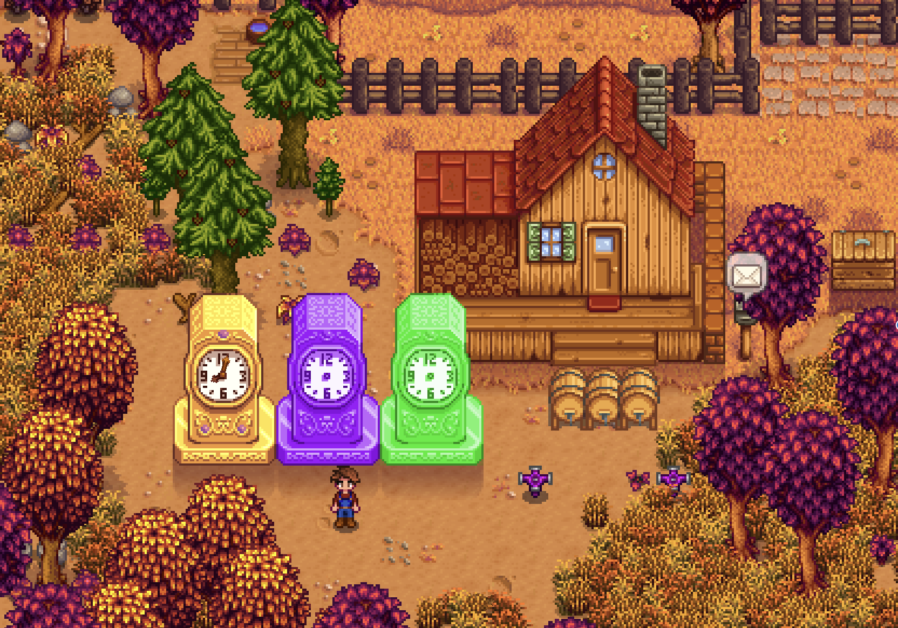

**You're viewing a file in the SMAPI mod dump, which contains a copy of every open-source SMAPI mod
for queries and analysis.**

**This is _not_ the original file, and not necessarily the latest version.**  
**Source repository: https://github.com/p-holodynski/StardewValleyMods**

----

# Stardew Valley Mod: More Clocks

A mod that adds 2 additional Clock buildings (Iridium and Radioactive) to the Wizard Building Menu with their own custom effects for your farm as well as adding additional effect to the Gold Clock making it more usable for the end game.

## Installation:
1. Install the latest version of SMAPI
2. Unzip `MoreClocks.zip` into Stardew Valley/Mods.
3. Run the game using SMAPI.

## Compatibility:
- Works with Stardew Valley 1.5 on Linux/Mac/Windows.
- Compatible with SMAPI 3.0+ (untested on earlier versions, but it might still work).
- No known mod conflicts (let me know if you find one).

## How To Use:
1. Run the game using SMAPI.
2. This mod adds 2 new Clock Buildings to the game as well as giving the Gold Clock one new effect.
3. All Clock options can be changed either by editing the config.json file or using Generic Mod Config Menu
4. Gold Clock - Gives you additional % more gold for selling items through the Shipping Bin. This works the same as the Profit Margin modifier when you start a new Multiplayer game.
5. Iridium Clock - Allows you to plant any seeds any season on your farm. It also gives a % chance at the end of each day of Speeding Up all of the machines currently running, meaning their time to finish producing an item is reduced by %. Currently it costs 10 million gold and 100 Iridium Bars.
6. Radioactive Clock - Gives a % chance to any crop on your farm (not Greenhouse and Ginger Island) to "mutate" and become Fully Grown overnight :) or to grow by one "growth phase". It also increases the chance of getting Giant Crops (Vanilla Crops only) to set %. Currently it costs 10 million gold and 100 Radioactive Bars.
7. Enjoy!