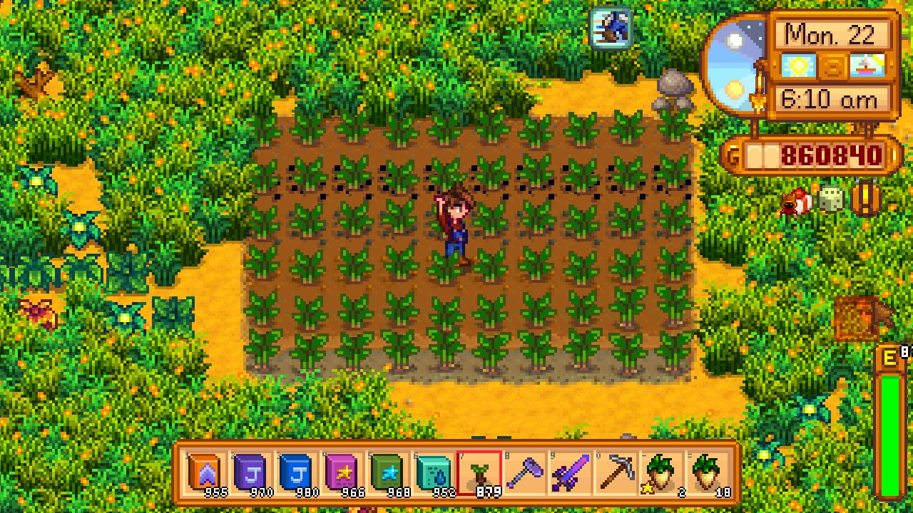

**You're viewing a file in the SMAPI mod dump, which contains a copy of every open-source SMAPI mod
for queries and analysis.**

**This is _not_ the original file, and not necessarily the latest version.**  
**Source repository: https://github.com/atravita-mods/MoreFertilizers**

----

More Fertilizers
===========================

This mod adds eleven new fertilizers, including some with quite unique effects. See the table for details.

## Install

1. Install the latest version of [SMAPI](https://smapi.io).
2. Download and unzip [Spacecore](https://www.nexusmods.com/stardewvalley/mods/1348) and [Json Assets](https://www.nexusmods.com/stardewvalley/mods/1720), and unzip both into `Stardew Valley/Mods`.
2. Download this mod and unzip it into `Stardew Valley/Mods`.
3. Run the game using SMAPI.

## Uninstall
Remove every instance of all these fertilizers you have in your inventory and any chest, and then remove this mod from your Mods folder.

## Usage

This mod adds eleven fertilizers that do the following things:

fertilizer                      | effect                                         | purchase from
:------------------------------ | :------------------------------------          | :---------------------- 
Bountiful Fertilizer            | 10% chance of a double harvest.                | Pierre on Wednesdays and Sundays, year 2 or later, after completing Pierre's special order. (Also at the Stardew Valley Fair, unless you've finished the JojaMart.)
Fish Food                       | Increases the chances of rare fish spawning    | Willy on Wednesdays, Saturdays and Sundays, after completing the CC fish tank. Not available to Joja members. 
Deluxe Fish Food                | Same as the fish food, but lasts three times as long| Traded for five magma caps from the Island Traders after at least 50% of unique available fish are caught. Not available to joja members. 
Domesticated Fish Food          | Chance to make fish in fish ponds reproduce faster| Willy on Saturdays and Sundays, after finishing his special order. Year 2 or later. 
Fruit Tree Fertilizer           | 10% increase in fruit tree growth speed        | Sandy (no other requirements.)
Deluxe Fruit Tree Fertilizer    | 20% increase in fruit tree growth speed        | Sandy, year 2 or later, after reaching floor 100 in the Skull Cavern.
Joja's Patented Fertilizer      | Crops are silver quality.                      | JojaMart, after earning 10k g.
Joja's Deluxe Fertilizer        | Crops have a 20% chance to be gold; the remaining are silver. | JojaMart, on Wednesdays, Saturdays, and Sundays only. Only available to Joja members, and only after earning 1,000,000g.
Maeby's Good-Luck Fertilizer     | Protects crops from crows and lightning strikes| Pierre's, after spring year 1, on lucky days only.
Organic Fertilizer              | Increases the value of crops by 10% (carries over to Artisan products made with those crops.) Joja crops, however, cannot become organic.| Pierre on Wednesdays and Sundays, year 2 or later, after completing Pierre's special order. (Also at the Stardew Valley Fair, unless you've finished the JojaMart.)
Waterlogged Fertilizer.         | Paddy crops planted with this fertilizer will always be considered irrigated. **Does nothing for non-paddy crops**. | Krobus (no other requirements)

Additionally, fertilizers may be found by breaking barrels in the mines, while panning, while killing monsters on the farm, and in fishing treasure chests. Some may rarely be found in big slimes. 

## Compatibility

* Works with Stardew Valley 1.5.6 on Linux/macOS/Windows. Not compatible with Android.
* Works in single player, multiplayer, and split-screen mode. In multiplayer, all players should install.
* This mod relies heavily on transpilers and I cannot guarantee compatibility with other mods, especially other transpiler mods, or even possibly test every combination myself. If the mod is not listed below, **I don't know and you should test it yourself.** This mod is designed to fail fast if it thinks there may be a problem and produce large red errors if there's a likely incompatability. Let me know about any compatibilities!

#### Known compatability:

* [Walk of Life](https://www.nexusmods.com/stardewvalley/mods/8111). 
* [Json Assets](https://www.nexusmods.com/stardewvalley/mods/1720) and any crops/fruit trees added through JA.
* [Multi Yield Crops](https://www.nexusmods.com/stardewvalley/mods/6069) - fully supported.
* [Automate](https://www.nexusmods.com/stardewvalley/mods/1063) and [PFMAutomate](https://www.nexusmods.com/stardewvalley/mods/5038).
* [Teh's Fishing Overhaul](https://www.nexusmods.com/stardewvalley/mods/866).
* [More Rings](https://www.nexusmods.com/stardewvalley/mods/2054?tab=description). The Quality+ ring will increase the quality of joja-crops.
* [Smart Building](https://www.nexusmods.com/stardewvalley/mods/11158?tab=description) supports these fertilizers. Thank you so much, DecidedlyHuman!
* The large framework mods (CP/BFAV/PFM/FTM/MFM, etc.) work with this mod.
* Any of my other mods - I try not to cause **myself** compat issues.
* Honestly most other mods should work fine, not many actually use transpilers.

#### Known mod incompatibilities:

**Major incompatibility**:

* [MultiFertilizer](https://www.nexusmods.com/stardewvalley/mods/7436) - I tried. It...mostly works, except sometimes the fertilizers from this mod disappear. You can only appply one fertilizer from this mod on any particular tile, but with that mod you can also apply any of the vanilla fertilizers, and the behavior can be quite unpredictable. Note: this mod patches MultiFertilizer.

**Minor incompatibilities**:

* [Dynamic Game Assets](https://www.nexusmods.com/stardewvalley/mods/9365) - fertilizers from this mod may or may not affect DGA crops. Still trying to figure out why. (DGA fruit trees are supported.)
* [Lookup Anything](https://www.nexusmods.com/stardewvalley/mods/541) will only show these fertilizers as a possible output of the Bone Mill if PFM is installed. The bone mill will produce these fertilizers anyways. Otherwise fine.
* [Fish Wells](https://www.nexusmods.com/stardewvalley/mods/7651) do not work with Domesticated Fish Food, as they do not preserve mod data. The remaining fertilizers should work, and that mod has settings that let you adjust the fish spawn time.
* No mod will include the Fruit Tree Fertilizers while calculating the age of fruit trees. You'll just see the days required decrement by two occasionally.

**Reporting an incompatibility**

A `harmony_summary` would be greatly appreciated! If you go to the console and type the words `harmony_summary` into the console, it'll list every mod that uses harmony that you have installed and what they've patched.

**Please include a [smapi.io/log](https://smapi.io/log) - there's not really much I can do without a log.**

## Known issues

* Fish ponds also slightly change color if Fish Food is applied on the farm, despite the fact that fish food does not affect fish ponds. There's realistically nothing I can do about this without tanking performance. I'd recommend [Pond Painter](https://www.nexusmods.com/stardewvalley/mods/4703).
* There's no visual indicator for the Domesticated Fish Food. I tried a bunch of things and didn't like any of them.

## Acknowledgements

Many thanks to [Violetlizabet](https://www.nexusmods.com/stardewvalley/users/120958053) for helping me with the fertilizer sprites, Schneitizel for the French translation, and [CopperSun](https://www.nexusmods.com/stardewvalley/users/114762643) for helping me with the text!

## See also

[Changelog](MoreFertilizers/docs/Changelog.md)
