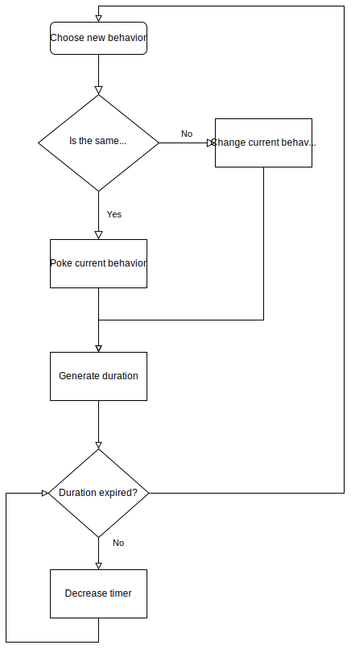

# Idle behaviors

## Idle NPC definitions

In this file you can define which idle activities is declared for an NPC companion.

**Format**

```js
{
  "<NPC_name>": "<behaviors>/<tendencies>/<duration range>"
}
```

| Position | Parameter      | Type         | Description                                                                                                                                                     |
| -------- | -------------- | ------------ | --------------------------------------------------------------------------------------------------------------------------------------------------------------- |
| 0        | behaviors      | string[]     | List of behaviors delimited by space, which companion can to do. This behaviors is defined in `Data/IdleBehaviors`                                              |
| 1        | tendencies     | float[]        | List of tendencies which describes how tendency has companion to do this behavior. Index (position) of tendency cresponds to index (position) of behavior.      |
| 2        | duration range | int[2]       | Min duration and max duration of doing current behavior. Total duration is generated randomly between this numbers. Delimited by space |

**IMPORTANT:** *Count of behaviors = count of tendencies*

If count of behaviors are not equal to count of tendencies, then mod crashes!

### Choosing a behavior.

After generated duration timed out, then game try to change behavior. When is choosed the same behavior as current, then current behavior gives a poke event. Poke event is a signal for current behavior. Every behavior kind handles this signal itself. For example: Kind of animation behavior try to change current animation when got poke signal. If you don't have any behavior definitions for your NPC, you can use generic `everybody_idle` behavior instance. Just refer it in definition line for your NPC.



**Example**

```js
{
  "Abigail": "Abigail_animate Abigail_lookaround/5 2/10 30",
  "Alex": "Alex_animate Alex_lookaround/2.5 2.5/10 30",
  "Elliott": "Elliott_animate Elliott_lookaround/3 3/10 30",
  "Emily": "Emily_animate Emily_lookaround/3 3/10 30",
  "Haley": "Haley_animate Haley_lookaround/4 2/10 30",
  "Harvey": "Harvey_animate Harvey_lookaround/5 3/10 30",
  "Leah": "Leah_animate Leah_lookaround/3 2.5/10 30",
  "Maru": "Maru_lookaround everybody_idle/2 1/10 30",
  "Penny": "Penny_animate Penny_lookaround/7 1.5/10 30",
  "Sam": "Sam_animate Sam_lookaround/3 3/10 30",
  "Sebastian": "Sebastian_animate Sebastian_lookaround/2 4.5/10 30",
  "Shane": "Shane_animate Shane_lookaround/7 1.5/10 30"
}
```

## Define behavior instances

**Format**
```js
{
  "<NameYOurBehaviorInstanceHere>": "<behaviorKind>/<parameters>"
}
```

### Kind of behaviors

#### Animate

Description: Your companion do some animatzions when is idle.

Definition string name: `animate`

Parameters: A list of animation definitions which are defined in `Data/animationDescriptions` delimited by space ` `. (string[])

Definition line: `lookaround/<list of animations>`

#### Look around

Description: Your companion looks around when is idle.

Definition string name: `lookaround`

Parameters: Min seconds and max seconds before change look direction. (Both is int)

Definition line: `lookaround/<minSeconds> <maxSeconds>`

#### Idle

Description: Your companion do nothing.

Definition string name: `idle`

Parameters: nothing

Definition line: `idle`

**Example**

```js
{
  "Abigail_animate": "animate/abigail_sitting abigail_flute",
  "Abigail_lookaround": "lookaround/2 5",
  "Alex_animate": "animate/alex_footbal alex_reading alex_sitting",
  "Alex_lookaround": "lookaround/2 5",
  "Elliott_animate": "animate/elliott_read",
  "Elliott_lookaround": "lookaround/4 8",
  "Emily_animate": "animate/emily_exercise",
  "Emily_lookaround": "lookaround/4 8",
  "Haley_animate": "animate/haley_photo",
  "Haley_lookaround": "lookaround/6 9",
  "Harvey_animate": "animate/harvey_read harvey_eat",
  "Harvey_lookaround": "lookaround/8 12",
  "Leah_animate": "animate/leah_sculpt leah_draw",
  "Leah_lookaround": "lookaround/6 10",
  "Maru_lookaround": "lookaround/10 12",
  "Penny_animate": "animate/penny_read",
  "Penny_lookaround": "lookaround/6 8",
  "Sam_animate": "animate/sam_guitar sam_gameboy sam_skateboarding",
  "Sam_lookaround": "lookaround/6 10",
  "Sebastian_animate": "animate/sebastian_smoking",
  "Sebastian_lookaround": "lookaround/8 12",
  "Shane_animate": "animate/shane_drink shane_warmup",
  "Shane_lookaround": "lookaround/4 6",
  "everybody_idle": "idle"
}
```

## Idle animations

You can define idle animation frames in `Data/animationDescriptions`

**Format**
```js
{
  "<animationName>": "<introFrames>/<loopFrames>/<outroFrames>"
}
```

All values are list of integers. Every integer represents one frame in animation. Frame duration constntly is 100ms.
Find a spritesheet of your NPC and look to animation frames. May be hard to find your frames in sheet. For example here is Abigail's frames. For your NPC probably is similar frame indexing.


**Example**

```js
{
  "abigail_flute": "0/16 16 17 17 18 18 19 19/0",
  "abigail_sitting": "26 26 26 26/27/26 26 26 26",
  "alex_footbal": "23/23 23 23 23 23 23 23 23 23 23 23 23 23 23 23 23 23 23 16 16 16 17 18 19 19 20 21 22 23 23 23 23 23 23 23 23 23 23 23 23 23 23 23 23 23 23 23 23 23 23 23 23 23 23 23 23/23",
  "alex_reading": "36 36 38 38/35/38 38 36 36"
}
```
