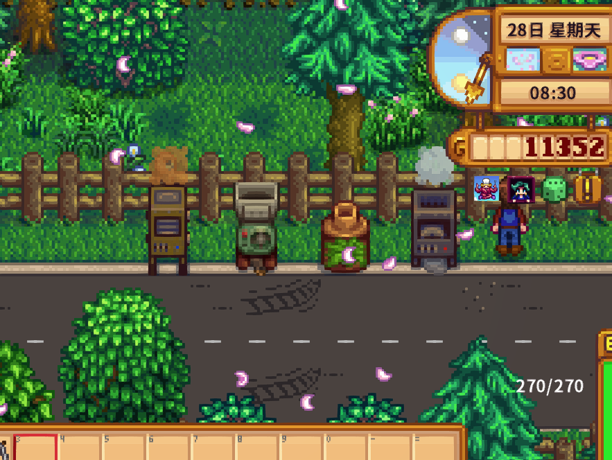

**You're viewing a file in the SMAPI mod dump, which contains a copy of every open-source SMAPI mod
for queries and analysis.**

**This is _not_ the original file, and not necessarily the latest version.**  
**Source repository: https://github.com/siweipancc/StardewMods**

----

# [CP] Resources Generators
[中文](Readme_zh.md)

## Description

Craftable machines to generate basic resources. Including clay, wood, stone, fiber , etc.

## Machine Types

### ClayMachine

1. 100% \[330] Clay 
2. 005% \[382] Coal 
3. 004% \[535] Geode 
4. 004% \[536] Frozen Geode 
5. 004% \[537] Magma Geode 
6. 003% \[749] Omani Geode 
7. 002% \[MysteryBox] Mystery Box 

### FiberMachine

1. 100% \[771] Fiber 
2. 006% \[770] Mixed Seeds 
3. 005% \[495~498] Spring/Summer/Fall/Winter Seeds 
4. 006% \[MixedFlowerSeeds] Mixed Flower Seeds 
5. 008% \[Moss] Moss 
6. 001% \[MossySeed] Mossy Seed 

### StoneMachine

1. 100% \[390] Stone 
2. 006% \[378] Copper Ore 
3. 004% \[380] Iron Ore 
4. 003% \[384] Gold Ore 
5. 002% \[386] Iridium Ore 

### WoodMachine

1. 100% \[388] Wood 
2. 010% \[709] Hardwood 
3. 015% \[382] Coal 

## Shop modification

All Machines available at Clint Shop.