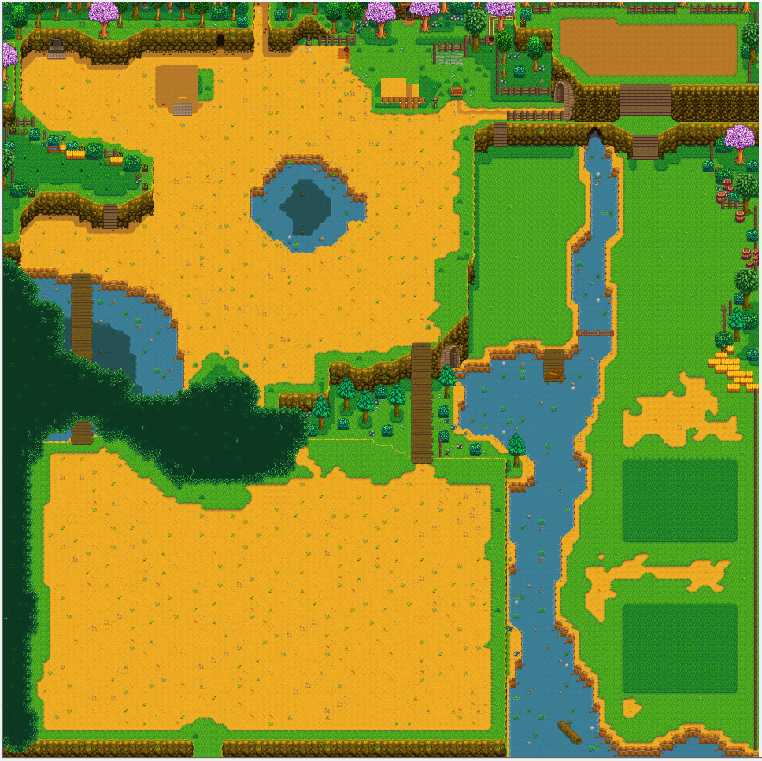

**OmniFarm** is an mod for Stardew Valley which expands the combat farm map and adds extra
functionality:  

**[Download the mod here](https://github.com/lambui/StardewValleyMod_OmniFarm/releases).**

## Install
1. Install [Stardew Valley](http://store.steampowered.com/app/413150/) and [SMAPI 1.1+](https://github.com/Pathoschild/SMAPI/releases).
2. Back up your game's `Content\Maps\Farm_Combat.xnb` file.
3. Unzip the mod folder (the one you just downloaded).
4. Copy the mod's `Farm_Combat.xnb` into your game's `Contents/Maps` folder.
5. Copy the `OmniFarmSMAPI` folder into your game's `Mods` folder.
6. Play with SMAPI.

## Uninstall
1. Restore your game's original `Content\Maps\Farm_Combat.xnb` file.
2. Remove `OmniFarmSMAPI` folder from your game's `Mods` folder.

## Release notes
### 2.0.3
* **[SMAPI]** Updated for Stardew Valley version 1.3 beta.
* **[SMAPI]** XNB map is now loaded from folder called ``assets`` within the mod folder, so please place the mod XNB file in there. Vanilla XNB no longer needs to be replaced and thus can be restored (if previously replaced).
* **[SMAPI]** Added Custom farm cave capacity. To use, just place ``FarmCave.xnb`` file into ``assets`` folder and set useOptionalCave to ``true`` in config file. Enable by default. To disable, set useOptionalCave to ``false``.
* Special thanks to [TyoAtrosa](https://github.com/TyoAtrosa) for this update.

### 2.0.2
* **[SMAPI]** Updated for compatibility with SMAPI 2.0.
* **[SMAPI]** Enabled update checks in SMAPI 2.0+.

### 2.0.1
* **[SMAPI]** Fixed a bug that caused `config.json` changes to be ineffective.

### 2.0
* **[XNB]** Fixed objects spawning in unreachable areas.
* **[XNB]** Tweaked some tiles to make the map looks better.
* **[XNB]** Added open area to the right of the house, on top of the way in from bus stop.
* **[SMAPI]** Added `config.json` ([see documentation](Customization.md)).

## 1.1.mini_patch
* **[XNB]** Fixed objects spawning on the greenhouse.

## 1.1
* **[XNB]** Added forest and mountain fish to the farm waters.
* **[XNB]** Added weeds, stones, trees, grass, etc to new areas (only affects new saves).
* **[SMAPI]** Fixed warp points from forest warp player to the middle of the farm.

## 1.0
* Initial XNB release:
  - Added stairs leading to a little cliff area on the left.
  - Added massive farming area south of farm.
  - Added stairs leading to the river area right of farm.
  - Added minecart transport to the top-right of the shipping box.
  - Added open area behind your house.
  - Added secret warp spot.
* Initial SMAPI release:
  - Added stump and hollow log spawning on the little cliff on the left.
  - Added ore and gem spawning in the mining area on the right.
  - Added animal grass spawning (except in winter) in the bottom right corner.
