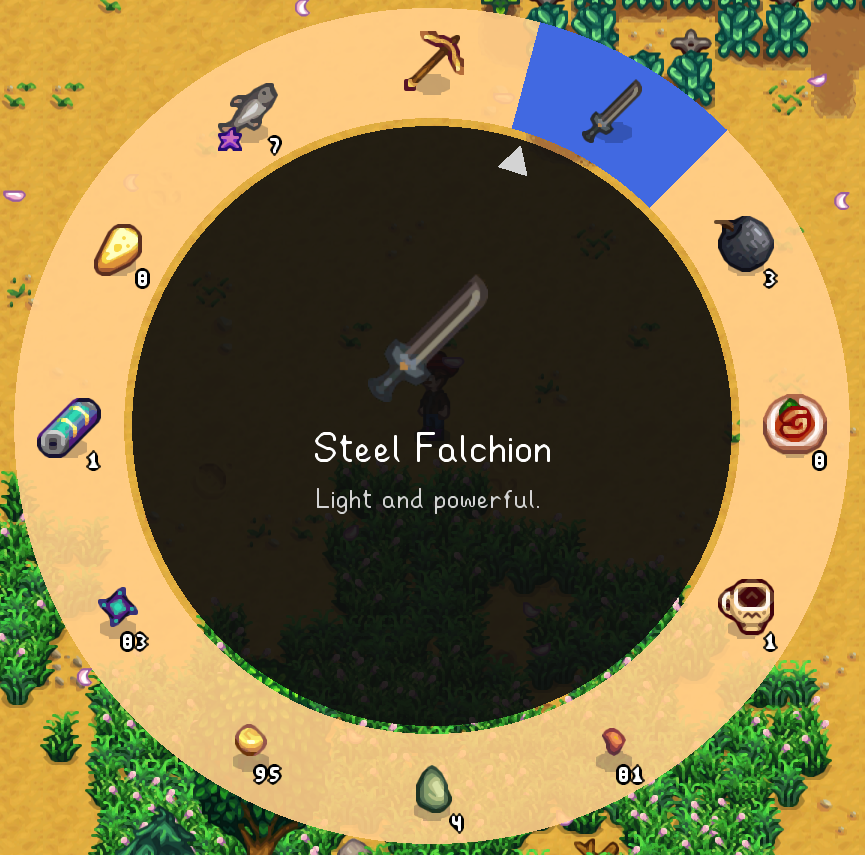
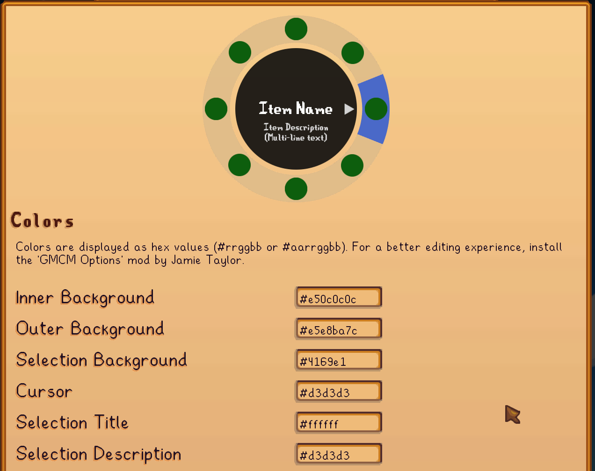

**You're viewing a file in the SMAPI mod dump, which contains a copy of every open-source SMAPI mod
for queries and analysis.**

**This is _not_ the original file, and not necessarily the latest version.**  
**Source repository: https://github.com/focustense/StardewRadialMenu**

----

# Stardew Radial Menu

(aka: "Better Gamepads")

## Introduction

Stardew Valley has good controller support. *Good* - not *great*. Have you ever felt frustrated mashing the trigger buttons to get to the tool you want, trying to watch the little toolbar at the top/bottom of the screen while still paying attention to the center where all the action is happening, often ending up in the wrong place and accidentally pickaxing your crop instead of watering it? Or do you have a lot of mods and not enough buttons on your controller to actually use them all?

If so, then this mod is for you. Radial menus, sometimes called [Pie Menus](https://en.wikipedia.org/wiki/Pie_menu), have been a staple of controller-based UI ever since the original [Secret of Mana](https://en.wikipedia.org/wiki/Secret_of_Mana) and maybe before. They're a great way to make complex inventory or action management accessible by gamepad, taking advantage of the most critical difference between a gamepad and a mouse: gamepads are *directional*, not *positional*. A radial menu only requires you to point in the direction of the item you want, rather than finding its exact position on screen, or (in the case of Stardew Valley) having to cycle through many items using modeless button presses.



The RadialMenu mod **replaces** the function of the left and right trigger buttons, so that instead of cycling through your current page of tools/items, they open up separate radial menus:

* The first (default: left trigger) menu holds your inventory, just like the vanilla toolbar.
* The second (default: right trigger) menu can be set up with any shortcuts you like, generally for activating features provided by other mods - such as the excellent [Event Lookup](https://www.nexusmods.com/stardewvalley/mods/8505), [UI Info Suite](https://github.com/Annosz/UIInfoSuite2) and so on.

Read on for a more detailed explanation of the functions and features.

## Installation

RadialMenu follows the standard installation procedure for most mods:

1. Install SMAPI and set up your game for mods, per the [Modding: Player's Guide](https://stardewvalleywiki.com/Modding:Player_Guide/Getting_Started) instructions.
2. Download the [latest release](https://github.com/focustense/StardewRadialMenu/releases). Make sure you download the `RadialMenu x.y.z.zip` file, **not** the source code.
3. Open the .zip file and extract the `RadialMenu` folder into your `Stardew Valley\Mods` folder.
4. Launch the game!

### Optional Dependencies

RadialMenu works with [Generic Mod Config Menu](https://www.nexusmods.com/stardewvalley/mods/5098), if you want to be able to change its settings in-game. You can also install the [GMCM Options](https://www.nexusmods.com/stardewvalley/mods/10505) mod if you want color pickers in the [style editor](#style), though it isn't required for GMCM integration to work.

## Features

RadialMenu aims to be a *vanilla-friendly*, *usability* and *quality of life* mod, following the "no cheats/balance changes" philosophy in various [min-maxing guides](https://github.com/Zamiell/stardew-valley/blob/main/Min-Max_Guide.md#appendix-b-mods). It does not care if you choose to install _other_ mods that do those things, but the focus of this mod will always be on improving vanilla gameplay.

For a full list of all the configurable features, refer to [Configuration](#configuration). Some of the highlights include:

* Pausing gameplay, including NPC/enemy AI, while a menu is open. You can take as long as you need to select the correct item.

* No explicit "dismiss" button; unlike other menus, if you change your mind and decide not to take any action, you do not need to press the "B" button to close the menu - simply let go of the trigger. This also makes it a more convenient alternative to opening the actual in-game menu every time you want to pause for a brief second to take a breath, scan the environment, etc.

* Quick actions for most consumable items including food, warp totems, staircases, etc. Activating one of these items from the Inventory menu will _not_ switch your selection; it will preserve your previous tool selection and directly perform that item's action (eat the food, take you to the next floor, etc.). Loosely inspired by [EatDrinkFromInventory](https://github.com/Zamiell/stardew-valley-mods/tree/main/EatDrinkFromInventory).

* Access all backpack pages while the menu is open; switch using the Left/Right shoulder buttons.

* Access not only your inventory via the menu, but also mod-added functions! Set up any list of shortcuts you want, with any actions you want.

> [!IMPORTANT]
> If you are installing RadialMenu for the first time, your list of shortcuts (custom actions) will be empty. A [complete example configuration](https://gist.github.com/focustense/b7022697cd9763059015d0edc30b746b) is available for your reference/inspiration. Or, refer to [Shortcut Settings](#custom-item-shortcut-settings) for more information on the specification, or use the in-game config menu to add and edit mod shortcuts.

* Integration with [Generic Mod Config Menu](https://www.nexusmods.com/stardewvalley/mods/5098). You can experiment with different control schemes and also edit your list of shortcuts all from within the game.

> [!NOTE]
> GMCM does not natively support much of what RadialMenu needs to do in its config UI; therefore, RadialMenu pries into GMCM's internals quite a bit, and may break with future versions of GMCM.
>
> The latest _tested_ version of GMCM is 1.12.0. If you run into problems with RadialMenu's configuration using a newer version of GMCM, please file a bug report including the GMCM version, [SMAPI log](https://smapi.io/log) and a _detailed_ description of what you tried and what happened. It may be very difficult to fix a GMCM-related bug without all of the above information.

  

## Configuration

All of this mod's options are configurable through GMCM. If you prefer to edit the `config.json` or are having any trouble with the in-game settings, read on for a detailed explanation of what the settings do.

<details>
<summary>Example Configuration</summary>

```json
{
  "TriggerDeadZone": 0.2,
  "SwapTriggers": false,
  "ThumbStickPreference": "AlwaysLeft",
  "ThumbStickDeadZone": 0.2,
  "Activation": "ActionButtonPress",
  "ActivationDelayMs": 250,
  "SelectButton": "ControllerX",
  "DelayedActions": "ToolSwitch",
  "MaxInventoryItems": 12,
  "CustomMenuItems": [
    {
      "Name": "Event Lookup",
      "Description": "Show today's events",
      "Keybind": "N",
      "SpriteSourceFormat": "ItemIcon",
      "SpriteSourcePath": "(BC)42",
      "Gmcm": {
        "ModId": "shekurika.EventLookup",
        "FieldId": "85fde494779a435084bc5c3f491155cc",
        "FieldName": "show available events key",
        "UseCustomName": true
      }
    },
    {
      "Name": "Calendar",
      "Description": "",
      "Keybind": "B",
      "SpriteSourceFormat": "ItemIcon",
      "SpriteSourcePath": "(F)1402",
      "Gmcm": null
    },
    {
      "Name": "Quest Board",
      "Description": "See current Special Orders",
      "Keybind": "H",
      "SpriteSourceFormat": "TextureSegment",
      "SpriteSourcePath": "maps/summer_town:(122,291,35,20)",
      "Gmcm": null
    }
  ],
  "Styles": {
    "InnerBackgroundColor": "#e50c0c0c",
    "InnerRadius": 300.0,
    "OuterBackgroundColor": "#e5e8ba7c",
    "OuterRadius": 110.0,
    "SelectionColor": "#e5d88c26",
    "HighlightColor": "#4169e1",
    "GapWidth": 8.0,
    "MenuSpriteHeight": 64,
    "StackSizeColor": "#ffffff",
    "CursorDistance": 8.0,
    "CursorSize": 32.0,
    "CursorColor": "#d3d3d3",
    "SelectionSpriteHeight": 128,
    "SelectionTitleColor": "#ffffff",
    "SelectionDescriptionColor": "#d3d3d3"
  }
}
```
</details>

### Main Settings

* `TriggerDeadZone`: How far the left/right triggers have to be pressed in before the menu will show. Valid values are between 0 and 1. The default of 0.2 should be comfortable for most players, preventing accidental triggers without making the menu awkward to activate or hold open.
* `SwapTriggers`: Switches the trigger used to open each menu. Normally, the left trigger opens the Inventory (Tools) menu and the right trigger opens the Custom (Shortcuts) menu. If you enable this option, left/right will be switched.
* `ThumbStickPreference`: Controls which controller thumbstick will control the selection in an active menu. Valid values are:
  * `AlwaysLeft` - left analog stick controls both radial menus.
  * `AlwaysRight` - right analog stick controls both radial menus.
  * `SameAsTrigger` - left stick controls the left-trigger menu, right stick controls the right-trigger menu.
* `ThumbStickDeadZone`: Same as `TriggerDeadZone`, but applies to the left/right analog sticks while a menu is active.
* `PrimaryAction`: The action to perform on `PrimaryActivation` (see below). Valid values are:
  * `Select`: Always selects the item as a tool - i.e. makes it the "held item", regardless of whether or not it has any quick action. Used whenever you want to gift an item to an NPC, or put it into a machine, and so on.
  * `Use`: Automatically consume the item and performs its quick-action or use-action if there is one, such as eating food, warping with a warp totem, or using a staircase to go to the next floor. If the specific item has no use action, it will act the same as `Select`.

* `PrimaryActivation`: How to perform the primary action on a highlighted menu item. Valid values are:
  * `ActionButtonPress`: Press whichever button you normally use to interact with the world; typically the "A" button.
  * `ThumbStickPress`: Press down on whichever thumbstick is being used to control the active menu; see also `ThumbStickPreference` above.
  * `TriggerRelease`: Release the trigger button that was used to open the menu in order to activate whichever item was last highlighted.
* `SecondaryAction`: Alternate action to perform on the `SecondaryActionButton` press; has the same option as `PrimaryAction`. Typically, this should be whichever action is *not* the primary.
* `SecondaryActionButton`: Button to activate the configured `SecondaryAction`.
  * Note that due to limitations of GMCM, you can't set this using the in-game menu to be the primary action button (the one associated with `PrimaryActivation.ActionButtonPress`, typically "ControllerA"). However, you _can_ set it to this in the `config.json`, and it will work correctly if you are using a different method for primary activation such as trigger release.
  * Of course, you can set it to any other button as well.

* `ActivationDelayMs`: Waits a specified delay, in milliseconds, before performing the action you select. During this time, the menu stays open (confirming your selection) and the game stays paused. This helps most players avoid accidental game inputs from using the menu.

  * For example, if you are holding the left stick up to select the top item, and don't want the character to start walking upward immediately after a click, the default value of 250 ms means you have 1/4 of a second to release the stick in order to avoid that directional movement.
  * Every player has different reaction times, so you should experiment with this setting to find the value that works best for you. The GMCM UI sets a limit of 500 ms, but you can edit the `config.json` to have any positive value. You can also set it as low as 0 to eliminate any delay, if your priority is responsiveness and you don't care about a bit of "character drift".
* `DelayedActions`: Lets you specify _which_ menu actions will receive the delay assigned to `ActivationDelayMs`. Only applicable if the delay is non-zero (obviously). This setting exists because most in-game actions (warp totems, horse whistle, etc.) will play some animation and thus *already* apply a delay, so any additional delay may not feel useful. The two settings are:
  * `All`: Apply the delay to all actions, period; anything you select from either menu will have the configured delay.
  * `ToolSwitch`: Only apply the delay to item _selection_ or "tool switches". If an item has a use-action associated with it, such as food/drinks, totems, staircases, etc., or shortcuts in the Custom menu, it will not receive the delay.
* `MaxInventoryItems`: Maximum number of items to show in the Inventory menu. The default is 12, which is intended for game balance, allowing you to access the same number of items as you would without the mod using normal L/R trigger cycling. You can set this to any positive number; however, values above 24 are likely to look bad (e.g. overlapping text) and may make it harder to "hit" any given menu item. Most players should keep this at 12.
* `CustomMenuItems`: The shortcuts that appear in the Custom (default: right-trigger) menu. See the next section.
* `Styles`: Controls the visual styles of the menu. If you don't like the default colors, or find that they clash with your game because you're using a mod to change the vanilla colors, then you can update these settings accordingly.

  * It is strongly recommended to use the GMCM UI for editing styles, as you'll get an instant preview of how the menu will look.
      

> [!CAUTION]
>
> While the dimensions (radii, heights, etc.) can also be edited, it is not possible to test this mod with every possible combination of values. Most players should leave the non-color settings alone. If you've changed these values, especially to anything very far away from the defaults, and are running into broken UI or other visual glitches, please *do not* file a bug.

### Custom Item (Shortcut) Settings

Each custom item in the `CustomMenuItems` list has its own properties defining how it looks and what it does.

* `Name`: Required. The title that is displayed in large text inside the center circle when an item is highlighted; the "Item Name" text in the screenshot above. This won't wrap, so it should be short enough to fit on one line.

* `Description`: Optional. Small text displayed underneath the title (`Name`). See the "Item Description" text in the screenshot above.

* `Keybind`: Controls what action will actually be performed by this shortcut. The custom menu works by simulating key presses, so any valid key-binding string like "B" or "Shift + F3" is valid here.

* `SpriteSourceFormat`: The first field that determines the image or icon that will be displayed in the menu for this shortcut. Valid values are:

  * `ItemIcon`: Use the icon/sprite associated with any item in the game - regular objects, craftables, furniture, etc.
  * `TextureSegment`: Specify an exact rectangular area of a specific game asset. You might use this to grab the sprite of a cat, dog, or horse; or the bulletin board on display in town.

* `SpriteSourcePath`: The second and final field that determines which image or icon will be displayed in the menu for this shortcut. The exact format depends on which `SpriteSourceFormat` is used:

  * For `ItemIcon`, the format should be a [Qualified Item ID](https://stardewvalleywiki.com/Modding:Common_data_field_types#Item_ID) such as `(O)434`. You can use the GMCM UI to search for the icon you want; alternative, [Stardew IDs](https://mateusaquino.github.io/stardewids/) is a great resource for quickly finding a specific item or just browsing what's available.
  * For `TextureSegment`, the format must be an [asset name](https://stardewvalleywiki.com/Modding:Modder_Guide/APIs/Content#What.27s_an_.27asset_name.27.3F), followed by the colon character (`:`), then the rectangle dimensions in parentheses.
    * In the configuration example above, we've used `maps/summer_town:(122,291,35,20)` for the bulletin board/quest board icon. This means it looks in the `maps/summer_town`  asset (sprite sheet), and specifically the rectangular area starting at `X = 122, Y = 291`, and having a width of 35 pixels and height of 20 pixels.

* `Gmcm` links this shortcut to another mod's Generic Mod Config Menu key binding, so that it automatically stays in sync; that is, if you update the key binding for the other mod, then RadialMenu will use the updated keys.

  * `ModId` is the **unique ID** (not the short name) of the other mod; it should almost always be in the form of "authorname.ModName".

  * `FieldName` is the "full name" of the field in GMCM accounting for page name and header title, e.g. "Hotkeys > Search Key".

    * It's often hard to know exactly what this is, so RadialMenu provides a debug option called `DumpAvailableKeyBindingsOnStartup`. If you set this to `true`, it will print a list of all possible mod IDs and field names to the SMAPI console when starting the game, which you can then copy into the configuration file.
    * Alternatively, use RadialMenu's own GMCM UI which will present dropdown lists for all the available mods and their keybindings.

  * `UseCustomName`: Tells RadialMenu _not_ to overwrite the `Name` and `Description` you've set for this item based on information from the other mod. Set to `true` if you _only_ want to automatically update the `Keybind` value, and leave the other fields alone.

  * `FieldId` is mainly used for internal tracking, and players should generally ignore it because the values aren't stable unless the author of the other mod has used custom IDs.

> [!NOTE]
>
> Uninstalling the mod referenced by a GMCM association, or having it go out of sync due to a new version of the other mod that changes its options, will _not_ cause your shortcut to disappear or stop working; it will simply stop updating its information to match the other mod's settings. If this happens, you can fix it by changing the `FieldName` to its (new) correct value.

​    

## Limitations/Known Issues

* Radial menu triggers are **only enabled during normal gameplay**; they are disabled when other menus are open. This is an intentional design decision, since the left/right triggers are normally to be used to control pagination or other navigation within the menu, and blocking those inputs to show the radial menu could interfere with normal navigation without providing any alternative.
* Specifying a flooring ID like `(FL)0` for a custom item image will cause wallpaper to be drawn instead. This is a bug in the game code itself (1.6.8), has been reported and will be fixed in a future version.
* Mouse/keyboard inputs are not supported, and likely never will be. This mod is meant to improve gameplay with a game controller, and there's no real reason to use it without one since keyboards can already bind a nearly unlimited number of hotkeys.

## Questions/Bugs?

Feel free to either:

* Create a [GitHub issue](https://github.com/focustense/StardewRadialMenu/issues); when doing so, please follow bug-reporting etiquette. Check first for similar reports, and make sure to include all relevant details about your issue, especially including clear repro steps and/or [SMAPI log](https://smapi.io/log).
* Or, ping me on the [SV Discord](https://discord.com/invite/stardewvalley) if I happen to be around. Discord is best if you have a quick question, but I make no promises re: availability for in-depth troubleshooting.

## See Also

* [Changelog](CHANGELOG.md)
