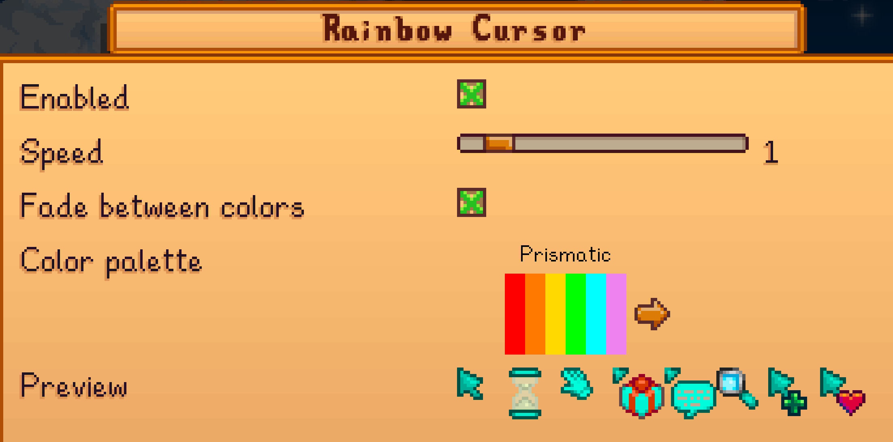
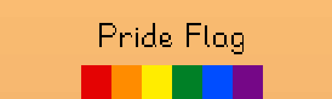

**You're viewing a file in the SMAPI mod dump, which contains a copy of every open-source SMAPI mod
for queries and analysis.**

**This is _not_ the original file, and not necessarily the latest version.**  
**Source repository: https://github.com/jltaylor-us/StardewRainbowCursor**

----

# Rainbow Cursor

**Rainbow Cursor** is a Stardew Valley mod that makes your cursor cycle
through colors.  By default, the colors are the prismatic rainbow, but new
color palettes can be added by other mods or content packs.

**Rainbow Cursor** releases are available in this GitHub repository and on
[nexus mods](https://www.nexusmods.com/stardewvalley/mods/15886).

## Installation and Use

1. If you have not already done so, install [SMAPI](https://smapi.io).
2. Unzip in the **Rainbow Cursor** release zip into your mods folder.
3. Start the game.

That's it!

The first time the game is launched after installing **Rainbow Cursor**,
it will create a `config.json` file inside the mod directory.  You can
customize various features by editing this file, but most people will find
it more convenient to use the in-game configuration menu that is available
if you have [Generic Mod Config
Menu](https://www.nexusmods.com/stardewvalley/mods/5098) installed.
You'll get a few more user interface enhancements on the configuration menu
if you also have [GMCM
Options](https://www.nexusmods.com/stardewvalley/mods/10505) installed.

## Custom Color Palettes

**Rainbow Cursor** supports defining new color palettes by both _content
pack_ mods and a [C# API](../RainbowCursor/IRainbowCursorAPI.cs).

For information on creating a content pack, see the [content pack
guide](content-pack-guide.md).

# Content Packs

This repository is also home to some Rainbow Cursor content packs.

## Ukraine Pack

The Ukraine Pack adds a color palette with the colors of the Ukrainian
flag.

## Pride Pack

The Pride Pack adds color palettes for various pride flags.  The version
1.0.0 release include the colors from:

* 6, 7, and 8 stripe, Philadelphia, and Progress flags
* ace, bi, and pan sexual flags
* trans, enby, agender, genderfluid, and genderqueer flags

# See Also

[Release Notes](release-notes.md)
