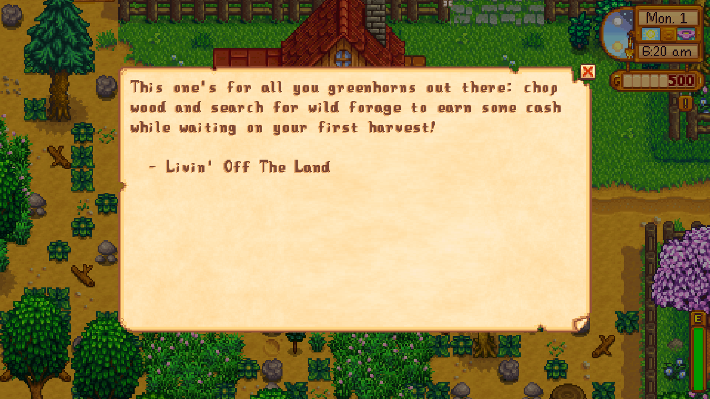
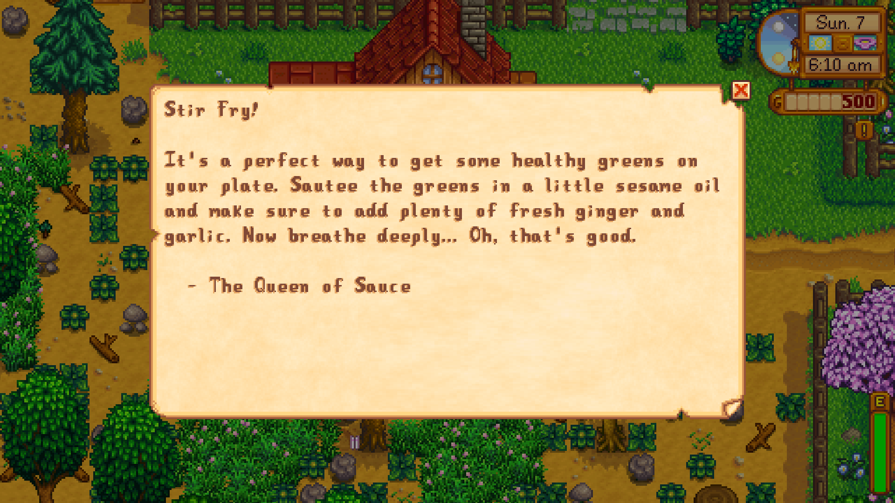
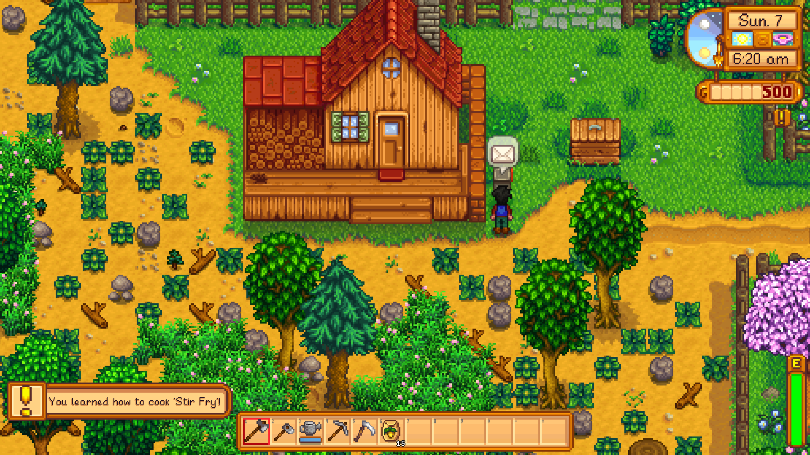

# Stardew Valley Readers Digest

Receive the Cooking or Tips Channel info as a mailbox message.

 
Livin' off the land

 
 

 
Queen of Sauce

 
 

 
Recipe learned notification

 
 

# Install

+ Install the latest version of [SMAPI](https://smapi.io/).
+ Install the latest version of [Content Patcher](https://www.nexusmods.com/stardewvalley/mods/1915).
+ [Download this mod](https://github.com/remybach/stardew-valley-readersdigest/releases) and unzip it into Stardew Valley/Mods.
+ Run the game using SMAPI.

# Compatibility

+ Works with Stardew Valley 1.3 on Linux/Mac/Windows.
+ Works in single-player and multiplayer.
+ No known mod conflicts.
+ Works in all languages

# Config

You have the following options available in `config.json`:

+ `clairvoyance` - (default: `false`) Make your farmer have a premonition and learn the recipe overnight (displays a tooltip saying you've learned the recipe upon waking up).
+ `enableCooking` - (default: `true`) Enables the cooking channel digest (Queen of Sauce).
+ `enableTips` - (default: `true`) Enables the tips channel digest (Livin' off the Land).

# See also

+ [Source code](https://github.com/remybach/stardew-valley-readersdigest)
+ [Release notes](https://github.com/remybach/stardew-valley-readersdigest/releases)
+ [Report Issues](https://github.com/remybach/stardew-valley-readersdigest/issues)
