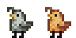
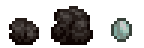

**You're viewing a file in the SMAPI mod dump, which contains a copy of every open-source SMAPI mod
for queries and analysis.**

**This is _not_ the original file, and not necessarily the latest version.**  
**Source repository: https://github.com/itsbenter/ResourcefulFriends**

----

# Coalclaw

> *"Well cared adults will gather coal clumps!"*

Coalclaw is a farm animal that lives in a Coop. It can be purchased at Marnie's Ranch for 550G or hatched by placing a Coalclaw Egg into an Incubator, taking 4,500m (2d 21h 40m) to incubate.

## Contents

* [Variation](#variation)
* [Produce](#produce)
  * [Estimation](#estimation)
  * [Auto Grabber Interaction](#auto-grabber-interaction)
* [Footnote](#footnote)

## Variation

There are two variations of Coalclaw. When purchasing from Marnie there is equal chance for both variations to be chosen.

## Produce

Coalclaws who eat every day mature after 2 nights have passed. A mature and fed Coalclaw will produce Coalclaw Clump every day, if the conditions are met. Once sufficient friendship and happiness is reached, Coalclaw has a chance to produce a Large Coalclaw Clump and an even smaller chance to produce Coalclaw Egg. Coalclaw Egg can be sold at base price of 95G or incubated to hatch a Coalclaw baby.

Coalclaw Clump and Large Coalclaw Clump cannot be picked up and instead must be destroyed using pickaxe, giving 7 mining experience. The number of coal produced when destroying the clump is increased by 50% when player has [Prospector](https://stardewvalleywiki.com/Skills#Mining) profession.

| Resource | Min | Max | Avg |
| -------- | --- | --- | --- |
| **Coalclaw Clump** | | | |
| Coal | 4 | 6 | 5 |
| | | | |
| **Large Coalclaw Clump** | | | |
| Coal | 7 | 9 | 8 |

The condition to produce Coalclaw Clump is the same to Pig producing Truffles. Refer to [Pig wiki](https://stardewvalleywiki.com/Pig) page for details. This pig-like behavior means Coalclaw will not produce during rain and winter. However, a config is provided to make Coalclaw produces exactly one Coalclaw Clump inside the coop on such day. This is set to 'true' by default.

### Estimation

Here is a rough estimate of Coalclaw produce in a season. A number between 2 produce to 3 produce per day is probably a reasonable estimate at max heart. [Spreadsheet](https://docs.google.com/spreadsheets/d/13k0kkcyTUVJseXhAiZoKnOVubqOB7M9F3xILHV-Sj54/edit#gid=549968683) can be accessed and used in case player wish to change the default produce quantity. To edit the spreadsheet, copy the file to your Google account.

| Resource | Produce per day: 1 | Produce per day: 2 | Produce per day: 3 |
| -------- | ------------------ | ------------------ | ------------------ |
| **Coalclaw Clump** | | | |
| Coal | 140 | 280 | 420 |
| *With Prospector profession*[1](#LargeCoalclawClump) | 210 | 420 | 630 |
| | | | |
| **Large Coalclaw Clump**[2](#LargeCoalclawClump) | | | |
| Coal | 182 | 364 | 546 |
| *With Prospector profession*[1](#LargeCoalclawClump) | 273 | 546 | 819 |

### Auto Grabber Interaction

If Auto Grabber is placed inside Coop and Coalclaw produce inside the Coop (using appropriate config), Coalclaw Clump and Large Coalclaw Clump will be picked up by Auto Grabber. Player can then grab the clumps to the inventory, place them on the ground, and destroy them using pickaxe to get the resources.

Adding patch to process produce using machine is in to-do-list for future update of this mod. This would allow a fully automated farm when using [Automate](https://www.nexusmods.com/stardewvalley/mods/1063).

## Footnote

<a name="Prospector">1</a>: 50% increase in stack size when having Prospector profession 
<a name="LargeCoalclawClump">2</a>: 50% chance to produce when having sufficient friendship and happiness 
