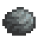

**You're viewing a file in the SMAPI mod dump, which contains a copy of every open-source SMAPI mod
for queries and analysis.**

**This is _not_ the original file, and not necessarily the latest version.**  
**Source repository: https://github.com/itsbenter/ResourcefulFriends**

----

# Molecat

> *"Digs up mining nodes when roam freely"*

Molecat is a farm animal that lives in a Coop. It can be purchased at Marnie's Ranch for 1100G. Molecat can become pregnant and give birth.

* [Variation](#variation)
* [Produce](#produce)
  * [Estimation](#estimation)
  * [Auto Grabber Interaction](#auto-grabber-interaction)
* [Footnote](#footnote)

## Variation

There are five variations of Molecat. When purchasing from Marnie there is equal chance for the five variations to be chosen.

## Produce

Molecat who eat every day mature after 3 nights have passed. A mature and fed Molecat will produce Molecat Node every day, if the conditions are met. Once an Iridium Ore is mined by player, Molecat Node has 50% chance to contain Iridium Ore.

Molecat Node cannot be picked up and instead must be destroyed using pickaxe, giving 20 mining experience. The number of ores produced when destroying the Node is increased by +1 per type of ore when player has [Miner](https://stardewvalleywiki.com/Skills#Mining) profession.

| Resource | Min | Max | Avg |
| -------- | --- | --- | --- |
| Stone | 2 | 3 | 2.5 |
| | | | |
| Common Ores (copper, iron, gold) | | | 6 |
| *Type of ore* | 2 | 2 | 2 |
| *Stack size per ore type* | 2 | 4 | 3 |
| | | | |
| Iridium Ore | 1 | 2 | 1.5 |

The condition to produce Molecat Node is the same to Pig producing Truffles. Refer to [Pig wiki](https://stardewvalleywiki.com/Pig) page for details. This pig-like behavior means Molecat will not produce during rain and winter. However, a config is provided to make Molecat produces exactly one Molecat Node inside the coop on such day. This is set to 'true' by default.

### Estimation

Here is a rough estimate of Molecat produce in a season. A number between 2 produce to 3 produce per day is probably a reasonable estimate at max heart. [Spreadsheet](https://docs.google.com/spreadsheets/d/13k0kkcyTUVJseXhAiZoKnOVubqOB7M9F3xILHV-Sj54/edit#gid=549968683) can be accessed and used in case player wish to change the default produce quantity. To edit the spreadsheet, copy the file to your Google account.

| Resource | Produce per day: 1 | Produce per day: 2 | Produce per day: 3 |
| -------- | ------------------ | ------------------ | ------------------ |
| Stone | 70 | 140 | 210 |
| | | | |
| Common Ores (copper, iron, gold) | 168 | 336 | 504 |
| *With Miner profession*[1](#Miner) | 224 | 448 | 672 |
| | | | |
| Iridium Ore[2](#IridiumOre) | 21 | 42 | 63 |
| *With Miner profession*[1](#Miner) | 35 | 70 | 105 |

### Auto Grabber Interaction

If Auto Grabber is placed inside Coop and Molecat produce inside the Coop (using appropriate config), Molecat Node will be picked up by Auto Grabber. Player can then grab the Node to the inventory, place them on the ground, and destroy them using pickaxe to get the resources.

Adding patch to process produce using machine is in to-do-list for future update of this mod. This would allow a fully automated farm when using [Automate](https://www.nexusmods.com/stardewvalley/mods/1063).

## Footnote

<a name="Miner">1</a>: +1 increase in ore stack size when having Miner profession 
<a name="IridiumOre">2</a>: 50% chance to find Iridium Ore after mining at least one Iridium Ore 
