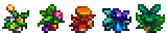

**You're viewing a file in the SMAPI mod dump, which contains a copy of every open-source SMAPI mod
for queries and analysis.**

**This is _not_ the original file, and not necessarily the latest version.**  
**Source repository: https://github.com/itsbenter/ResourcefulFriends**

----

# Petalkin

> *"Grows in-season forages on its back"*

Petalkin is a farm animal that lives in a Barn. It can be purchased at Marnie's Ranch for 4500G. Petalkin can become pregnant and give birth.

* [Seasonal Appearance](#seasonal-appearance)
* [Produce](#produce)
  * [Forage Grouping](#forage-grouping)
  * [Estimation](#estimation)
  * [Auto Grabber Interaction](#auto-grabber-interaction)
* [Footnote](#footnote)

## Seasonal Appearance

Petalkin appearance change based on the season. It also have unique appearance if player use mod to place Petalkin in Ginger Island.

## Produce

Petalkin who eat every day mature after 5 nights have passed. A mature and fed Petalkin will produce Forage Patch every 3 days. Once 4 hearts friendship is reached, Petalkin will produce Forage Patch every 2 days. Forage Patch appearance and content is different based on season (and location).

Forage Patch cannot be picked up and instead must be destroyed using scythe, giving 12 foraging experience. Quality of forages is affected by Foraging skill, the same as if player were gathering forages. The quantity of forages produced has 20% chance to double when player has [Gatherer](https://stardewvalleywiki.com/Skills#Foraging) profession. The quality of forages produced will be Iridium quality when player has [Botanist](https://stardewvalleywiki.com/Skills#Foraging) profession.

When Forage Patch is destroyed, it will produce 2 types of Common Forages with stack size between 2 to 5. It has 75% chance to produce 1 type of Uncommon Forages with a stack size between 1 to 2. And 20% chance to produce 1 type of Rare Forages with a stack size of 1.

| Resource | Min | Max | Avg |
| -------- | --- | --- | --- |
| Mixed Seeds | 1 | 3 | 2 |
| | | | |
| Common Forages | | | 7 |
| *Type of forage* | 2 | 2 | 2 |
| *Stack size per forage type* | 2 | 5 | 3.5 |
| | | | |
| Uncommon Forages (75% chance) | | | 1.5 |
| *Type of forage* | 1 | 1 | 1 |
| *Stack size per forage type* | 1 | 2 | 1.5 |
| | | | |
| Rare Forages (20% chance) | | | 1 |
| *Type of forage* | 1 | 1 | 1 |
| *Stack size per forage type* | 1 | 1 | 1 |

### Forage Grouping

Forages in the same rarity category have equal chance to be produced. Mod authors can add to the pool. Refer to [Compatibility](Compatibility.md).

| Context | Common Forages | Uncommon Forages | Rare Forages |
| ------- | -------------- | ---------------- | ------------ |
| Spring | Dandelion, Daffodil, Wild Horseradish, Leek, Spring Onion, Salmonberry[1](#Salmonberru) | Common Mushroom, Morel | |
| Summer | Sweet Pea, Spice Berry, Grape | Red Mushroom, Fiddlehead Fern | |
| Fall | Common Mushroom, Blackberry, Wild Plum, Hazelnut | Red Mushroom, Chanterelle, Purple Mushroom | Sweet Gem Berry |
| Winter | Crocus, Holly, Crystal Fruit | Winter Root, Snow Yam | |
| Ginger Island | Ginger, Fiddlehead Fern, Taro Tuber | | |

### Estimation

Here is a rough estimate of Petalkin produce in a season. [Spreadsheet](https://docs.google.com/spreadsheets/d/13k0kkcyTUVJseXhAiZoKnOVubqOB7M9F3xILHV-Sj54/edit#gid=549968683) can be accessed and used in case player wish to change the default produce quantity. To edit the spreadsheet, copy the file to your Google account.

| Resource | Days to produce: 3 | Days to produce: 2 |
| -------- | ------------------ | ------------------ |
| Mixed Seeds | 18 | 28 |
| | | |
| Common Forages | 63 | 98 |
| *With Gatherer profession*[2](#Gatherer) | 88.2 | 137.2 |
| | | |
| Uncommon Forages (75% chance) | 10.125 | 15.75 |
| *With Gatherer profession*[2](#Gatherer) | 14.175 | 22.05 |
| | | |
| Rare Forages (20% chance) | 1.8 | 2.8 |
| *With Gatherer profession*[2](#Gatherer) | 2.52 | 3.92 |

### Auto Grabber Interaction

If Auto Grabber is placed inside Barn, Forage Patch will be picked up by Auto Grabber. Player can then grab the Forage Patch to the inventory, place them on the ground, and destroy them using scythe to get the resources.

Adding patch to process produce using machine is in to-do-list for future update of this mod. This would allow a fully automated farm when using [Automate](https://www.nexusmods.com/stardewvalley/mods/1063).

## Footnote

<a name="Salmonberry">1</a>: Only during Salmonberry season (15 - 18 Spring) 
<a name="Gatherer">2</a>: 20% chance to double the stack size when having Gatherer profession 
