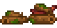

**You're viewing a file in the SMAPI mod dump, which contains a copy of every open-source SMAPI mod
for queries and analysis.**

**This is _not_ the original file, and not necessarily the latest version.**  
**Source repository: https://github.com/itsbenter/ResourcefulFriends**

----

# Timberbark

> *"Drops woods and place them in neat piles"*

Timberbark is a farm animal that lives in a Barn. It can be purchased at Marnie's Ranch for 2000G. Timberbark can become pregnant and give birth.

* [Produce](#produce)
  * [Estimation](#estimation)
  * [Auto Grabber Interaction](#auto-grabber-interaction)
* [Footnote](#footnote)

## Produce

Timberbark who eat every day mature after 3 nights have passed. A mature and fed Timberbark will produce Timberbark Pile every day. Once sufficient friendship and happiness is reached, Timberbark has a chance to produce a Large Timberbark Pile.

Timberbark Pile and Large Timberbark Pile cannot be picked up and instead must be destroyed using axe, giving 5 foraging experience. The forages produced has 20% chance to double when player has [Gatherer](https://stardewvalleywiki.com/Skills#Foraging) profession. The quality of forages produced will be Iridium quality when player has [Botanist](https://stardewvalleywiki.com/Skills#Foraging) profession.

| Resource | Min | Max | Avg |
| -------- | --- | --- | --- |
| **Timberbark Pile** | | | |
| Sap | 5 | 5 | 5 |
| Moss | 1 | 3 | 2 |
| Wood | 12 | 16 | 14 |
| | | | |
| **Large Timberbark Pile** | | | |
| Sap | 6 | 8 | 7 |
| Moss | 3 | 5 | 4 |
| Wood | 18 | 24 | 21 |
| Hardwood | 2 | 2 | 2 |

### Estimation

Here is a rough estimate of Timberbark produce in a season. [Spreadsheet](https://docs.google.com/spreadsheets/d/13k0kkcyTUVJseXhAiZoKnOVubqOB7M9F3xILHV-Sj54/edit#gid=549968683) can be accessed and used in case player wish to change the default produce quantity. To edit the spreadsheet, copy the file to your Google account.

| Resource | Timberbark Pile | Large Timberbark Pile |
| -------- | --------------- | --------------------- |
| Sap | 140 | 196 |
| Moss | 56 | 112 |
| | | |
| Wood | 392 | 588 |
| *With Forester profession*[1](#Forester) | 490 | 735 |
| *With Woody's Secret power up*[2](#WoodysSecret) | 431.2 | 646.8 |
| *With Forester profession*[1](#Forester) *With Woody's Secret power up*[2](#WoodysSecret) | 539 | 808.5 |
| | | |
| Hardwood | 0 | 56 |
| *With Lumberjack profession*[3](#Lumberjack) | 28 | 84 |
| *With Forester profession*[1](#Forester) | 0 | 70 |
| *With Woody's Secret power up*[2](#WoodysSecret) | 0 | 61.6 |
| *With Lumberjack profession*[3](#Lumberjack) *With Forester profession*[1](#Forester) *With Woody's Secret power up*[2](#WoodysSecret) | 38.5 | 115.5 |

### Auto Grabber Interaction

If Auto Grabber is placed inside Barn, Timberbark Pile and Large Timberbark Pile will be picked up by Auto Grabber. Player can then grab the them to the inventory, place them on the ground, and destroy them using axe to get the resources.

Adding patch to process produce using machine is in to-do-list for future update of this mod. This would allow a fully automated farm when using [Automate](https://www.nexusmods.com/stardewvalley/mods/1063).

## Footnote

<a name="Forester">1</a>: 25% increase in stack size when having Forester profession 
<a name="Woody's Secret">2</a>: 5% chance to double the stack size when having Woody's Secret power up 
<a name="Lumberjack">1</a>: +1 increase in Hardwood when having Lumberjack profession 
