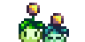
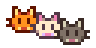
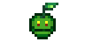
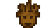
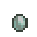

**You're viewing a file in the SMAPI mod dump, which contains a copy of every open-source SMAPI mod
for queries and analysis.**

**This is _not_ the original file, and not necessarily the latest version.**  
**Source repository: https://github.com/itsbenter/ResourcefulFriends**

----

# Resourceful Friends

[Resourceful Friends](https://www.nexusmods.com/stardewvalley/mods/23227) adds new farm animals to the game. Expanding ways to obtain resources in-game.

## Contents

* [Configuration](#configuration)
* [Farm Animals](#farm-animals)
* [Objects](#objects)
* [Compatibility](#compatibility)
* [FAQ](#faq)
* [Notes](#notes)

## Configuration

> [!IMPORTANT]
> [Generic Mod Config Menu](https://www.nexusmods.com/stardewvalley/mods/5098) is highly recommended.

The mod config supports:

* Enable or disable specific animal.
* Modify animal price.
* Modify some production behavior (including amount of produce).

Details of the config options is shown when hovered over in [Generic Mod Config Menu](https://www.nexusmods.com/stardewvalley/mods/5098) in-game mod options.

## Farm Animals

In version 1.0.0, this mod have five farm animals. They produce existing resources that not are obtainable through the farm animals. Effectively enabling a steady supply. Three of the farm animals are meant for Coop and two are meant for Barn.

| Farm Animal | Purchase Price | Resources Produced | Building | Days to Mature |
| :---------: | -------------- | ------------------ | -------- | -------------- |
| [Coalclaw](Documentation/Coalclaw.md) | 550G | Coal Coalclaw egg | Coop | 2 |
| [Honeypuff](Documentation/Honeypuff.md) | 1250G | Honey | Coop | 3 |
| [Molecat](Documentation/Molecat.md) | 1100G | Stone Copper ore Iron ore Gold ore Iridium ore | Coop | 3 |
| [Petalkin](Documentation/Petalkin.md) | 4500G | Mixed seeds In-season forages | Barn | 5 |
| [Timberbark](Documentation/Timberbark.md) | 2000G | Wood Hardwood Moss Sap | Barn | 3 |

## Objects

| Object | Explanation |
| :----: | ----------- |
| [Jellomone](Documentation/Jellomone.md) | Produce Sea Jelly, River Jelly, and Cave Jelly when placed in fish pond. |
| [Coalclaw Egg](Documentation/Coalclaw.md) | Rarely produced by Coalclaw. Can be placed in incubator to hatch Coalclaw chick. |

## Compatibility

* [Better Truffles](https://www.nexusmods.com/stardewvalley/mods/23228). Is not only compatible but also recommended. Gives Coalclaw and Molecat easier time to produce and give bubbles to easily spot where the produces are.
* [Stardew Valley Expanded](https://www.nexusmods.com/stardewvalley/mods/3753). Petalkin will produce the forages added by SVE.
* Recolor mods. The mod visual might look janky with some recolors. Authors are welcomed to make compatibility patches. Refer to [Compatibility](Documentation/Compatibility.md)

## FAQ

1. Is it safe to add this mod mid-save?  
It should be safe to add. If you need to remove the mod, selling/throwing out objects and animals added by the mod is recommended before removing the mod.
2. Can I use this mod in multiplayer?  
Yes, you can. Ideally with same mods installed and with same setting on all players.
3. Is this mod compatible with that mod?  
Most likely compatible. Check compatibility section for some precautions.

## Notes

* The concept for the animals are inspired by Dryads in Rimworld.
