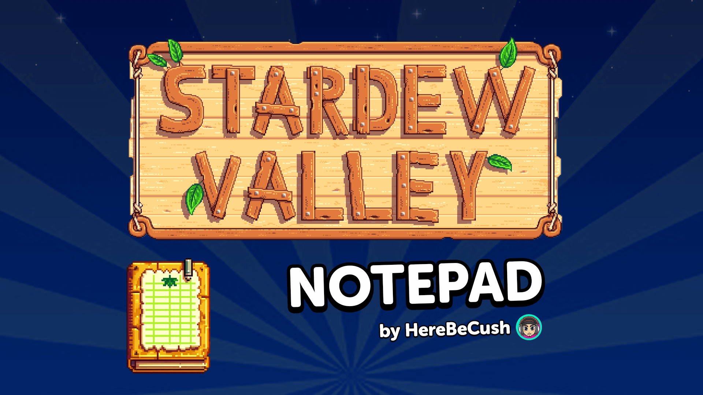

**You're viewing a file in the SMAPI mod dump, which contains a copy of every open-source SMAPI mod
for queries and analysis.**

**This is _not_ the original file, and not necessarily the latest version.**  
**Source repository: https://gitlab.com/hbc-mods/stardew-valley**

----

# SVNotebook
> by [HereBeCush](https://herebecush.tv)

## :inbox_tray: Installation
1. [Download the mod](https://herebecush.tv/mods/SV/Notepad/download.php)
2. Install this mod as you would any other SV mod.

If this is your first time installing a mod for SV, follow the [Getting Started Guide](https://stardewvalleywiki.com/Modding:Player_Guide/Getting_Started) until the end of the 'Install Mods' section
 (*NB: you can skip the 'Find mods' section if this will be your only mod*)

## :electric_plug: Configuration
*There is currently no configuration required (or available) for this mod*

## :pencil: Using the Mod
This mod adds a basic notepad to your game, containing two fields (suggested to be used as Title and Content fields, but you can use them however you like within the scope of the mod's functionality)
- **N** opens the notepad from within a save game
- The character limit for the Title field is currently **35**
- **Esc** (or clicking **OK**) closes the notepad
- Clicking the **Clear** icon (next to OK) clears both fields in the notepad
- Special symbols can be used in notes as provided by the core game - these are (without quotes):
	- **">"** - Right arrow
	- **"@"** - Left arrow
	- **"<"** - A heart
	- **"="** - Purple star
	- **"$"** - Coin
	- **"+"** - A head skateboarding (before you ask, I don't know...)

When the notepad is closed your changes are not lost, however...<mark> **you must go to sleep to save your changes when the game is closed** </mark>
 *(this will be changed in a future release, but for now a warning will be shown every time you close the notepad to remind you of this)*

## :bug: Known Issues
- The main text field cannot be scrolled yet, so (to prevent text overflow) the length of **text entered in this field is limited to what is visible**
- To prevent strange core behaviour in SV, a line of complete **text containing no spaces/line breaks in the main text field will not continue onto the next line**; in order to continue you must add a space/line break within, or at the end of, that line
- Due to the lack of scrolling present in the note's main text field, and to prevent accidental data loss by users, the **notepad should not be opened at such a small size that previously-saved text in the main field would overflow** that field's boundaires
	- For example, if you save your note with the main text field full at a 1080 resolution then open the notebook at a 720 resolution the screen will not have enough space to load the note properly. **This may cause unexpected results**
- Holding an input character (or backspace) will continuously input/backspace as you would expect. However, this is **not** the case for arrow keys or Delete
- ~~Up/down arrow navigation is not yet present~~ Added in **v1.1.0**
- Text **selection/highlighting is not present**

## :bulb: Feedback / Suggestions
If you have feedback/suggestions, please contact me on [Discord](https://discord.gg/BdfNeeRhdw) or during a Stardew Valley stream on [Twitch](https://www.twitch.tv/herebecush). Links to both of these (and more places) can also be found [on my website](https://herebecush.tv/links) but please note that I am rarely ever active on Instagram.
