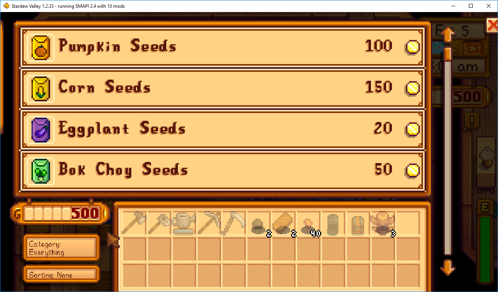

**You're viewing a file in the SMAPI mod dump, which contains a copy of every open-source SMAPI mod
for queries and analysis.**

**This is _not_ the original file, and not necessarily the latest version.**  
**Source repository: https://github.com/strobel1ght/StardewValleyMods**

----

# Better Shop Menu
This is the source code. Releases can be found at:
* [My site](http://spacechase0.com/mods/stardew-valley/better-shop-menu/)
* [Nexus](http://www.nexusmods.com/stardewvalley/mods/2012/?)
* [Chucklefish forums](https://community.playstarbound.com/resources/better-shop-menu.5245/)

Changes the shop menu to be a grid. (Can be disabled in the config file.)

Adds a couple of buttons allowing you to filter by category, and sort by price or item name.

## See also
* [Release notes](release-notes.md)
