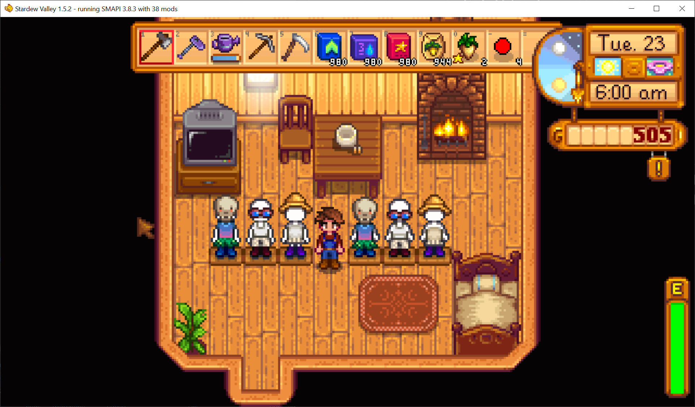

**You're viewing a file in the SMAPI mod dump, which contains a copy of every open-source SMAPI mod
for queries and analysis.**

**This is _not_ the original file, and not necessarily the latest version.**  
**Source repository: https://github.com/strobel1ght/StardewValleyMods**

----

# Displays
Adds some displays, currently just mannequins.

Right click with what you want to put on it, or with an empty hand to swap what you currently have
equipped.

Purchaseable from Robin.

## See also
* [Release notes](release-notes.md)
