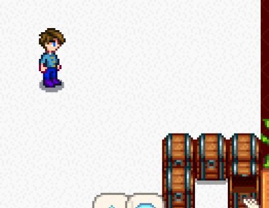

**You're viewing a file in the SMAPI mod dump, which contains a copy of every open-source SMAPI mod
for queries and analysis.**

**This is _not_ the original file, and not necessarily the latest version.**  
**Source repository: https://github.com/strobel1ght/StardewValleyMods**

----

# Extended Reach
This is the source code. Releases can be found at:
* [My site](http://spacechase0.com/mods/stardew-valley/extended-reach/)
* [Nexus](https://www.nexusmods.com/stardewvalley/mods/1493/)
* [Chucklefish forums](https://community.playstarbound.com/resources/extended-reach.4997/)

This mod lets you reach action tiles (such as the mailbox or a chest) from anywhere.

## See also
* [Release notes](release-notes.md)
